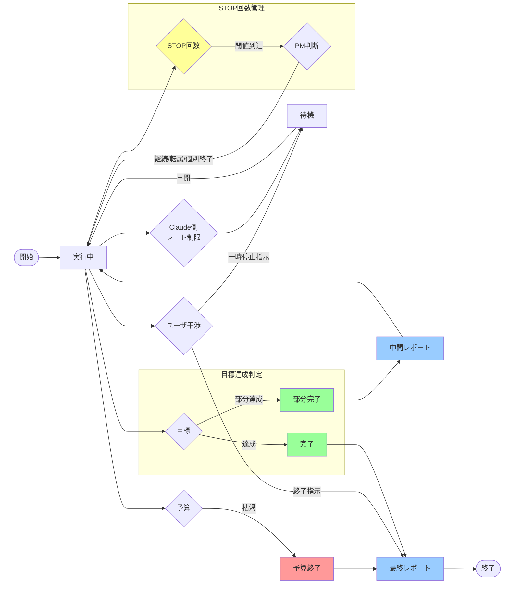
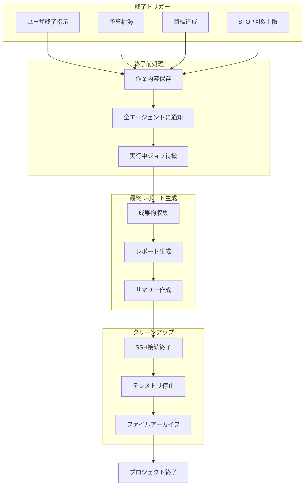

# プロジェクト終了フローチャート

## 概要
VibeCodeHPCプロジェクトの終了条件と状態遷移を定義します。

## 状態遷移図

## 終了トリガー

### 1. ユーザ介入による終了
- **割り込み終了**: ユーザが明示的に終了を指示
- **一時停止**: ユーザが一時的に中断（再開可能）
- **緊急停止**: 問題発生時の即座の停止

### 2. PMによる計画的終了
- **予算枯渇**: 計算資源の予算が閾値以下
- **目標達成**: 要件定義の目標を達成
- **部分達成**: 時間/予算制約により部分的な成果で終了

### 3. システムによる自動終了
- **STOP回数上限**: 各エージェントのSTOP hook呼び出し回数が閾値到達
  - 閾値到達時はPMが「継続」「転属」「個別終了」を選択
  - 転属の例:
    - PG (OpenMP) → PG (OpenMP_MPI) - 単一技術から複合技術へ
    - PG (single-node) → SE (multi-node) - 役割変更を伴う昇格
    - CI (gcc) → CI (intel) - 別環境での環境構築担当
    - SE1配下のPG → SE2配下のPG - 別チームへの移籍
- **レート制限**: Claude APIのレート制限（一時的）
- **コンテキスト枯渇**: auto-compactが頻発し継続困難

## STOP回数閾値（stop_polling_v2.py実装）

| エージェント | 閾値 | 理由 |
|------------|------|------|
| PM | 50回 | プロジェクト全体の管理者のため最も高い |
| CD | 40回 | 非同期動作が多く、GitHub同期タイミングが不定期のため |
| SE | 30回 | 監視タスクと分析タスクのバランス |
| CI | 20回 | ジョブ待機が多いため中程度 |
| PG | - | イベントドリブン型のため対象外 |
| ID | - | イベントドリブン型のため対象外 |

### 閾値の動的管理
- **設定ファイル**: `/Agent-shared/stop_thresholds.json`
- **PMによる調整**: 各エージェントの`.claude/hooks/stop_count.txt`を直接編集
- **requirement_definition.mdでの指定**: プロジェクト開始時に個別設定可能

## 終了時の処理フロー

## 終了時のチェックリスト

### PMの終了時タスク
1. [ ] 全エージェントの稼働状況確認
2. [ ] 予算使用状況の最終記録（`/Agent-shared/budget_history.md`）
3. [ ] 最終レポート生成（`/User-shared/final_report.md`）
4. [ ] エージェント停止順序の決定
5. [ ] クリーンアップ指示

### SEの終了時タスク
1. [ ] 最終的な統計グラフ生成
2. [ ] ChangeLog.mdの統合レポート作成
3. [ ] 性能推移の最終分析
4. [ ] 未完了タスクのリスト化

### CIの終了時タスク
1. [ ] 実行中ジョブの完了待機または強制終了
2. [ ] SSH/SFTPセッションのクローズ
3. [ ] 一時ファイルのクリーンアップ
4. [ ] ジョブ実行履歴の最終保存

### PGの終了時タスク
1. [ ] 最終コードのコミット
2. [ ] ChangeLog.mdの最終更新
3. [ ] SOTA判定の最終確認
4. [ ] 未実装機能のドキュメント化

### CDの終了時タスク
1. [ ] 最終的なGitHub同期
2. [ ] 匿名化処理の完了確認
3. [ ] リリースタグの作成（必要に応じて）
4. [ ] README.mdの最終更新

## 終了状態の定義

### 正常終了
- **完全達成**: すべての要件を満たして終了
- **部分達成**: 主要な要件を満たして終了
- **計画終了**: 予定通りの終了

### 異常終了
- **予算超過**: 予算制限により強制終了
- **エラー終了**: 致命的エラーによる終了
- **タイムアウト**: 時間制限による終了

## 再開可能性

### 再開可能な状態
- 一時停止状態
- レート制限による待機
- 部分達成での中断

### 再開不可能な状態
- 予算完全枯渇
- プロジェクト完全達成
- ユーザによる明示的な終了

## 実装上の注意点

1. **stop_count.txtの管理**
   - 各エージェントの`.claude/hooks/`ディレクトリに保存
   - エージェント再起動時もカウントは保持
   - 明示的なリセットが必要

2. **終了時の通信**
   - `agent_send.sh`で終了通知を送信
   - 非同期のため、確認応答は期待しない
   - 重要な通知は複数回送信

3. **データの永続性**
   - 終了前に必ずChangeLog.mdを更新
   - 重要なデータは`/User-shared/`に保存
   - SSH上のデータは必要に応じてダウンロード

## 将来の拡張案

1. **グレースフルシャットダウン**
   - 段階的なエージェント停止
   - 依存関係を考慮した停止順序

2. **チェックポイント機能**
   - 定期的な状態保存
   - 中断からの効率的な再開

3. **終了予測**
   - 予算消費率からの終了時刻予測
   - STOP回数の増加率分析