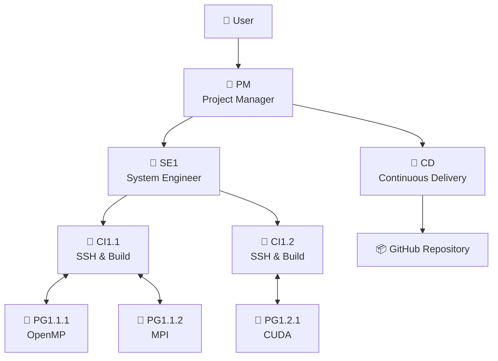
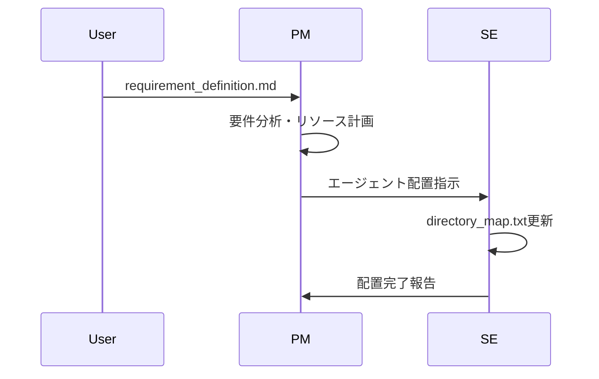
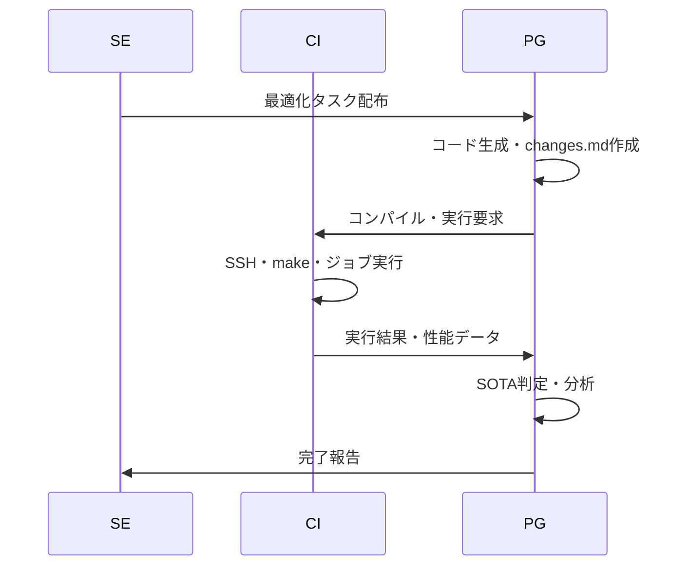

# 🎯OpenCodeAT - CLI Multi-Agent System for Auto-Tuning HPC Code

OpenCodeATは、HPCコードの自動最適化を行うマルチエージェントシステムです。
Claude Code等のCLI環境でtmux-based通信により、複数のAIエージェントが協調してコードの並列化・最適化を実現します。

## システム概要

### 特徴
- **階層型マルチエージェント**: PM → SE → CI ↔ PG の企業的分業体制
- **進化的階層設計**: ボトムアップ型のFlattened Directory構造による効率的探索
- **自動最適化**: OpenMP、MPI、OpenACC、CUDA...等の段階的並列化と技術融合
- **SOTA追跡**: Local/Parent/Global/Projectの4階層での性能指標
- **予算管理**: 計算資源の効率的配分と追跡
- **統一ログ**: changes.mdによる一元的な進捗管理

### 対応環境
- **スパコン**: 不老、富岳等のHPCシステム
- **コンパイラ**: Intel OneAPI、GCC、NVIDIA HPC SDK...

## 🏗️ エージェント構成



## 📁 ディレクトリ構造

```
OpenCodeAT/🤖PM
├── 📄 CLAUDE.md                     # 全エージェント共通ルール
├── 📄 requirement_definition.md     # 要件定義書
├── 📄 sota_project.txt              # プロジェクト全体SOTA
│
├── 📁 Agent-shared/                 # 全エージェント共有
│   ├── 📄 changes_unified.md        # 統一フォーマット仕様
│   ├── 📄 directory_map.txt         # エージェント配置
│   └── 📁 changes_query/            # ログ検索ツール
│
├── 📁 BaseCode/                     # 既存のオリジナルコード
│
├── 📁 communication/                # tmux通信システム
│   ├── 🔧 agent-send.sh
│   └── 🔧 setup.sh
│
├── 📁 GitHub/🤖CD
│
└── 📁 Flow/TypeII/single-node/🤖SE1 # ハードウェア階層
    ├── 📄 sota_global.txt           # 指定ハード内の Global SOTA
    ├── 📁 intel2024/🤖CI1.1         # コンパイラ環境                       
    │   └── 📁 OpenMP/🤖PG1.1.1      # 並列化モジュール
    │        ├── 📄 changes.md       # 進捗記録
    │        ├── 📄 sota_local.txt
    │        └── 📄 matrix_v1.2.3.c
    └── 📁 gcc11.3.0/🤖CI1.2        # 別コンパイラ
        └── 📁 CUDA/🤖PG1.2.1
```

## 🔄 ワークフロー

### 1. プロジェクト初期化



### 2. コード最適化サイクル



## 🚀 クイックスタート

### 1. 事前セットアップ
本システムを利用する前に、以下の環境がセットアップ済みであることを確認してください。

#### ☑️ OpenCodeATリポジトリのコードをダウンロード

> [!NOTE]
> OpenCodeATは git clone を用いずzipでダウンロードし展開することを推奨
> 
> 理由：GitHub/📁以下で、プロジェクトの匿名版コピーを管理するCDエージェントのGit認証と混同を避けるため

#### GUIの場合
[release](https://github.com/Katagiri-Hoshino-Lab/OpenCodeAT-jp/releases)から
ダウンロードした.zipを展開

#### CLIの場合
あるいは以下のコマンドでもよい

OpenCodeATをダウンロード
```bash
wget https://github.com/Katagiri-Hoshino-Lab/OpenCodeAT-jp/archive/refs/tags/v{バージョン}.zip
```
zip解凍
```bash
unzip OpenCodeAT-jp-{バージョン}.zip
```
展開後、OpenCodeATのルートへ移動
```bash
cd OpenCodeAT-jp-{バージョン}
```

---

#### ☑️ **GitHubの認証（CDエージェントを使わない場合は不要）**
GitHubのGUIでリポジトリ作成（Privateも可）

GitHub/📁に移動
```bash
cd GitHub
```
Gitの設定済み情報が表示するコマンド
```bash
git config -l
```
GitHubアカウント情報を登録
```bash
git config --global user.email xxx@yyy.zzz
git config --global user.name YOUR_GITHUB_NAME
git remote add origin https://github.com/YOUR_NAME/YOUR_REPOSITORY.git
# 既に origin がある場合は:
git remote set-url origin https://github.com/YOUR_NAME/YOUR_REPOSITORY.git
```
##### GitのHTTPS(２段階)認証の方法
➡以下のように選択肢は様々
https://zenn.dev/miya789/articles/manager-core-for-two-factor-authentication

<details>
<summary>選択肢１：GCM</summary>

Git Credential Manager (GCM)が推奨。
https://github.com/git-ecosystem/git-credential-manager/releases

WSLで使用する際の注意
https://zenn.dev/jeffi7/articles/dccb6f29fbb640
</details>


<details>
<summary>選択肢２：gh</summary>

gh (GitHub CLIツール)ダウンロード
```bash
sudo apt update
sudo apt install gh
```
ghでの認証
```bash
gh auth login
```
ブラウザ経由でログイン
</details>

---

#### ☑️ **SSHエージェントの設定 (ssh-agent)**
- スーパーコンピュータへのパスワード不要のSSH接続を有効にするため、`ssh-agent` に秘密鍵を登録します。
- ssh-agentを有効にする手順は[こちらのGoogleスライドを参照](https://docs.google.com/presentation/d/1Nrz6KbSsL5sbaKk1nNS8ysb4sfB2dK8JZeZooPx4NSg/edit?usp=sharing)
- ターミナルで以下のコマンドを実行し、パスフレーズを入力してください。
  ```bash
  eval "$(ssh-agent -s)"
  ssh-add ~/.ssh/your_private_key
  ```
- 確認コマンド
  ```bash
  ssh-add -l
  ```
> [!NOTE]
> このターミナルを閉じるまでは有効で、tmuxのターミナル分割でも引き継がれます。


---

#### ☑️ **Claude Codeのインストールと認証**
- Windowsの場合は、WSL (Ubuntu 22.04) をセットアップします。
- `nvm` 経由でのNode.js (v18以上) のインストールを推奨します [参考: https://zenn.dev/acntechjp/articles/eb5d6c8e71bfb9]
- 以下のコマンドでClaude Codeをインストールし、初回起動時にアカウント認証を完了させてください。
  ```bash
  npm install -g @anthropic-ai/claude-code
  claude
  ```

---

#### ☑️ **MCPサーバのセットアップ (wcgw)**
- Claude CodeからHPC環境のコマンドを安全に実行するため、`wcgw` MCPサーバを追加します https://github.com/rusiaaman/wcgw
- 以下のコマンドで `wcgw` を追加
  ```bash
  claude mcp add wcgw -- uv tool run --python 3.12 wcgw@latest
  ```
- ２分後に別のターミナルを起動しClaude Code内で `/mcp` コマンドで接続を確認してください。


---

> [!WARNING]
> wcgw を使用する場合、Windowsでは WSL 以外が非対応のため
> powershell等のWindowsネイティブなCLIは使用できません。
> 
> 代わりのMCPサーバ候補例 https://github.com/wonderwhy-er/DesktopCommanderMCP

### 2. 環境セットアップ
```bash
cd OpenCodeAT
./communication/setup.sh
tmux attach-session -t multiagent
```

### 3. プロジェクト開始
要件定義（skipした場合はPMと対話的に作成）
```bash
cp requirement_definition_template.md requirement_definition.md
# requirement_definition.mdを編集
```
PMを起動
```bash
tmux send-keys -t pm_session 'claude' C-m
# "requirement_definition.mdに基づいてプロジェクトを初期化してください"
```

## 🤖 エージェント役割

| Agent | 役割 | 主要成果物 | 責任範囲 |
|-------|------|------------|----------|
| **PM** | プロジェクト統括 | assign_history.txt<br/>budget.md | 要件定義・リソース配分・予算管理 |
| **SE** | システム設計 | PG_visible_dir.txt<br/>performance_trends.png | エージェント監視・統計分析 |
| **CI** | ビルド・実行 | setup.md<br/>job_list_CI*.txt | SSH接続・コンパイル・ジョブ実行 |
| **PG** | コード生成 | changes.md<br/>sota_local.txt | 並列化実装・性能測定・SOTA判定 |
| **CD** | デプロイ管理 | GitHub/以下のprojectコピー | SOTA達成コード公開・匿名化 |

## 📊 SOTA管理システム

### 4階層SOTA追跡
- **Local**: PG自身のディレクトリ内での最高性能
- **Parent**: 継承元フォルダ全体での最高性能（仮想的に算出）
- **Global**: ハードウェア全体での最高性能
- **Project**: プロジェクト全体での最高性能

各階層でのSOTA判定により、効率的なベンチマーク比較と最適化方針決定を自動化。

### changes.md統一フォーマット
```yaml
## version: v1.2.3 (PG writes)
change_summary: "OpenMP collapse(2)とMPI領域分割を追加"
timestamp: "2025-07-16 12:34:56 UTC"
code_files: "matrix_v1.2.3.c"

# Build & Execution (CI updates)
compile_status: success | fail | pending
job_status: completed | failed | timeout
performance_metric: "285.7 GFLOPS"
compute_cost: "12.5 node-hours"

# Analysis (PG updates)
sota_level: local | parent | global | project
technical_comment: "collapse(2)で15%向上、MPI分割で20%向上"
next_steps: "ループアンローリングとブロッキング最適化を実装"
```

## 🧬 進化的最適化アプローチ

### 段階的進化プロセス
1.  **🌱 種子期**: 単一技術の個別最適化 (`/OpenMP/`, `/MPI/`, `/AVX512/`, `/CUDA/`)
2.  **🌿 交配期**: 有望技術の融合 (`/OpenMP_MPI/`, `/MPI_CUDA/`)
3.  **🌳 品種改良期**: 高度な組み合わせ (`/OpenMP_MPI_AVX512/`)
4.  **🌲 進化継続**: さらなる技術統合と最適化...

### 📁Flattened Directory の利点
- **階層の曖昧性解消**: `/MPI/OpenMP/` vs `/OpenMP/MPI/` の重複排除
- **並列探索効率化**: 複数エージェントによる同時最適化
- **技術継承**: 上位世代が下位世代の成果を参照可能

- [ ] 詳細: [Agent-shared/evolutional_flatten_dir.md](Agent-shared/evolutional_flatten_dir.md)

## 🔍 高度な機能

### 統一ログシステム
changes.mdを中心としたフォーマットが統一されたログで情報共有を実現。
- [ ] 詳細：[Agent-shared/about_changes.md](Agent-shared/about_changes.md)
#### 成果物の全体像: 
- [ ] 詳細: [Agent-shared/artifacts_position.md](Agent-shared/artifacts_position.md)

### SOTA管理システム
4階層（Local/Parent/Global/Project）でのSOTA追跡により、効率的なベンチマーク管理を実現。
Virtual Parent算出により重複ファイルを排除。
> [!TIP]
> **エージェント可視化**
> SE担当の統計解析により、性能推移とSOTA更新履歴をリアルタイム監視。
- [ ] 詳細: [Agent-shared/sota_management.md](Agent-shared/sota_management.md)


## 🔒 セキュリティ

- [x] **機密情報保護**: `_remote_info/`はGit管理外
- [x] **自動匿名化**: GitHub公開時にユーザID等を匿名化
- [x] **SOTA達成コードのみ公開**: 性能向上を実現したコードのみ
- [x] **階層別アクセス制御**: Agent役割に応じた読み書き権限

## 📄 ライセンス

このプロジェクトは[Apache License 2.0](LICENSE)の下で公開されています。自由にご利用いただけますが、使用に関する責任は負いかねます。
