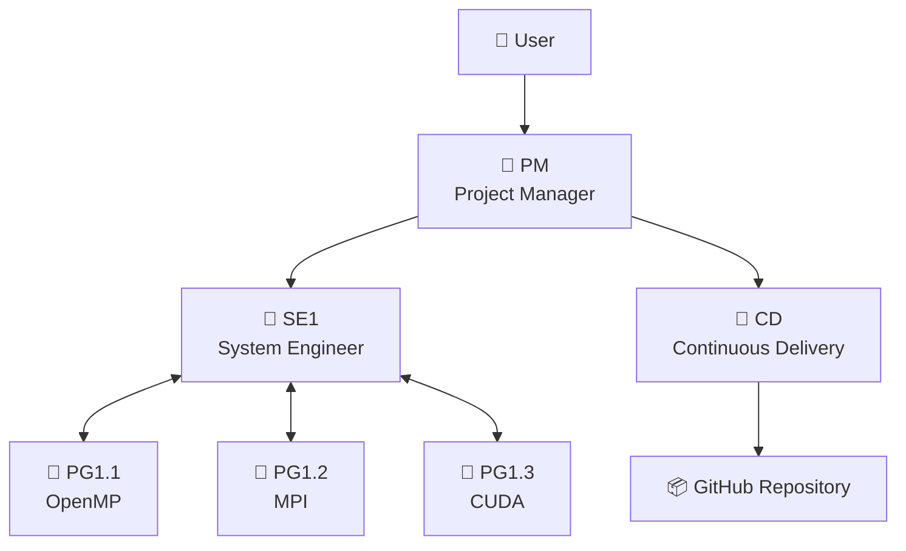
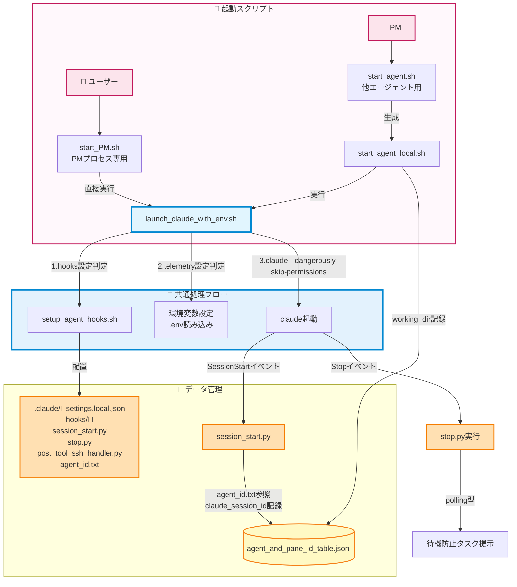
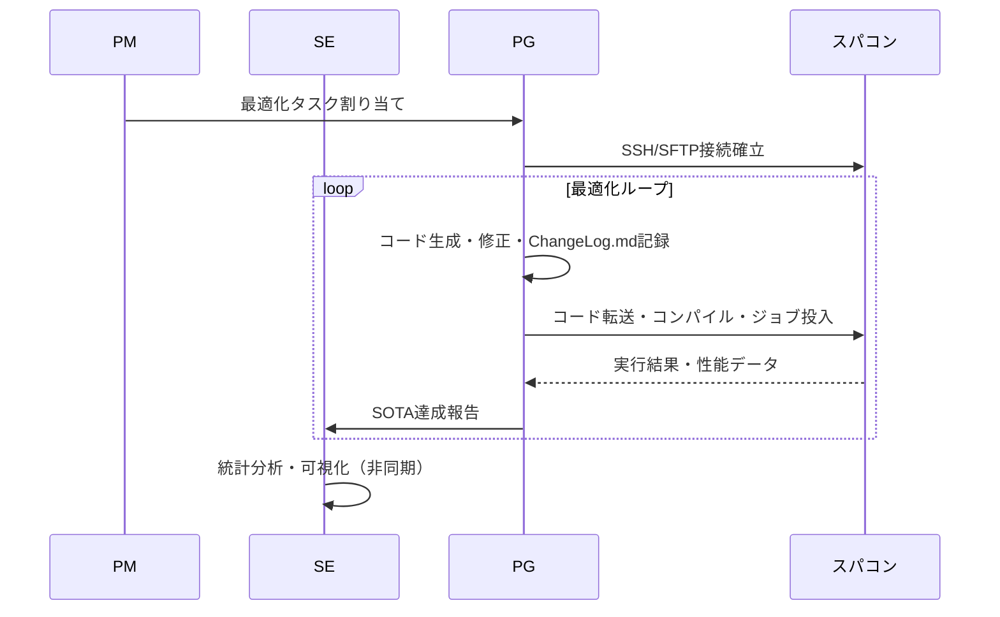
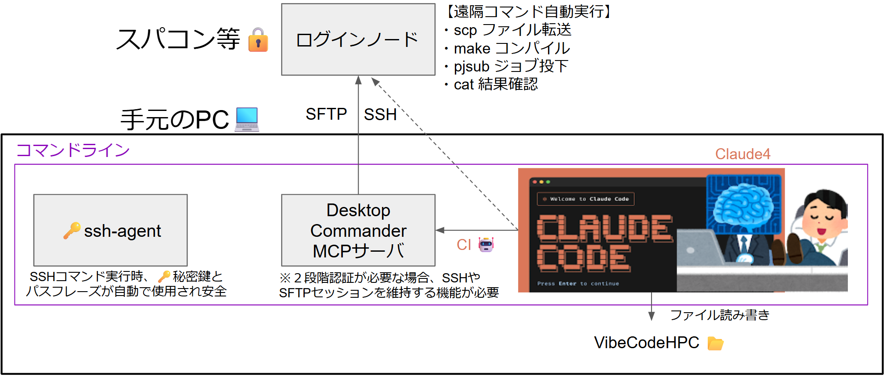
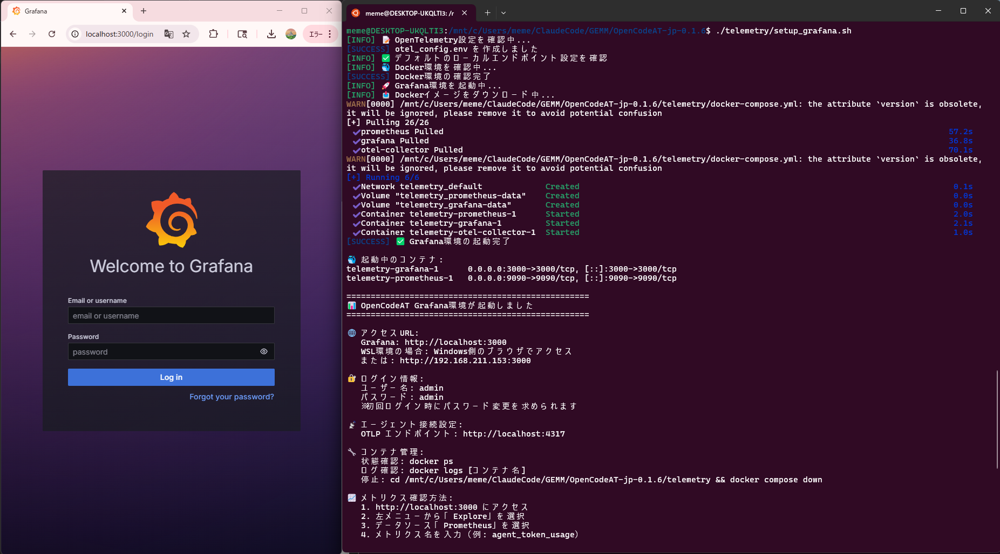
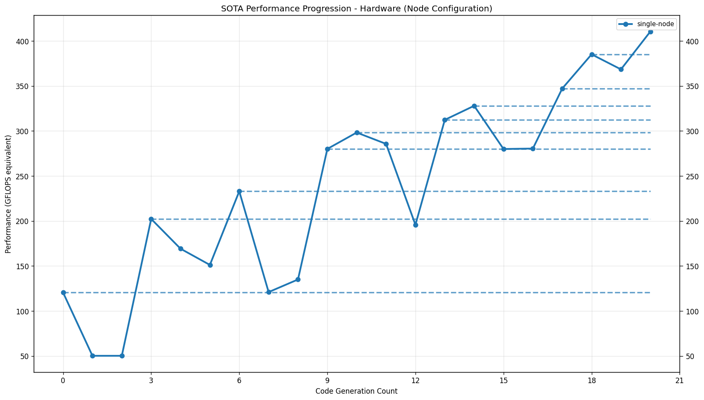
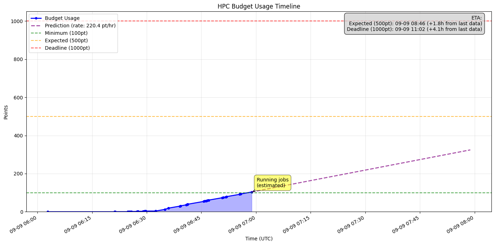
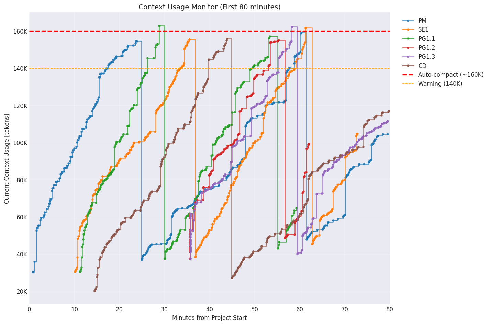

# VibeCodeHPC - Multi Agentic Vibe Coding for HPC

VibeCodeHPCは、HPC向けの全自動で環境構築・コード最適化を行うマルチエージェントシステムです。
Claude Code等のCLI環境でtmuxを用いた通信により、複数のAIエージェントが協調します。


## システム概要

### 特徴
- **階層型マルチエージェント**: PM → SE ↔ PG の企業的分業体制
- **プロジェクト地図**: 組織をリアルタイムに視覚化する`directory_pane_map`
- **進化的探索**: ボトムアップ型の`Flat`📁構造による効率的探索
- **自動最適化**: OpenMP、MPI、OpenACC、CUDA...等の段階的並列化と技術融合
- **予算管理**: 計算資源💰の効率的配分と追跡
- **統一ログ**: `ChangeLog.md`による一元的な進捗管理

### 対応環境
- **スパコン**: 不老、富岳等のHPCシステム
- **コンパイラ**: Intel OneAPI、GCC、NVIDIA HPC SDK...

## 🏗️ エージェント構成



### 🤖 エージェント役割

| Agent | 役割 | 主要成果物 | 責任範囲 |
|-------|------|------------|----------|
| **PM** | プロジェクト統括 | directory_pane_map.md<br/>User-shared/final_report.md | 要件定義・リソース配分・予算管理 |
| **SE** | システム設計 | User-shared/の画像とレポート | エージェント監視・統計分析・レポート生成 |
| **PG** | コード生成・実行 | ChangeLog.md<br/>sota_local.txt | 並列化実装・SSH/SFTP接続・ジョブ実行・性能測定 |
| **CD** | デプロイ管理 | GitHub/以下のprojectコピー | SOTA達成コード公開・匿名化 |

## 📁 ディレクトリ構造

```
VibeCodeHPC/🤖PM
├── 📄 CLAUDE.md                     # 全エージェント共通ルール
├── 📄 requirement_definition.md     # 要件定義書
├── 📄 directory_pane_map.md         # エージェント配置とtmuxペイン統合管理
├── 📄 sota_project.txt              # プロジェクト全体SOTA
│
├── 📁 Agent-shared/                 # エージェント共有指示書
│
├── 📁 User-shared/                  # ユーザ向け成果物
│   ├── 📄 final_report.md           # 最終報告書
│   ├── 📁 reports/                  # 統合レポート
│   └── 📁 visualizations/           # グラフ・図表
│
├── 📁 BaseCode/                     # 既存のオリジナルコード
│
├── 📁 communication/                # エージェント起動・tmux通信システム
│
├── 📁 GitHub/🤖CD
│
└── 📁 Flow/TypeII/single-node/🤖SE1 # ハードウェア階層
    ├── 📄 hardware_info.md          # 計算ノードのスペック情報
    ├── 📄 sota_hardware.txt         # 指定ハード内のSOTA
    ├── 📁 intel2024/                 # コンパイラ環境                       
    │   └── 📁 OpenMP/🤖PG1.1.1      # 並列化モジュール
    │        ├── 📄 ChangeLog.md      # 進捗記録
    │        └── 📄 sota_local.txt
    └── 📁 gcc11.3.0/                 # 別コンパイラ
        └── 📁 CUDA/🤖PG1.2.1
```

## 🔄 ワークフロー

### エージェント動作パターン

#### **⏳ ポーリング型** (PM, SE, PG, CD)
- **特徴**: 常にファイルやステータスを確認し、自律的に非同期で行動
- **例**: PMが全エージェントを巡回監視→リソース再配分
- **例**: PGがコード生成→自律的に実行→結果確認→次の最適化

#### **➡️ フロー駆動型** (PM初期のみ)
- **特徴**: 一連のタスクを順次実行し、各ステップで判断
- **例**: 要件定義→環境調査→階層設計→エージェント配置

### 1. エージェント起動時のhooksセットアップ



詳細は [Issue #23: エージェント起動とhooksのセットアップの流れ](https://github.com/Katagiri-Hoshino-Lab/VibeCodeHPC-jp/issues/23) を参照。

### 2. コード最適化サイクル



### 3. プロジェクト終了管理

プロジェクトの終了条件とフローチャートは [Issue #33: プロジェクト終了条件と手順](https://github.com/Katagiri-Hoshino-Lab/VibeCodeHPC-jp/issues/33) を参照してください。

# 🚀 クイックスタート

## 1. 事前セットアップ
本システムを利用する前に、以下の環境がセットアップ済みであることを確認してください。

### ☑️ VibeCodeHPCリポジトリのコードをダウンロード

> [!NOTE]
> 以下の理由から VibeCodeHPC は git clone を用いずzipでダウンロードし展開することを推奨
> 
> GitHub/📁でプロジェクトの匿名版コピーを管理するCDエージェントのGit認証との混同を避ける

#### GUIの場合
[release](https://github.com/Katagiri-Hoshino-Lab/VibeCodeHPC-jp/releases)から(mainからでもOK) ダウンロードした.zipを展開

#### CLIの場合
<details>
<summary>コマンドラインでダウンロードする場合（クリックで展開）</summary>

VibeCodeHPCをダウンロード
```bash
wget https://github.com/Katagiri-Hoshino-Lab/VibeCodeHPC-jp/archive/refs/tags/v{バージョン}.zip
```

zip解凍
```bash
unzip VibeCodeHPC-jp-{バージョン}.zip
```

展開後、VibeCodeHPCのルートへ移動
```bash
cd VibeCodeHPC-jp-{バージョン}
```
</details>

---

### ☑️ **SSHエージェントの設定 (ssh-agent)**
- スーパーコンピュータへのパスワード不要のSSH接続を有効にするため、`ssh-agent` に秘密鍵を登録します。
- ssh-agentを有効にする手順は[こちらのGoogleスライドを参照](https://docs.google.com/presentation/d/1Nrz6KbSsL5sbaKk1nNS8ysb4sfB2dK8JZeZooPx4NSg/edit?usp=sharing)
  
  ssh-agentを起動：
  ```bash
  eval "$(ssh-agent -s)"
  ```
  
  秘密鍵を追加：
  ```bash
  ssh-add ~/.ssh/your_private_key
  ```
- 確認コマンド
  ```bash
  ssh-add -l
  ```
> [!NOTE]
> このターミナルを閉じるまでは有効で、tmuxのターミナル分割でも引き継がれます。


---

### ☑️ **Claude Codeのインストールと認証**
- Windowsの場合は、WSL (Ubuntu 22.04) をセットアップします。
- `nvm` 経由でのNode.js (v18以上) のインストールを推奨します [参考: https://zenn.dev/acntechjp/articles/eb5d6c8e71bfb9]
- 以下のコマンドでClaude Codeをインストールし、初回起動時にアカウント認証を完了させてください。
  ```bash
  npm install -g @anthropic-ai/claude-code
  claude
  ```


### ☑️ **推奨ツールのインストール**
<details>
<summary>tmux, jq, Python環境のインストール方法（クリックで展開）</summary>

VibeCodeHPCの全機能を活用するため、以下のツールのインストールを推奨します：

#### **tmux** - ターミナルマルチプレクサ（マルチエージェント通信基盤）

Ubuntu/WSL:
```bash
sudo apt-get update && sudo apt-get install tmux
```

CentOS/RHEL/Fedora:
```bash
sudo yum install tmux  # または sudo dnf install tmux
```

macOS:
```bash
brew install tmux
```

ユーザ権限でのインストール（sudo不可の環境）:
```bash
wget https://github.com/tmux/tmux/releases/download/3.4/tmux-3.4.tar.gz
tar xzf tmux-3.4.tar.gz
cd tmux-3.4
./configure --prefix=$HOME/.local
make && make install
export PATH=$HOME/.local/bin:$PATH  # .bashrcに追加推奨
```
> シングルエージェントモード（`./start_solo.sh`）はtmuxなしでも動作しますが、セッション管理の観点からtmuxの使用を推奨

#### **jq** - JSONLファイル解析用

Ubuntu/WSL:
```bash
sudo apt install jq
```

macOS:
```bash
brew install jq
```
> エージェント間通信（agent_send.sh）でJSONL形式のテーブルを効率的に解析します


#### **Pythonパッケージ** - 可視化とデータ分析用

通常のインストール:
```bash
pip3 install -r requirements.txt
```

必要なパッケージ:
- **matplotlib** - グラフ生成（SOTA推移、予算消費、コンテキスト使用率）
- **numpy** - 数値計算（線形回帰、統計処理）
- **pandas** - データ分析（ChangeLog.md解析、集計）
- **scipy** - 統計分析（予算予測の線形回帰）

> これらのパッケージは主に可視化スクリプトで使用されます。バージョンは厳密に指定していないため、最新版で問題ありません

> 可視化スクリプトは `python3 script.py` で実行されます
</details>

---

### ☑️ **GitHubの認証（CDエージェントを使わない場合は不要）**
GitHubのGUIでリポジトリ作成（Privateも可）

GitHub/📁に移動
```bash
cd GitHub
```
Gitの設定済み情報が表示するコマンド
```bash
git config -l
```

もしuser.emailとuser.nameが設定されていない場合：
```bash
git config --global user.email xxx@yyy.zzz
git config --global user.name YOUR_GITHUB_NAME
```

GitHubディレクトリの初期設定
```bash
git init
```

リモートリポジトリの設定
```bash
git remote add origin https://github.com/YOUR_NAME/YOUR_REPOSITORY.git
# 既に origin がある場合は:
git remote set-url origin https://github.com/YOUR_NAME/YOUR_REPOSITORY.git
```
#### GitのHTTPS(２段階)認証の方法
➡以下のように選択肢は様々
https://zenn.dev/miya789/articles/manager-core-for-two-factor-authentication

<details>
<summary>選択肢１：GCM</summary>

Git Credential Manager (GCM)が推奨。
https://github.com/git-ecosystem/git-credential-manager/releases

WSLで使用する際の注意
https://zenn.dev/jeffi7/articles/dccb6f29fbb640
</details>


<details>
<summary>選択肢２：gh</summary>

gh (GitHub CLIツール)ダウンロード
```bash
sudo apt update
sudo apt install gh
```
ghでの認証
```bash
gh auth login
```
ブラウザ経由でログイン
</details>

---

### ☑️ **MCPサーバのセットアップ**

開始直前に以下のMCPサーバを設定することを推奨します：

プロジェクトルート📂で起動するPM🤖にMCPサーバを与えます。
**重要**: Claude Code起動前にMCPを設定してください。

```bash
cd VibeCodeHPC-main
```

[Desktop Commander MCP](https://github.com/wonderwhy-er/DesktopCommanderMCP)
PM、SE、PGがHPC環境へのSSH/SFTP接続を管理に活用
```bash
claude mcp add desktop-commander -- npx -y @wonderwhy-er/desktop-commander
```

[mcp-screenshot](https://github.com/kazuph/mcp-screenshot)
PMが障害対応等でtmux全体の状況を視覚的な確認に活用
```bash
claude mcp add mcp-screenshot -- npx -y @kazuph/mcp-screenshot
```

> [!WARNING]
> **mcp-screenshotはWSLでは機能しません**
> WSL環境ではスクリーンショット機能が動作しないため、OSネイティブなコマンドプロンプトでの使用を推奨します。



---

## 2. 環境セットアップ

```bash
# プロジェクトディレクトリに移動
cd VibeCodeHPC-jp-main
```
#### OpenTelemetryの無効化（軽量動作）

環境変数で無効化:
```bash
export VIBECODE_ENABLE_TELEMETRY=false
```

### 🔭 監視オプション

#### ccusage（簡易確認）

```bash
# セットアップ不要でトークン使用量を確認
npx ccusage@latest
```


#### 📊 Grafana + Prometheus + Loki環境（非推奨のオプション）

<details>

監視環境の自動セットアップ:
```bash
./telemetry/setup_grafana.sh
```

ブラウザでアクセス:
```
http://localhost:3000
```

ログイン情報:
- ユーザー名: `admin`
- パスワード: `admin`


[ccusage](https://github.com/ryoppippi/ccusage)は、JSONLログからトークン使用量を分析するCLIツールです。




Grafanaでメトリクスを確認する方法（OpenTelemetry有効時のみ）

#### 基本的な使い方
1. **Drilldown → Metrics** を選択
   - ログイン後、特に事前準備なしで利用可能
   - Cost（コスト）やToken数が自動的に可視化される
   - エージェント別・時系列でのトークン消費を確認


2. **注意事項**
   - Claude CodeのOpenTelemetryメトリクスはOTLP経由で送信
   - デフォルトではローカルのCollector（4317ポート）に接続
   - 詳細な設定は`telemetry/otel_config.env`で調整可能

</details>

### 🤖シングルエージェントモード (v0.5.3+)

<details>
<summary>実験評価用シングルエージェントモード（クリックで展開）</summary>

実験評価用のシングルエージェントモードを追加しました。1つのClaude Codeインスタンスが全ての役割（PM/SE/PG/CD）を担当します。

使用方法
```bash
# セットアップ（0ワーカー = シングルモード）
./communication/setup.sh 0 --project GEMM

# エージェント起動
./start_solo.sh
```

起動後、以下のプロンプトが表示されるのでコピーして貼り付けてください：
```
あなたはVibeCodeHPCのシングルエージェントモードで動作します。
全ての役割（PM/SE/PG/CD）を1人で担当し、効率的にプロジェクトを進めます。

【初期設定】
まず以下のファイルを読み込んでください：
- CLAUDE.md（全エージェント共通ルール）
- instructions/SOLO.md（シングルモード専用の統合プロンプト）
- requirement_definition.md（存在する場合）
- Agent-shared/project_start_time.txt（プロジェクト開始時刻）

【ToDoリストによる役割管理】
TodoWriteツールを積極的に使用し、各タスクに役割タグ（[PM], [SE], [PG], [CD]）を付けて管理してください。

【時間管理】
- プロジェクト開始時刻から経過時間を定期的に確認
- requirement_definition.mdに時間制限がある場合は厳守
- 予算管理と並行して時間効率も意識

【効率的な実行順序】
1. [PM] 要件定義と環境調査
2. [SE] 環境構築
3. [PG] 実装とテスト（ループ）
4. [SE] 統計・可視化
5. [CD] GitHub同期（必要時）
6. [PM] 最終報告

agent_send.shは使用不要です（通信相手がいないため）。
全ての処理を内部で完結させてください。

プロジェクトを開始してください。
```

#### 特徴
- **統合実行**: 1つのインスタンスで全役割を実行
- **ToDoリスト管理**: 役割切り替えを明示的に管理
- **時間管理**: project_start_time.txtで経過時間を追跡
- **マルチモードと同じ仕組み**: ChangeLog.md、SOTA管理等は共通

詳細は `instructions/SOLO.md` を参照してください。

</details>


### マルチエージェント:tmuxセッション作成

> [!IMPORTANT]
> VibeCodeHPCは複数のtmuxセッションを使用します：
> - **PMセッション**: PMエージェント専用（ユーザとの対話用）
>   - デフォルト: `Team1_PM`
>   - プロジェクト指定時: `{ProjectName}_PM`
> - **ワーカーセッション**: その他のエージェント（SE, PG, CD）
>   - デフォルト: `Team1_Workers1`
>   - プロジェクト指定時: `{ProjectName}_Workers1`
> 
> 最小エージェント数は2です（SE + PG）

```bash
cd VibeCodeHPC-jp-main
./communication/setup.sh [ワーカー数]  # 例: ./communication/setup.sh 12
```


コマンドラインオプション:
<details>
#   [ワーカー数]     : PM以外のエージェント総数 (最小: 2)
#   --project <名前> : プロジェクト名を指定（例: GEMM, MatMul）
#   --clean-only     : 既存セッションのクリーンアップのみ実行
#   --dry-run        : 実際のセットアップを行わずに計画を表示
#   --help           : ヘルプメッセージを表示
</details>

#### プロジェクト名指定例:
```bash
./communication/setup.sh 12 --project GEMM  # デフォルト60秒間隔で定期Enter送信
./communication/setup.sh 12 --project GEMM --periodic-enter 30  # 30秒間隔
./communication/setup.sh 12 --project GEMM --periodic-enter 0  # 定期Enter無効
```
上記コマンドで `GEMM_PM`, `GEMM_Workers1` セッションを作成、残留メッセージ強制送信機能も起動


#### 参考構成例（実際の配置はPMが決定）

| Workers | SE | PG | CD | 備考 |
|---------|----|----|-----|------|
| 2 | 1 | 1 | 0 | 最小構成 |
| 4 | 1 | 3 | 0 | 小規模 |
| 8 | 2 | 5 | 1 | SE≧2で安定 |
| 12 | 2 | 9 | 1 | 推奨構成 |
| 16 | 3 | 12 | 1 | 大規模 |

#### 2つのターミナルタブでそれぞれアタッチ
プロジェクト名を`GEMM`に指定した場合の例

タブ1（PMエージェント用）:
```bash
tmux attach-session -t GEMM_PM
```
タブ2（その他のエージェント用）:
```bash
tmux attach-session -t GEMM_Workers1
```

> [!TIP]
> setup.shの出力に表示される実際のセッション名を使用してください。

### 3. プロジェクト開始
要件定義（skipした場合は、PMと対話的に作成）
```bash
cp requirement_definition_template.md requirement_definition.md
# requirement_definition.mdを編集
```

PMを起動
```bash
./start_PM.sh
```

<details>
<summary>その他の起動オプション（クリックで展開）</summary>

```bash
# telemetryのみ（hooksなし、待機防止が無効）
./telemetry/launch_claude_with_env.sh PM

# 最小構成（hooks・telemetryなし）
claude --dangerously-skip-permissions

# telemetryのみ無効化（PM起動時）
VIBECODE_ENABLE_TELEMETRY=false ./start_PM.sh

# ⚠️ hooksの無効化は非推奨（ポーリング型エージェントが待機してしまう）
# どうしても無効化したい場合は、プロジェクト開始前に以下を実行：
# export VIBECODE_ENABLE_HOOKS=false
```

**注意**: PMはポーリング型エージェントのため、hooksを無効化すると待機状態に入ってしまいます。
</details>

### 🪝 Claude Code Hooks機能

エージェントの挙動を制御するhooks機能により、以下が実現されます：

#### 主な機能
- [x] **ポーリング型エージェント（PM, SE, PG, CD）の待機防止**: 定期的なタスクを自動提示
- [x] **SSH/SFTP接続支援**: PostToolUseフックがSSH接続を検出し、Desktop Commander MCPでのセッション管理方法を自動案内
- [x] **session_id追跡**: 各エージェントのClaude session_idを記録・管理

#### STOP Hooksバージョンの選択
```bash
# v3（デフォルト）確率的に生のドキュメントを提供
./communication/setup.sh 12

# v2: ファイルパスのみ提供（レガシー）
./communication/setup.sh 12 --hooks v2
```

- **v3**: 全モード推奨。`auto_tuning_config.json`で役割別の確率カスタマイズ可能
- **v2**: 旧バージョン。固定ファイルリストのみ提供
- **SOLO**: 常にv3を使用（v2指定は無視される）

⚠️ hooks無効化は非推奨 - ポーリング型エージェントが待機状態に入りプロジェクト未達成のまま終了するリスク大

詳細は `hooks/hooks_deployment_guide.md` を参照してください。


起動後、以下のプロンプトをコピーして貼り付け：
```
あなたはPM（Project Manager）です。VibeCodeHPCプロジェクトを開始します。

まず以下のファイルを読み込んでプロジェクトの全体像を把握してください：
- CLAUDE.md（全エージェント共通ルール）
- instructions/PM.md（あなたの役割詳細）
- requirement_definition.md（プロジェクト要件）※存在する場合
- Agent-shared/以下の全ての.mdと.txtファイル（ただし、.pyファイルを除く）

特に重要：
- max_agent_number.txt（利用可能なワーカー数）
- agent_and_pane_id_table.jsonl（セッション構成とエージェント管理）
- directory_pane_map_example.md（エージェント配置とペイン管理）
- sota_management.md（SOTA管理方法とfamilyの重要性）

全て読み込んだ後、該当する既存の tmux セッションを活用してプロジェクトを初期化してください。新規セッションは作成しないでください。
```

---

## 📈 SOTA管理システム

### 4階層SOTA追跡

| 名称 | 最高性能のスコープ |
|---------|------------------------|
| **Local** | PG自身のディレクトリ内 |
| **Family** | 技術系統（親子世代の関係） |
| **Hardware** | 同一ハードウェア構成内（single-node/multi-node等） |
| **Project** | プロジェクト全体 |

各階層でのSOTA判定により、効率的なベンチマーク比較と最適化方針決定を自動化。

### SOTA性能推移の可視化



異なるミドルウェア（gcc, intel等）のデータを統合し、ハードウェア（single-node）構成全体での性能変遷が自動プロットされる。
特にその時点での最高性能：SOTA（State-of-the-Art）を可視化する。

### 予算消費のリアルタイム追跡



HPC予算の消費をリアルタイムで追跡し、線形回帰による予測と閾値到達時刻（ETA）を表示。多くのスパコンでは前日までの集計しか確認できませんが、ChangeLog.mdから即座に推定値を算出します。

### ChangeLog.md統一フォーマット

エージェント間の情報共有を実現する統一ログシステム。

実際の`ChangeLog.md`例：

---

### v1.1.0
**変更点**: "ブロッキング最適化とスレッド数調整"  
**結果**: 理論性能の65.1%達成 `312.4 GFLOPS`  
**コメント**: "ブロックサイズを64から128に変更、キャッシュ効率が大幅改善"  

<details>

- **生成時刻**: `2025-08-20T10:30:00Z`
- [x] **compile**
    - status: `success`
    - warnings: `none`
- [x] **job**
    - id: `123456`
    - resource_group: `F_small`
    - start_time: `2025-08-20T10:31:00Z`
    - end_time: `2025-08-20T10:31:45Z`
    - runtime_sec: `45`
    - status: `success`
- [x] **test**
    - status: `pass`
    - performance: `312.4`
    - unit: `GFLOPS`
    - efficiency: `65.1%`
    - accuracy: `PASS (diff < 1e-6)`
- [x] **sota**
    - scope: `local`
- **params**:
    - nodes: `8`
    - threads_per_node: `32`
    - block_size: `128`
</details>

---

### v1.0.0
**変更点**: "初期OpenMP実装"  
**結果**: ベースライン確立 `248.3 GFLOPS`  
**コメント**: "基本的なOpenMP並列化を外側ループに適用"  

<details>

- **生成時刻**: `2025-08-20T10:15:00Z`
- [x] **compile**
    - status: `success`
    - warnings: `none`
- [x] **job**
    - id: `123454`
    - resource_group: `F_small`
    - start_time: `2025-08-20T10:16:00Z`
    - end_time: `2025-08-20T10:16:48Z`
    - runtime_sec: `48`
    - status: `success`
- [x] **test**
    - status: `pass`
    - performance: `248.3`
    - unit: `GFLOPS`
    - efficiency: `51.7%`
- **params**:
    - nodes: `8`
    - threads_per_node: `32`
</details>

---

- 詳細：[Agent-shared/change_log/ChangeLog_format.md](Agent-shared/change_log/ChangeLog_format.md)
- PMオーバーライド：[Agent-shared/change_log/ChangeLog_format_PM_override_template.md](Agent-shared/change_log/ChangeLog_format_PM_override_template.md)

## 🧬 進化的最適化アプローチ

### 段階的進化プロセス
1.  **🌱 種子期**: 単一技術の個別最適化 (`/OpenMP/`, `/MPI/`, `/AVX512/`, `/CUDA/`)
2.  **🌿 交配期**: 有望技術の融合 (`/OpenMP_MPI/`, `/MPI_CUDA/`)
3.  **🌳 品種改良期**: 高度な組み合わせ (`/OpenMP_MPI_AVX512/`)

### 📁Flat Directory の利点
- **階層の曖昧性解消**: `/MPI/OpenMP/` vs `/OpenMP/MPI/` の重複排除
- **並列探索効率化**: 複数エージェントによる同時最適化
- **技術継承**: 上位世代が下位世代の成果を参照可能

- [ ] 詳細: [Agent-shared/strategies/auto_tuning/evolutional_flat_dir.md](Agent-shared/strategies/auto_tuning/evolutional_flat_dir.md)

## 🔍 ファイルベースの情報共有

### 成果物の管理
- 成果物配置: [Agent-shared/artifacts_position.md](Agent-shared/artifacts_position.md)
- SOTA管理: [Agent-shared/sota/sota_management.md](Agent-shared/sota/sota_management.md)
- レポート階層: [Agent-shared/report_hierarchy.md](Agent-shared/report_hierarchy.md)

> [!IMPORTANT]
> **ユーザ向け成果物**
> プロジェクトの成果は`User-shared/`ディレクトリに集約されます：

> [!TIP]
> **エージェント可視化**
> 各エージェントのコンテキスト推移を可視化
> SE担当の統計解析により、性能推移とSOTA更新履歴をリアルタイム監視。

## 🔭 監視とメトリクス

### 組み込みコンテキスト監視



エージェントごとのコンテキスト使用量を自動追跡し、auto-compact（メモリリセット）の発生を予測・検知する監視機能を標準搭載。各エージェントの消費量を可視化し、効率的なリソース管理を支援します。

### OpenTelemetry監視（オプション）

より詳細なトークン使用量やコスト、ツール実行状況の分析が必要な場合は、組み込みのOpenTelemetryによる監視が可能です。ただし、スパコン環境への導入が困難な場合があるため、オプション機能として提供しています。

監視設定は[「2. 環境セットアップ」](https://github.com/Katagiri-Hoshino-Lab/VibeCodeHPC-jp#-%E7%9B%A3%E8%A6%96%E3%82%AA%E3%83%97%E3%82%B7%E3%83%A7%E3%83%B3) の監視オプションを参照してください。

詳細設定: [telemetry/README.md](telemetry/README.md)

## 🔒 セキュリティ

- [x] **機密情報保護**: `_remote_info/`はGit管理外
- [x] **自動匿名化**: GitHub公開時にユーザID等を匿名化
- [x] **SOTA達成コードのみ公開**: 性能向上を実現したコードのみ
- [x] **階層別アクセス制御**: Agent役割に応じた読み書き権限

## 📄 ライセンス

このプロジェクトは[Apache License 2.0](LICENSE)の下で公開されています。自由にご利用いただけますが、使用に関する責任は負いかねます。
