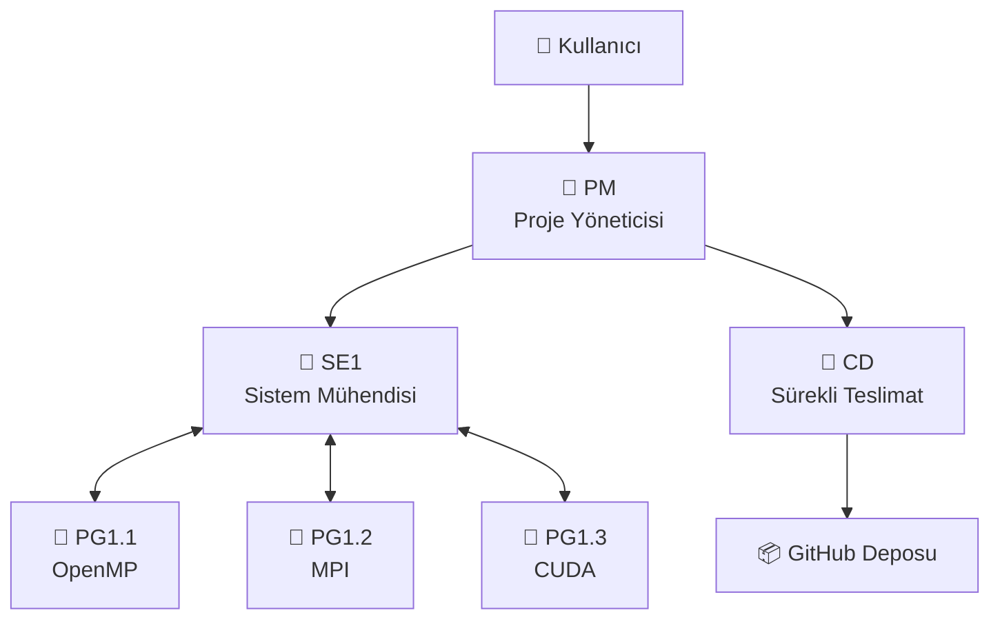
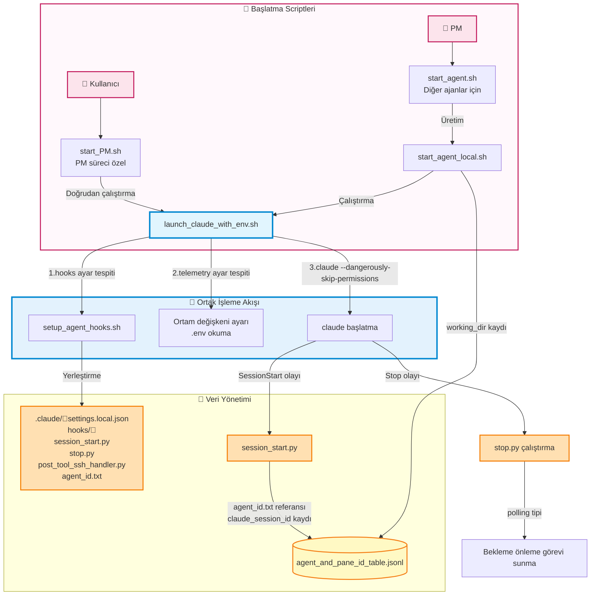
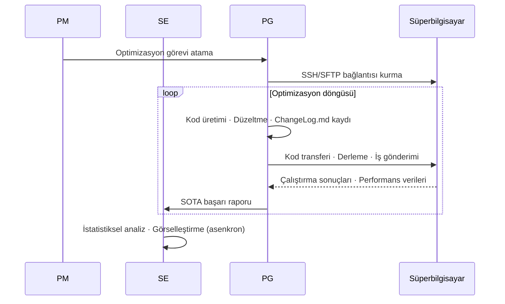
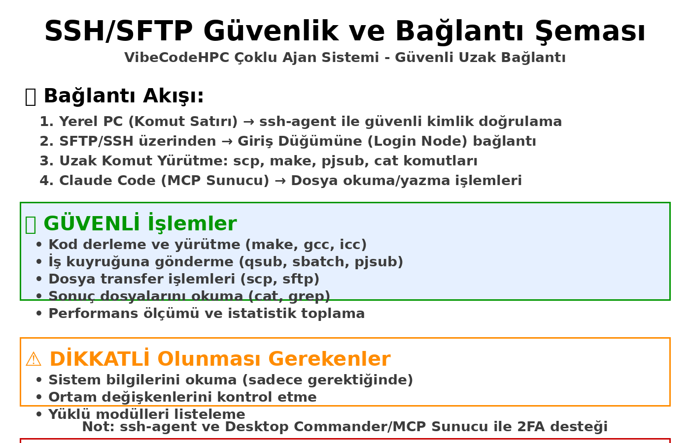

# VibeCodeHPC - HPC için Çoklu Ajanlı Vibe Kodlama

VibeCodeHPC, HPC için tam otomatik ortam kurulumu ve kod optimizasyonu gerçekleştiren bir çoklu ajan sistemidir.
Claude Code gibi CLI ortamlarında tmux kullanılarak iletişim sağlanır ve birden fazla AI ajanı işbirliği yapar.


## Makale
- [📝arXiv (2025/10/02)](https://arxiv.org/abs/2510.00031)
- [🎞️Google Slaytları (Deney Bölümü)](https://docs.google.com/presentation/d/1u9aK52nouAgjFTTchJAiZm5HglynGwl-Hwi97EK2Gis/edit?usp=sharing)
- [Çoklu Ajan Deney Sonuçları](https://github.com/Katagiri-Hoshino-Lab/VibeCodeHPC-demo-0.6.10-multi-ex1/blob/all_local_and_remote_files/User-shared/final_report.md)
- [Tekli Ajan Deney Sonuçları](https://github.com/Katagiri-Hoshino-Lab/VibeCodeHPC-demo-0.6.10-solo-ex1/blob/solo_commited_push_later/User-shared/reports/final_report.md)

## Sistem Özeti

### Özellikler
- **Hiyerarşik Çoklu Ajan**: PM → SE ↔ PG kurumsal iş bölümü yapısı
- **Proje Haritası**: Organizasyonu gerçek zamanlı görselleştiren `directory_pane_map`
- **Evrimsel Keşif**: Aşağıdan yukarıya `Flat`📁 yapısı ile verimli keşif
- **Otomatik Optimizasyon**: OpenMP, MPI, OpenACC, CUDA... gibi aşamalı paralelleştirme ve teknoloji entegrasyonu
- **Bütçe Yönetimi**: Hesaplama kaynaklarının💰 verimli dağıtımı ve takibi
- **Birleşik Günlük**: `ChangeLog.md` ile merkezi ilerleme yönetimi

### Desteklenen Ortamlar
- **Süperbilgisayar**: Furo, Fugaku gibi HPC sistemleri
- **Derleyici**: Intel OneAPI, GCC, NVIDIA HPC SDK...

## 🏗️ Ajan Yapısı



### 🤖 Ajan Rolleri

| Ajan | Rol | Ana Çıktılar | Sorumluluk Alanı |
|-------|------|------------|----------|
| **PM** | Proje Koordinasyonu | directory_pane_map.md<br/>User-shared/final_report.md | Gereksinim tanımı · Kaynak dağıtımı · Bütçe yönetimi |
| **SE** | Sistem Tasarımı | User-shared/ içindeki görseller ve raporlar | Ajan izleme · İstatistiksel analiz · Rapor oluşturma |
| **PG** | Kod Üretimi · Çalıştırma | ChangeLog.md<br/>sota_local.txt | Paralelleştirme uygulaması · SSH/SFTP bağlantısı · İş yürütme · Performans ölçümü |
| **CD** | Dağıtım Yönetimi | GitHub/ altındaki proje kopyası | SOTA başarı kodu yayınlama · Anonimleştirme |

## 📁 Dizin Yapısı

```
VibeCodeHPC/🤖PM
├── 📄 CLAUDE.md                     # Tüm ajanlar için ortak kurallar
├── 📄 requirement_definition.md     # Gereksinim tanım belgesi
├── 📄 directory_pane_map.md         # Ajan yerleşimi ve tmux bölme entegre yönetimi
├── 📄 sota_project.txt              # Proje genelinde SOTA
│
├── 📁 Agent-shared/                 # Ajanlar arası paylaşılan talimatlar
│
├── 📁 User-shared/                  # Kullanıcıya yönelik çıktılar
│   ├── 📄 final_report.md           # Nihai rapor
│   ├── 📁 reports/                  # Entegre raporlar
│   └── 📁 visualizations/           # Grafikler · Şekiller
│
├── 📁 BaseCode/                     # Mevcut orijinal kod
│
├── 📁 communication/                # Ajan başlatma · tmux iletişim sistemi
│
├── 📁 GitHub/🤖CD
│
└── 📁 Flow/TypeII/single-node/🤖SE1 # Donanım katmanı
    ├── 📄 hardware_info.md          # Hesaplama düğümü spesifikasyon bilgileri
    ├── 📄 sota_hardware.txt         # Belirtilen donanımdaki SOTA
    ├── 📁 intel2024/                 # Derleyici ortamı                       
    │   └── 📁 OpenMP/🤖PG1.1.1      # Paralelleştirme modülü
    │        ├── 📄 ChangeLog.md      # İlerleme kaydı
    │        └── 📄 sota_local.txt
    └── 📁 gcc11.3.0/                 # Alternatif derleyici
        └── 📁 CUDA/🤖PG1.2.1
```

## 🔄 İş Akışı

### Ajan Çalışma Modelleri

#### **⏳ Yoklama Tipi** (PM, SE, PG, CD)
- **Özellik**: Sürekli olarak dosyaları ve durumu kontrol eder, özerk olarak asenkron hareket eder
- **Örnek**: PM tüm ajanları sırayla izler → Kaynakları yeniden dağıtır
- **Örnek**: PG kod üretir → Özerk olarak çalıştırır → Sonuçları kontrol eder → Sonraki optimizasyon

#### **➡️ Akış Güdümlü Tip** (Yalnızca PM başlangıcı)
- **Özellik**: Bir dizi görevi sırayla yürütür, her adımda karar verir
- **Örnek**: Gereksinim tanımı → Ortam araştırması → Katman tasarımı → Ajan yerleşimi

### 1. Ajan başlatmada hooks kurulumu



Ayrıntılar için [Issue #23: Ajan başlatma ve hooks kurulum akışı](https://github.com/Katagiri-Hoshino-Lab/VibeCodeHPC-jp/issues/23) bölümüne bakınız.

### 2. Kod Optimizasyon Döngüsü



### 3. Proje Sonlandırma Yönetimi

Proje sonlandırma koşulları ve akış şeması için [Issue #33: Proje sonlandırma koşulları ve prosedürleri](https://github.com/Katagiri-Hoshino-Lab/VibeCodeHPC-jp/issues/33) bölümüne bakınız.

# 🚀 Hızlı Başlangıç

## 1. Ön Kurulum
Bu sistemi kullanmadan önce, aşağıdaki ortamların kurulu olduğundan emin olun.

### ☑️ VibeCodeHPC deposu kodunu indirin

> [!NOTE]
> Aşağıdaki nedenlerden dolayı VibeCodeHPC'yi git clone kullanmadan zip ile indirip açmanız önerilir
> 
> GitHub/📁 içinde projenin anonim kopyasını yöneten CD ajanının Git kimlik doğrulamasıyla karışıklığı önlemek için

#### GUI durumunda
[release](https://github.com/Katagiri-Hoshino-Lab/VibeCodeHPC-jp/releases) sayfasından (main'den de olur) indirilen .zip dosyasını açın

#### CLI durumunda
<details>
<summary>Komut satırıyla indirme durumu (Tıklayarak genişletin)</summary>

VibeCodeHPC'yi indirin
```bash
wget https://github.com/Katagiri-Hoshino-Lab/VibeCodeHPC-jp/archive/refs/tags/v{sürüm}.zip
```

zip'i açın
```bash
unzip VibeCodeHPC-jp-{sürüm}.zip
```

Açtıktan sonra, VibeCodeHPC'nin kök dizinine gidin
```bash
cd VibeCodeHPC-jp-{sürüm}
```
</details>

---

### ☑️ **SSH ajanı ayarı (ssh-agent)**
- Süperbilgisayara şifresiz SSH bağlantısını etkinleştirmek için, `ssh-agent`'a özel anahtarı kaydedin.
- ssh-agent'ı etkinleştirme adımları için [bu Google Slaytlarına bakınız](https://docs.google.com/presentation/d/1Nrz6KbSsL5sbaKk1nNS8ysb4sfB2dK8JZeZooPx4NSg/edit?usp=sharing)
  
  ssh-agent'ı başlatın:
  ```bash
  eval "$(ssh-agent -s)"
  ```
  
  Özel anahtarı ekleyin:
  ```bash
  ssh-add ~/.ssh/your_private_key
  ```
- Doğrulama komutu
  ```bash
  ssh-add -l
  ```
> [!NOTE]
> Bu terminal kapatılana kadar geçerlidir ve tmux terminal bölünmesinde de devralınır.


---

### ☑️ **Claude Code kurulumu ve kimlik doğrulama**
- Windows durumunda, WSL (Ubuntu 22.04) kurun.
- `nvm` üzerinden Node.js (v18 ve üzeri) kurulumu önerilir [Referans: https://zenn.dev/acntechjp/articles/eb5d6c8e71bfb9]
- Aşağıdaki komutla Claude Code'u kurun ve ilk başlatmada hesap kimlik doğrulamasını tamamlayın.
  ```bash
  npm install -g @anthropic-ai/claude-code
  claude
  ```


### ☑️ **Önerilen araçların kurulumu**
<details>
<summary>tmux, jq, Python ortamı kurulum yöntemi (Tıklayarak genişletin)</summary>

VibeCodeHPC'nin tüm özelliklerini kullanmak için aşağıdaki araçların kurulumu önerilir:

#### **tmux** - Terminal çoklayıcı (Çoklu ajan iletişim altyapısı)

Ubuntu/WSL:
```bash
sudo apt-get update && sudo apt-get install tmux
```

CentOS/RHEL/Fedora:
```bash
sudo yum install tmux  # veya sudo dnf install tmux
```

macOS:
```bash
brew install tmux
```

Kullanıcı yetkisiyle kurulum (sudo kullanılamayan ortamlar):
```bash
wget https://github.com/tmux/tmux/releases/download/3.4/tmux-3.4.tar.gz
tar xzf tmux-3.4.tar.gz
cd tmux-3.4
./configure --prefix=$HOME/.local
make && make install
export PATH=$HOME/.local/bin:$PATH  # .bashrc'ye eklenmesi önerilir
```
> Tekli ajan modu (`./start_solo.sh`) tmux olmadan da çalışır, ancak oturum yönetimi açısından tmux kullanımı önerilir

#### **jq** - JSONL dosya ayrıştırma için

Ubuntu/WSL:
```bash
sudo apt install jq
```

macOS:
```bash
brew install jq
```
> Ajanlar arası iletişimde (agent_send.sh) JSONL formatındaki tabloları verimli bir şekilde ayrıştırır


#### **Python paketleri** - Görselleştirme ve veri analizi için

Normal kurulum:
```bash
pip3 install -r requirements.txt
```

Gerekli paketler:
- **matplotlib** - Grafik oluşturma (SOTA geçişi, bütçe tüketimi, bağlam kullanım oranı)
- **numpy** - Sayısal hesaplama (doğrusal regresyon, istatistiksel işleme)
- **pandas** - Veri analizi (ChangeLog.md ayrıştırma, toplama)
- **scipy** - İstatistiksel analiz (bütçe tahmini için doğrusal regresyon)

> Bu paketler esas olarak görselleştirme scriptlerinde kullanılır. Sürüm kesin olarak belirtilmediğinden, en son sürüm sorun çıkarmaz

> Görselleştirme scriptleri `python3 script.py` ile çalıştırılır
</details>

---

### ☑️ **GitHub kimlik doğrulama (CD ajanı kullanılmıyorsa gerekli değildir)**
GitHub GUI'de depo oluşturun (Private de olabilir)

GitHub/📁 dizinine gidin
```bash
cd GitHub
```
Git'in yapılandırılmış bilgilerini görüntüleyen komut
```bash
git config -l
```

Eğer user.email ve user.name ayarlanmamışsa:
```bash
git config --global user.email xxx@yyy.zzz
git config --global user.name YOUR_GITHUB_NAME
```

GitHub dizini başlangıç ayarı
```bash
git init
```

Uzak depo ayarı
```bash
git remote add origin https://github.com/YOUR_NAME/YOUR_REPOSITORY.git
# Zaten origin varsa:
git remote set-url origin https://github.com/YOUR_NAME/YOUR_REPOSITORY.git
```
#### Git HTTPS (2 aşamalı) kimlik doğrulama yöntemi
➡Aşağıdaki gibi çeşitli seçenekler var
https://zenn.dev/miya789/articles/manager-core-for-two-factor-authentication

<details>
<summary>Seçenek 1: GCM</summary>

Git Credential Manager (GCM) önerilir.
https://github.com/git-ecosystem/git-credential-manager/releases

WSL'de kullanırken dikkat edilmesi gerekenler
https://zenn.dev/jeffi7/articles/dccb6f29fbb640
</details>


<details>
<summary>Seçenek 2: gh</summary>

gh (GitHub CLI aracı) indirin
```bash
sudo apt update
sudo apt install gh
```
gh ile kimlik doğrulama
```bash
gh auth login
```
Tarayıcı üzerinden giriş yapın
</details>

---

### ☑️ **MCP sunucu kurulumu**

Başlamadan hemen önce aşağıdaki MCP sunucularını ayarlamanız önerilir:

Proje kök dizininde📂 başlatılan PM🤖'ye MCP sunucularını verin.
**Önemli**: Claude Code başlatılmadan önce MCP'yi ayarlayın.

```bash
cd VibeCodeHPC-main
```

[Desktop Commander MCP](https://github.com/wonderwhy-er/DesktopCommanderMCP)
PM, SE, PG'nin HPC ortamına SSH/SFTP bağlantı yönetiminde kullanması için
```bash
claude mcp add desktop-commander -- npx -y @wonderwhy-er/desktop-commander
```

[mcp-screenshot](https://github.com/kazuph/mcp-screenshot)
PM'nin hata giderme vb. için tmux genel durumunu görsel olarak kontrol etmesinde kullanması için
```bash
claude mcp add mcp-screenshot -- npx -y @kazuph/mcp-screenshot
```

> [!WARNING]
> **mcp-screenshot WSL'de çalışmaz**
> WSL ortamında ekran görüntüsü özelliği çalışmadığından, OS yerel komut isteminde kullanımı önerilir.



---

## 2. Ortam Kurulumu

```bash
# Proje dizinine gidin
cd VibeCodeHPC-jp-main
```
#### OpenTelemetry'yi devre dışı bırakma (hafif çalışma)

Ortam değişkeniyle devre dışı bırakın:
```bash
export VIBECODE_ENABLE_TELEMETRY=false
```

### 🔭 İzleme Seçenekleri

#### ccusage (Basit kontrol)

```bash
# Kurulum gerektirmeden token kullanımını kontrol edin
npx ccusage@latest
```


#### 📊 Grafana + Prometheus + Loki ortamı (Önerilmeyen seçenek)

<details>

İzleme ortamının otomatik kurulumu:
```bash
./telemetry/setup_grafana.sh
```

Tarayıcıdan erişim:
```
http://localhost:3000
```

Giriş bilgileri:
- Kullanıcı adı: `admin`
- Şifre: `admin`


[ccusage](https://github.com/ryoppippi/ccusage), JSONL günlüklerinden token kullanımını analiz eden bir CLI aracıdır.


Grafana'da metrikleri kontrol etme yöntemi (Yalnızca OpenTelemetry etkin olduğunda)

#### Temel kullanım
1. **Drilldown → Metrics** seçin
   - Giriş yaptıktan sonra, özellikle ön hazırlık olmadan kullanılabilir
   - Maliyet (Cost) ve Token sayısı otomatik olarak görselleştirilir
   - Ajan bazında · Zaman serisiyle token tüketimini kontrol edin


2. **Dikkat edilmesi gerekenler**
   - Claude Code'un OpenTelemetry metrikleri OTLP üzerinden gönderilir
   - Varsayılan olarak yerel Collector'a (4317 portu) bağlanır
   - Ayrıntılı ayarlar `telemetry/otel_config.env`'de yapılabilir

</details>

### 🤖Tekli Ajan Modu (v0.5.3+)

<details>
<summary>Deney değerlendirmesi için tekli ajan modu (Tıklayarak genişletin)</summary>

Deney değerlendirmesi için tekli ajan modu eklendi. Tek bir Claude Code örneği tüm rolleri (PM/SE/PG/CD) üstlenir.

Kullanım yöntemi
```bash
# Kurulum (0 worker = tekli mod)
./communication/setup.sh 0 --project GEMM

# Ajan başlatma
./start_solo.sh
```

Başlatma sonrası, aşağıdaki prompt görüntülenir, kopyalayıp yapıştırın:
```
VibeCodeHPC'nin tekli ajan modunda çalışıyorsunuz.
Tüm rolleri (PM/SE/PG/CD) tek başına üstlenip, projeyi verimli bir şekilde ilerletiyorsunuz.

【Başlangıç Ayarı】
Önce aşağıdaki dosyaları okuyun:
- CLAUDE.md (Tüm ajanlar için ortak kurallar)
- instructions/SOLO.md (Tekli mod özel entegre prompt)
- requirement_definition.md (Varsa)
- Agent-shared/project_start_time.txt (Proje başlangıç zamanı)

【ToDoList ile Rol Yönetimi】
TodoWrite aracını aktif olarak kullanın ve her göreve rol etiketi ([PM], [SE], [PG], [CD]) ekleyerek yönetin.

【Zaman Yönetimi】
- Proje başlangıç zamanından geçen süreyi düzenli olarak kontrol edin
- requirement_definition.md'de zaman sınırı varsa kesinlikle uyun
- Bütçe yönetimiyle paralel olarak zaman verimliliğini de göz önünde bulundurun

【Verimli Yürütme Sırası】
1. [PM] Gereksinim tanımı ve ortam araştırması
2. [SE] Ortam kurulumu
3. [PG] Uygulama ve test (döngü)
4. [SE] İstatistik · Görselleştirme
5. [CD] GitHub senkronizasyonu (gerektiğinde)
6. [PM] Nihai rapor

agent_send.sh kullanılmasına gerek yoktur (iletişim karşı tarafı olmadığı için).
Tüm işlemleri dahili olarak tamamlayın.

Projeyi başlatın.
```

#### Özellikler
- **Entegre Yürütme**: Tek bir örnekte tüm rolleri yürütme
- **ToDoList Yönetimi**: Rol değişimini açıkça yönetme
- **Zaman Yönetimi**: project_start_time.txt ile geçen süreyi takip etme
- **Çoklu mod ile aynı mekanizma**: ChangeLog.md, SOTA yönetimi vb. ortaktır

Ayrıntılar için `instructions/SOLO.md` dosyasına bakınız.

</details>


### Çoklu Ajan: tmux Oturumu Oluşturma

> [!IMPORTANT]
> VibeCodeHPC birden fazla tmux oturumu kullanır:
> - **PM Oturumu**: PM ajanı özel (Kullanıcı ile etkileşim için)
>   - Varsayılan: `Team1_PM`
>   - Proje belirtildiğinde: `{ProjeAdı}_PM`
> - **Worker Oturumu**: Diğer ajanlar (SE, PG, CD)
>   - Varsayılan: `Team1_Workers1`
>   - Proje belirtildiğinde: `{ProjeAdı}_Workers1`
> 
> Minimum ajan sayısı 2'dir (SE + PG)

```bash
cd VibeCodeHPC-jp-main
./communication/setup.sh [Worker sayısı]  # Örnek: ./communication/setup.sh 12
```


Komut satırı seçenekleri:
<details>
#   [Worker sayısı]  : PM dışındaki toplam ajan sayısı (minimum: 2)
#   --project <isim> : Proje adını belirtin (Örnek: GEMM, MatMul)
#   --clean-only     : Yalnızca mevcut oturumları temizle
#   --dry-run        : Gerçek kurulum yapmadan planı göster
#   --help           : Yardım mesajını göster
</details>

#### Proje adı belirtme örneği:
```bash
./communication/setup.sh 12 --project GEMM  # Varsayılan 60 saniye aralıklarla periyodik Enter gönderimi
./communication/setup.sh 12 --project GEMM --periodic-enter 30  # 30 saniye aralıklarla
./communication/setup.sh 12 --project GEMM --periodic-enter 0  # Periyodik Enter devre dışı
```
Yukarıdaki komutla `GEMM_PM`, `GEMM_Workers1` oturumlarını oluşturur, kalan mesaj zorla gönderme özelliğini de başlatır


#### Referans yapılandırma örnekleri (Gerçek yerleşim PM tarafından belirlenir)

| Workers | SE | PG | CD | Not |
|---------|----|----|-----|------|
| 2 | 1 | 1 | 0 | Minimum yapılandırma |
| 4 | 1 | 3 | 0 | Küçük ölçekli |
| 8 | 2 | 5 | 1 | SE≧2 ile kararlı |
| 12 | 2 | 9 | 1 | Önerilen yapılandırma |
| 16 | 3 | 12 | 1 | Büyük ölçekli |

#### 2 terminal sekmesinde ayrı ayrı bağlanma
Proje adını `GEMM` olarak belirtme durumu örneği

Sekme 1 (PM ajanı için):
```bash
tmux attach-session -t GEMM_PM
```
Sekme 2 (Diğer ajanlar için):
```bash
tmux attach-session -t GEMM_Workers1
```

> [!TIP]
> setup.sh çıktısında görüntülenen gerçek oturum adını kullanın.

### 3. Proje Başlatma
Gereksinim tanımı (skip edilmişse, PM ile etkileşimli olarak oluşturun)
```bash
cp requirement_definition_template.md requirement_definition.md
# requirement_definition.md'yi düzenleyin
```

PM'yi başlatın
```bash
./start_PM.sh
```

<details>
<summary>Diğer başlatma seçenekleri (Tıklayarak genişletin)</summary>

```bash
# Yalnızca telemetry (hooks yok, bekleme önleme devre dışı)
./telemetry/launch_claude_with_env.sh PM

# Minimum yapılandırma (hooks · telemetry yok)
claude --dangerously-skip-permissions

# Yalnızca telemetry devre dışı (PM başlatma sırasında)
VIBECODE_ENABLE_TELEMETRY=false ./start_PM.sh

# ⚠️ hooks'ları devre dışı bırakmak önerilmez (Yoklama tipi ajanlar beklemede kalır)
# Yine de devre dışı bırakmak isterseniz, proje başlamadan önce aşağıdakini çalıştırın:
# export VIBECODE_ENABLE_HOOKS=false
```

**Dikkat**: PM yoklama tipi bir ajan olduğundan, hooks'ları devre dışı bırakırsanız bekleme durumuna girer.
</details>

### 🪝 Claude Code Hooks Özelliği

Ajan davranışını kontrol eden hooks özelliği ile aşağıdakiler gerçekleştirilir:

#### Ana Özellikler
- [x] **Yoklama Tipi Ajanların (PM, SE, PG, CD) Bekleme Önleme**: Periyodik görevleri otomatik sunar
- [x] **SSH/SFTP Bağlantı Desteği**: PostToolUse hook'u SSH bağlantısını tespit eder ve Desktop Commander MCP ile oturum yönetim yöntemini otomatik olarak gösterir
- [x] **session_id Takibi**: Her ajanın Claude session_id'sini kaydeder · yönetir

#### STOP Hooks Sürüm Seçimi
```bash
# v3 (Varsayılan) Olasılıklı olarak ham belge sağlar
./communication/setup.sh 12

# v2: Yalnızca dosya yolu sağlar (Eski)
./communication/setup.sh 12 --hooks v2
```

- **v3**: Tüm modlar için önerilir. `auto_tuning_config.json` ile rol bazında olasılık özelleştirmesi yapılabilir
- **v2**: Eski sürüm. Yalnızca sabit dosya listesi sağlar
- **SOLO**: Her zaman v3 kullanır (v2 belirtimi göz ardı edilir)

⚠️ hooks devre dışı bırakma önerilmez - Yoklama tipi ajanlar bekleme durumuna girer ve proje başarısız olarak sona erer riski büyük

#### Özel İzleme Modu (v0.7+)

Resmi hooks kararsız olduğunda alternatif olarak, tmux izleme ile durum tespiti sağlar.

**Etkinleştirme yöntemi**:
```bash
export CLI_HOOKS_MODE=custom
./communication/setup.sh 12
```

- **Özellik**: Stop/SessionStart/PostToolUse hooks'larını tmux capture-pane üzerinden gerçekleştirir
- **Ayrıntılar**: [Issue #45](https://github.com/Katagiri-Hoshino-Lab/VibeCodeHPC-jp/issues/45)

Ayrıntılar için `hooks/hooks_deployment_guide.md` dosyasına bakınız.


Başlatma sonrası, aşağıdaki prompt'u kopyalayıp yapıştırın:
```
Siz PM (Proje Yöneticisi)'siniz. VibeCodeHPC projesini başlatıyorsunuz.

Öncelikle aşağıdaki dosyaları okuyarak projenin genel resmini kavrayın:
- CLAUDE.md (Tüm ajanlar için ortak kurallar)
- instructions/PM.md (Sizin rol detaylarınız)
- requirement_definition.md (Proje gereksinimleri) ※Varsa
- Agent-shared/ altındaki tüm .md ve .txt dosyaları (ancak .py dosyaları hariç)

Özellikle önemli:
- max_agent_number.txt (Kullanılabilir worker sayısı)
- agent_and_pane_id_table.jsonl (Oturum yapılandırması ve ajan yönetimi)
- directory_pane_map_example.md (Ajan yerleşimi ve bölme yönetimi)
- sota_management.md (SOTA yönetim yöntemi ve family'nin önemi)

Tümünü okuduktan sonra, ilgili mevcut tmux oturumunu kullanarak projeyi başlatın. Yeni oturum oluşturmayın.
```

---

## 📈 SOTA Yönetim Sistemi

### 4 Katmanlı SOTA Takibi

| İsim | En Yüksek Performans Kapsamı |
|---------|------------------------|
| **Local** | PG'nin kendi dizini içinde |
| **Family** | Teknoloji soy ağacı (ebeveyn-çocuk nesil ilişkisi) |
| **Hardware** | Aynı donanım yapılandırması içinde (single-node/multi-node vb.) |
| **Project** | Proje genelinde |

Her katmandaki SOTA tespiti ile, verimli kıyaslama karşılaştırması ve optimizasyon politikası kararını otomatikleştirir.

### SOTA Performans Geçişinin Görselleştirilmesi


Farklı ara yazılım (gcc, intel vb.) verilerini entegre eder ve donanım (single-node) yapılandırması genelinde performans değişimi otomatik olarak çizdirilir.
Özellikle o andaki en yüksek performans: SOTA (State-of-the-Art) görselleştirilir.

### Bütçe Tüketiminin Gerçek Zamanlı Takibi


HPC bütçesinin tüketimini gerçek zamanlı olarak takip eder, doğrusal regresyonla tahmin ve eşik ulaşma zamanını (ETA) gösterir. Çoğu süperbilgisayarda yalnızca önceki güne kadarki toplam kontrol edilebilir, ancak ChangeLog.md'den anında tahmin değeri hesaplanır.

### ChangeLog.md Birleşik Formatı

Ajanlar arası bilgi paylaşımını gerçekleştiren birleşik günlük sistemi.

Gerçek `ChangeLog.md` örneği:

---

### v1.1.0
**Değişiklik**: "Blok optimizasyonu ve iş parçacığı sayısı ayarlaması"  
**Sonuç**: Teorik performansın %65.1'ine ulaşıldı `312.4 GFLOPS`  
**Yorum**: "Blok boyutu 64'ten 128'e değiştirildi, önbellek verimliliği büyük ölçüde iyileşti"  

<details>

- **Oluşturma zamanı**: `2025-08-20T10:30:00Z`
- [x] **compile**
    - status: `success`
    - warnings: `none`
- [x] **job**
    - id: `123456`
    - resource_group: `F_small`
    - start_time: `2025-08-20T10:31:00Z`
    - end_time: `2025-08-20T10:31:45Z`
    - runtime_sec: `45`
    - status: `success`
- [x] **test**
    - status: `pass`
    - performance: `312.4`
    - unit: `GFLOPS`
    - efficiency: `65.1%`
    - accuracy: `PASS (diff < 1e-6)`
- [x] **sota**
    - scope: `local`
- **params**:
    - nodes: `8`
    - threads_per_node: `32`
    - block_size: `128`
</details>

---

### v1.0.0
**Değişiklik**: "İlk OpenMP uygulaması"  
**Sonuç**: Temel çizgi oluşturuldu `248.3 GFLOPS`  
**Yorum**: "Temel OpenMP paralelleştirmesi dış döngüye uygulandı"  

<details>

- **Oluşturma zamanı**: `2025-08-20T10:15:00Z`
- [x] **compile**
    - status: `success`
    - warnings: `none`
- [x] **job**
    - id: `123454`
    - resource_group: `F_small`
    - start_time: `2025-08-20T10:16:00Z`
    - end_time: `2025-08-20T10:16:48Z`
    - runtime_sec: `48`
    - status: `success`
- [x] **test**
    - status: `pass`
    - performance: `248.3`
    - unit: `GFLOPS`
    - efficiency: `51.7%`
- **params**:
    - nodes: `8`
    - threads_per_node: `32`
</details>

---

- Ayrıntılar: [Agent-shared/change_log/ChangeLog_format.md](Agent-shared/change_log/ChangeLog_format.md)
- PM Geçersiz Kılma: [Agent-shared/change_log/ChangeLog_format_PM_override_template.md](Agent-shared/change_log/ChangeLog_format_PM_override_template.md)

## 🧬 Evrimsel Optimizasyon Yaklaşımı

### Aşamalı Evrim Süreci
1.  **🌱 Tohum Dönemi**: Tek teknolojinin bireysel optimizasyonu (`/OpenMP/`, `/MPI/`, `/AVX512/`, `/CUDA/`)
2.  **🌿 Çaprazlama Dönemi**: Umut verici teknolojilerin füzyonu (`/OpenMP_MPI/`, `/MPI_CUDA/`)
3.  **🌳 Islah Dönemi**: Gelişmiş kombinasyonlar (`/OpenMP_MPI_AVX512/`)

### 📁Flat Directory Avantajları
- **Katman Belirsizliğinin Giderilmesi**: `/MPI/OpenMP/` vs `/OpenMP/MPI/` tekrarını önleme
- **Paralel Keşif Verimliliği**: Birden fazla ajan tarafından eşzamanlı optimizasyon
- **Teknoloji Mirası**: Üst neslin alt neslin başarılarına başvurabilmesi

- [ ] Ayrıntılar: [Agent-shared/strategies/auto_tuning/evolutional_flat_dir.md](Agent-shared/strategies/auto_tuning/evolutional_flat_dir.md)

## 🔍 Dosya Tabanlı Bilgi Paylaşımı

### Çıktıların Yönetimi
- Çıktı yerleşimi: [Agent-shared/artifacts_position.md](Agent-shared/artifacts_position.md)
- SOTA yönetimi: [Agent-shared/sota/sota_management.md](Agent-shared/sota/sota_management.md)
- Rapor katmanları: [Agent-shared/report_hierarchy.md](Agent-shared/report_hierarchy.md)

> [!IMPORTANT]
> **Kullanıcıya Yönelik Çıktılar**
> Projenin çıktıları `User-shared/` dizininde toplanır:

> [!TIP]
> **Ajan Görselleştirmesi**
> Her ajanın bağlam geçişini görselleştirin
> SE sorumluluğundaki istatistiksel analiz ile, performans geçişini ve SOTA güncelleme geçmişini gerçek zamanlı izleme.

## 🔭 İzleme ve Metrikler

### Yerleşik Bağlam İzleme


Ajan bazında bağlam kullanım miktarını otomatik olarak takip eder, auto-compact (bellek sıfırlama) oluşumunu tahmin eder ve tespit eden izleme özelliği standart olarak yerleşiktir. Her ajanın tüketim miktarını görselleştirir ve verimli kaynak yönetimini destekler.

### OpenTelemetry İzleme (İsteğe Bağlı)

Daha ayrıntılı token kullanım miktarı, maliyet, araç yürütme durumu analizi gerekiyorsa, yerleşik OpenTelemetry ile izleme mümkündür. Ancak süperbilgisayar ortamına kurulumun zor olabileceği için, isteğe bağlı özellik olarak sunulmaktadır.

İzleme ayarları için [「2. Ortam Kurulumu」](https://github.com/Katagiri-Hoshino-Lab/VibeCodeHPC-jp#-%E7%9B%A3%E8%A6%96%E3%82%AA%E3%83%97%E3%82%B7%E3%83%A7%E3%83%B3) bölümündeki izleme seçeneklerine bakınız.

Ayrıntılı ayarlar: [telemetry/README.md](telemetry/README.md)

## 🔒 Güvenlik

- [x] **Gizli Bilgi Koruması**: `_remote_info/` Git yönetimi dışında
- [x] **Otomatik Anonimleştirme**: GitHub'da yayınlarken kullanıcı ID'si vb. anonimleştirilir
- [x] **Yalnızca SOTA Başarı Kodu Yayınlanır**: Performans artışı sağlayan kod yalnızca
- [x] **Katman Bazlı Erişim Kontrolü**: Ajan rolüne göre okuma yazma yetkileri

## 📄 Lisans

Bu proje [Apache License 2.0](LICENSE) altında yayınlanmıştır. Özgürce kullanabilirsiniz, ancak kullanımdan doğan sorumluluk kabul edilmez.
