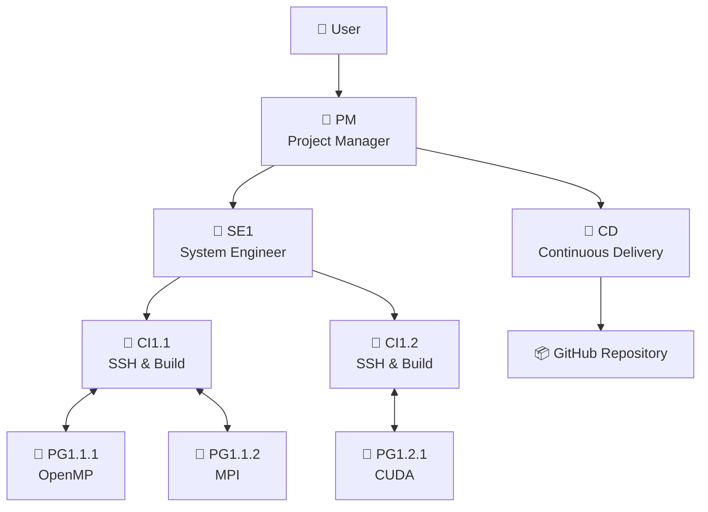
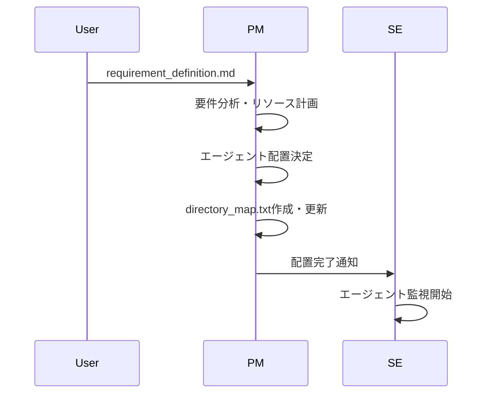
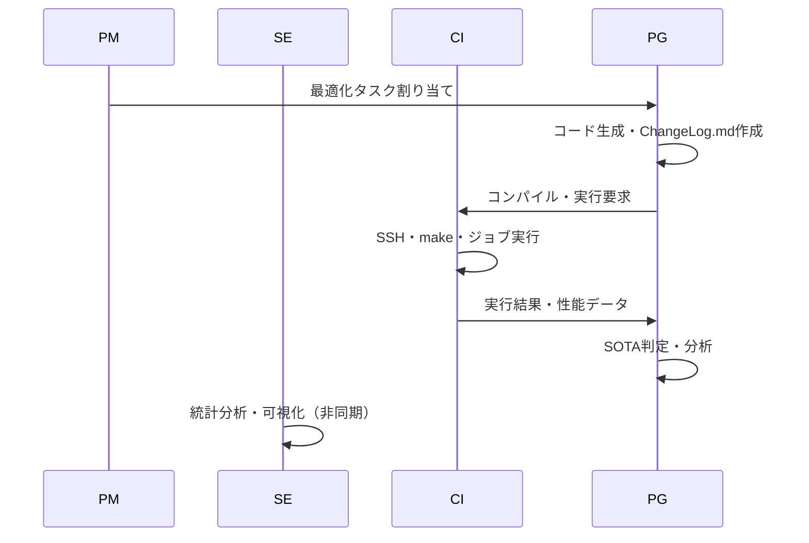

# 🎯OpenCodeAT - CLI Multi-Agent System for Auto-Tuning HPC Code

OpenCodeATは、HPCコードの自動最適化を行うマルチエージェントシステムです。
Claude Code等のCLI環境でtmux-based通信により、複数のAIエージェントが協調してコードの並列化・最適化を実現します。


## システム概要

### 特徴
- **階層型マルチエージェント**: PM → SE → CI ↔ PG の企業的分業体制
- **プロジェクト地図**: 組織をリアルタイムに視覚化する`directory_map`
- **進化的探索**: ボトムアップ型の`Flat`📁構造による効率的探索
- **自動最適化**: OpenMP、MPI、OpenACC、CUDA...等の段階的並列化と技術融合
- **予算管理**: 計算資源💰の効率的配分と追跡
- **統一ログ**: `ChangeLog.md`による一元的な進捗管理
- **SOTA追跡**: 4階層での性能指標
  ```
  エージェント別 / 進化的階層別 / 指定ハードウェア内 / Project全体
  ```

### 対応環境
- **スパコン**: 不老、富岳等のHPCシステム
- **コンパイラ**: Intel OneAPI、GCC、NVIDIA HPC SDK...

## 🏗️ エージェント構成



### 🤖 エージェント役割

| Agent | 役割 | 主要成果物 | 責任範囲 |
|-------|------|------------|----------|
| **PM** | プロジェクト統括 | assign_history.txt<br/>User-shared/final_report.md | 要件定義・リソース配分・予算管理 |
| **SE** | システム設計 | User-shared/reports/<br/>User-shared/visualizations/ | エージェント監視・統計分析・レポート生成 |
| **CI** | ビルド・実行 | hardware_info.txt<br/>job_list_CI*.txt | SSH接続・コンパイル・ジョブ実行 |
| **PG** | コード生成 | ChangeLog.md<br/>sota_local.txt | 並列化実装・性能測定・SOTA判定 |
| **CD** | デプロイ管理 | GitHub/以下のprojectコピー | SOTA達成コード公開・匿名化 |
| **ID** | 情報表示 | エージェント配置図 | tmux全体の可視化 |

## 📁 ディレクトリ構造

```
OpenCodeAT/🤖PM
├── 📄 CLAUDE.md                     # 全エージェント共通ルール
├── 📄 requirement_definition.md     # 要件定義書
├── 📄 sota_project.txt              # プロジェクト全体SOTA
│
├── 📁 Agent-shared/                 # 全エージェント共有
│   ├── 📄 ChangeLog_format.md       # 基本フォーマット
│   ├── 📄 ChangeLog_format_PM_override.md # PMオーバーライド
│   ├── 📄 directory_map.txt         # エージェント配置
│   └── 📄 changelog_report_template.py # レポート生成テンプレート
│
├── 📁 User-shared/                  # ユーザ向け成果物
│   ├── 📄 final_report.md           # 最終報告書
│   ├── 📁 reports/                  # 統合レポート
│   └── 📁 visualizations/           # グラフ・図表
│
├── 📁 BaseCode/                     # 既存のオリジナルコード
│
├── 📁 communication/                # tmux通信システム
│   ├── 🔧 agent-send.sh
│   └── 🔧 setup.sh
│
├── 📁 GitHub/🤖CD
│
└── 📁 Flow/TypeII/single-node/🤖SE1 # ハードウェア階層
    ├── 📄 hardware_info.txt         # ハードウェア仕様（理論性能含む）
    ├── 📄 sota_global.txt           # 指定ハード内の Global SOTA
    ├── 📁 intel2024/🤖CI1.1         # コンパイラ環境                       
    │   └── 📁 OpenMP/🤖PG1.1.1      # 並列化モジュール
    │        ├── 📄 ChangeLog.md      # 進捗記録
    │        ├── 📄 sota_local.txt
    │        └── 📄 matrix_v1.2.3.c
    └── 📁 gcc11.3.0/🤖CI1.2        # 別コンパイラ
        └── 📁 CUDA/🤖PG1.2.1
```

## 🔄 ワークフロー

### エージェント動作パターン

#### **📨 イベントドリブン型** (PG, ID)
- **特徴**: メッセージ受信時にのみ反応し、完了後は待機
- **例**: PGがコード生成→CIに実行依頼→結果待ち→次の最適化

#### **⏳ ポーリング型** (PM, SE, CI, CD)
- **特徴**: 常にファイルやステータスを確認し、自律的に非同期で行動
- **例**: PMが全エージェントを巡回監視→リソース再配分

#### **➡️ フロー駆動型** (PM初期のみ)
- **特徴**: 一連のタスクを順次実行し、各ステップで判断
- **例**: 要件定義→環境調査→階層設計→エージェント配置

### 1. プロジェクト初期化



### 2. コード最適化サイクル



## 🚀 クイックスタート

### 1. 事前セットアップ
本システムを利用する前に、以下の環境がセットアップ済みであることを確認してください。

#### ☑️ OpenCodeATリポジトリのコードをダウンロード

> [!NOTE]
> 以下の理由から OpenCodeATは git clone を用いずzipでダウンロードし展開することを推奨
> 
> GitHub/📁でプロジェクトの匿名版コピーを管理するCDエージェントのGit認証との混同を避ける

#### GUIの場合
[release](https://github.com/Katagiri-Hoshino-Lab/OpenCodeAT-jp/releases)から
ダウンロードした.zipを展開

#### CLIの場合
<details>
<summary>コマンドラインでダウンロードする場合（クリックで展開）</summary>

OpenCodeATをダウンロード
```bash
wget https://github.com/Katagiri-Hoshino-Lab/OpenCodeAT-jp/archive/refs/tags/v{バージョン}.zip
```

zip解凍
```bash
unzip OpenCodeAT-jp-{バージョン}.zip
```

展開後、OpenCodeATのルートへ移動
```bash
cd OpenCodeAT-jp-{バージョン}
```
</details>

---

#### ☑️ **GitHubの認証（CDエージェントを使わない場合は不要）**
GitHubのGUIでリポジトリ作成（Privateも可）

GitHub/📁に移動
```bash
cd GitHub
```
Gitの設定済み情報が表示するコマンド
```bash
git config -l
```
GitHubディレクトリの初期設定
```bash
git init
```
GitHubアカウント情報を登録
```bash
git config --global user.email xxx@yyy.zzz
git config --global user.name YOUR_GITHUB_NAME
git remote add origin https://github.com/YOUR_NAME/YOUR_REPOSITORY.git
# 既に origin がある場合は:
git remote set-url origin https://github.com/YOUR_NAME/YOUR_REPOSITORY.git
```
##### GitのHTTPS(２段階)認証の方法
➡以下のように選択肢は様々
https://zenn.dev/miya789/articles/manager-core-for-two-factor-authentication

<details>
<summary>選択肢１：GCM</summary>

Git Credential Manager (GCM)が推奨。
https://github.com/git-ecosystem/git-credential-manager/releases

WSLで使用する際の注意
https://zenn.dev/jeffi7/articles/dccb6f29fbb640
</details>


<details>
<summary>選択肢２：gh</summary>

gh (GitHub CLIツール)ダウンロード
```bash
sudo apt update
sudo apt install gh
```
ghでの認証
```bash
gh auth login
```
ブラウザ経由でログイン
</details>

---

#### ☑️ **SSHエージェントの設定 (ssh-agent)**
- スーパーコンピュータへのパスワード不要のSSH接続を有効にするため、`ssh-agent` に秘密鍵を登録します。
- ssh-agentを有効にする手順は[こちらのGoogleスライドを参照](https://docs.google.com/presentation/d/1Nrz6KbSsL5sbaKk1nNS8ysb4sfB2dK8JZeZooPx4NSg/edit?usp=sharing)
  
  ssh-agentを起動：
  ```bash
  eval "$(ssh-agent -s)"
  ```
  
  秘密鍵を追加：
  ```bash
  ssh-add ~/.ssh/your_private_key
  ```
- 確認コマンド
  ```bash
  ssh-add -l
  ```
> [!NOTE]
> このターミナルを閉じるまでは有効で、tmuxのターミナル分割でも引き継がれます。


---

#### ☑️ **Claude Codeのインストールと認証**
- Windowsの場合は、WSL (Ubuntu 22.04) をセットアップします。
- `nvm` 経由でのNode.js (v18以上) のインストールを推奨します [参考: https://zenn.dev/acntechjp/articles/eb5d6c8e71bfb9]
- 以下のコマンドでClaude Codeをインストールし、初回起動時にアカウント認証を完了させてください。
  ```bash
  npm install -g @anthropic-ai/claude-code
  claude
  ```

---

#### ☑️ **MCPサーバのセットアップ**

プロジェクト開始前に以下のMCPサーバを設定することを推奨します：

**Desktop Commander MCP** - HPC環境へのSSH/SFTP接続を管理  
[https://github.com/wonderwhy-er/DesktopCommanderMCP](https://github.com/wonderwhy-er/DesktopCommanderMCP)
```bash
# PMとCIエージェントが使用
claude mcp add desktop-commander -- npx -y @wonderwhy-er/desktop-commander
```

**mcp-screenshot** - tmux全体の状況を視覚的に確認  
[https://github.com/kazuph/mcp-screenshot](https://github.com/kazuph/mcp-screenshot)
```bash
# PMの定期巡回や障害対応で活用
claude mcp add mcp-screenshot -- npx -y @kazuph/mcp-screenshot
```

設定後、Claude Codeを再起動して有効化してください。


---

### 2. 環境セットアップ

```bash
# プロジェクトディレクトリに移動
cd OpenCodeAT-jp
```

### 🔭 監視オプション

#### 📊 Grafana + Prometheus + Loki環境（推奨）

監視環境の自動セットアップ:
```bash
./telemetry/setup_grafana.sh
```

ブラウザでアクセス:
```
http://localhost:3000
```

ログイン情報:
- ユーザー名: `admin`
- パスワード: `admin`

<details>
<summary>その他の監視オプション（クリックで展開）</summary>

#### テレメトリの無効化（軽量動作）

環境変数で無効化:
```bash
export OPENCODEAT_ENABLE_TELEMETRY=false
```

または起動時に指定:
```bash
OPENCODEAT_ENABLE_TELEMETRY=false ./communication/start_agent.sh PG1.1.1 /path
```

#### 代替案: ccusage（簡易確認）

```bash
# セットアップ不要でトークン使用量を確認
npx ccusage@latest
```

[ccusage](https://github.com/ryoppippi/ccusage)は、JSONLログからトークン使用量を分析するCLIツールです。

</details>


<details>
<summary>📊 Grafanaでメトリクスを確認する方法（OpenTelemetry有効時のみ）（クリックで展開）</summary>

#### メトリクスの確認手順
1. **Explore機能を使う**（最も簡単）
   - 左メニューから「Explore」（コンパスアイコン）をクリック
   - データソースで「Prometheus」を選択
   - メトリクス名を入力して「Run query」

2. **よく使うメトリクス**
   
   エージェント別トークン使用量：
   ```promql
   agent_token_usage{agent_id="SE1"}
   ```
   
   ツール実行回数（全エージェント）：
   ```promql
   sum by (agent_id, tool_name) (tool_execution_total)
   ```
   
   セッション別コスト：
   ```promql
   sum by (session_id) (session_cost)
   ```

3. **ダッシュボード作成**（オプション）
   - 「Dashboards」→「New」→「New Dashboard」
   - 「Add visualization」でグラフを追加
   - クエリは後から自由に変更可能
   - 過去のデータも遡って確認できます

</details>

> [!NOTE]
> - 短時間のテストや既に他のOTLPバックエンドがある場合はスキップ可能

#### 2.1. tmuxセッションセットアップ

> [!IMPORTANT]
> OpenCodeATは2つのtmuxセッションを使用します：
> - `pm_session`: PMエージェント専用（ユーザとの対話用）
> - `opencodeat`: その他のエージェント（SE, CI, PG, CD）
> 
> 最小エージェント数は3です（SE + CI + PG）。解像度に応じて調整してください。

```bash
cd OpenCodeAT-jp
./communication/setup.sh [ワーカー数(PM除く)]  # 例: ./communication/setup.sh 11

# コマンドラインオプション:
#   [ワーカー数]     : PM以外のエージェント総数 (最小: 3)
#   --clean-only     : 既存セッションのクリーンアップのみ実行
#   --dry-run        : 実際のセットアップを行わずに計画を表示
#   --help           : ヘルプメッセージを表示
```

#### 参考構成例（実際の配置はPMが決定）

| Workers | SE | CI | PG | CD | 備考 |
|---------|----|----|----|----|------|
| 3 | 1 | 1 | 1 | 0 | 最小構成 |
| 6 | 1 | 1 | 3 | 1 | ジョブバインド型 |
| 8 | 2 | 2 | 3 | 1 | SE≧2で安定 |
| 11 | 2 | 3 | 5 | 1 | 推奨構成 |
| 15 | 2 | 4 | 8 | 1 | 大規模 |

#### 2つのターミナルタブでそれぞれアタッチ

タブ1（PMエージェント用）:
```bash
tmux attach-session -t pm_session
```

タブ2（その他のエージェント用）:
```bash
tmux attach-session -t opencodeat
```

### 3. プロジェクト開始
要件定義（skipした場合はPMと対話的に作成）
```bash
cp requirement_definition_template.md requirement_definition.md
# requirement_definition.mdを編集
```

PMを手動起動
```bash
# pm_sessionで以下を実行:
# 方法1: telemetry付きで起動（推奨、メトリクス収集あり）
./telemetry/start_agent_with_telemetry.sh PM

# 方法2: telemetryなしで起動（メトリクス収集なし）
claude --dangerously-skip-permissions
```

起動後、以下のプロンプトをコピーして貼り付け：
```
あなたはPM（Project Manager）です。OpenCodeATプロジェクトを開始します。

まず以下のファイルを読み込んでプロジェクトの全体像を把握してください：
- CLAUDE.md（全エージェント共通ルール）
- instructions/PM.md（あなたの役割詳細）
- requirement_definition.md（プロジェクト要件）※存在する場合
- Agent-shared/以下の全ての.mdと.txtファイル（.pyファイルは除く）

特に重要：
- max_agent_number.txt（利用可能なワーカー数）
- agent_and_pane_id_table.txt（既存セッション構成）
- directory_map.txt（エージェント配置管理）

全て読み込んだ後、既存の opencodeat セッションを活用してプロジェクトを初朞化してください。新規セッションは作成しないでください。
```

---

## 📈 SOTA管理システム

### 4階層SOTA追跡
- **Local**: PG自身のディレクトリ内での最高性能
- **Parent**: 継承元フォルダ全体での最高性能（仮想的に算出）
- **Global**: ハードウェア全体での最高性能
- **Project**: プロジェクト全体での最高性能

各階層でのSOTA判定により、効率的なベンチマーク比較と最適化方針決定を自動化。

### ChangeLog.md統一フォーマット

エージェント間の情報共有を実現する統一ログシステム。

実際のChangeLog.md例：

---
### v1.1.0
**変更点**: "ブロッキング最適化とスレッド数調整"  
**結果**: 理論性能の65.1%達成 `312.4 GFLOPS`  
**コメント**: "ブロックサイズを64から128に変更、キャッシュ効率が大幅改善"  

<details>

- [x] **compile**
    - status: `success`
    - request_id: `PG1.1.1-CI1.1-001`
    - log: `/results/compile_v1.1.0.log`
- [x] **job**
    - id: `123456`
    - status: `success`
- [x] **test**
    - status: `pass`
    - performance: `312.4`
    - unit: `GFLOPS`
    - efficiency: `65.1%`
- [x] **sota**
    - scope: `local`
- **params**:
    - nodes: `8`
    - threads_per_node: `32`
    - block_size: `128`

</details>

---
### v1.0.0
**変更点**: "初期OpenMP実装"  
**結果**: ベースライン確立 `248.3 GFLOPS`  
**コメント**: "基本的なOpenMP並列化を外側ループに適用"  

<details>

- [x] **compile**
    - status: `success`
    - request_id: `PG1.1.1-CI1.1-002`
- [x] **job**
    - id: `123454`
    - status: `success`
- [x] **test**
    - status: `pass`
    - performance: `248.3`
    - unit: `GFLOPS`
    - efficiency: `51.7%`
- **params**:
    - nodes: `8`
    - threads_per_node: `32`

</details>

---

- 詳細：[Agent-shared/ChangeLog_format.md](Agent-shared/ChangeLog_format.md)
- PMオーバーライド：[Agent-shared/ChangeLog_format_PM_override_template.md](Agent-shared/ChangeLog_format_PM_override_template.md)

## 🧬 進化的最適化アプローチ

### 段階的進化プロセス
1.  **🌱 種子期**: 単一技術の個別最適化 (`/OpenMP/`, `/MPI/`, `/AVX512/`, `/CUDA/`)
2.  **🌿 交配期**: 有望技術の融合 (`/OpenMP_MPI/`, `/MPI_CUDA/`)
3.  **🌳 品種改良期**: 高度な組み合わせ (`/OpenMP_MPI_AVX512/`)

### 📁Flat Directory の利点
- **階層の曖昧性解消**: `/MPI/OpenMP/` vs `/OpenMP/MPI/` の重複排除
- **並列探索効率化**: 複数エージェントによる同時最適化
- **技術継承**: 上位世代が下位世代の成果を参照可能

- [ ] 詳細: [Agent-shared/evolutional_flat_dir.md](Agent-shared/evolutional_flat_dir.md)

## 🔍 ファイルベースの情報共有

### 成果物の管理
- 成果物配置: [Agent-shared/artifacts_position.md](Agent-shared/artifacts_position.md)
- SOTA管理: [Agent-shared/sota_management.md](Agent-shared/sota_management.md)
- レポート階層: [Agent-shared/report_hierarchy.md](Agent-shared/report_hierarchy.md)

> [!TIP]
> **エージェント可視化**
> SE担当の統計解析により、性能推移とSOTA更新履歴をリアルタイム監視。

> [!IMPORTANT]
> **ユーザ向け成果物**
> プロジェクトの成果は`User-shared/`ディレクトリに集約されます：
> - 最終報告書（final_report.md）
> - 統合レポート（reports/）
> - 性能グラフ・図表（visualizations/）

## 🔭 OpenTelemetry監視

エージェントのトークン使用量やコスト、ツール実行状況をOpenTelemetryで監視・分析します。
監視設定は「2. 環境セットアップ」の監視オプションを参照してください。

詳細設定: [telemetry/README.md](telemetry/README.md)

## 🔒 セキュリティ

- [x] **機密情報保護**: `_remote_info/`はGit管理外
- [x] **自動匿名化**: GitHub公開時にユーザID等を匿名化
- [x] **SOTA達成コードのみ公開**: 性能向上を実現したコードのみ
- [x] **階層別アクセス制御**: Agent役割に応じた読み書き権限

## 📄 ライセンス

このプロジェクトは[Apache License 2.0](LICENSE)の下で公開されています。自由にご利用いただけますが、使用に関する責任は負いかねます。
