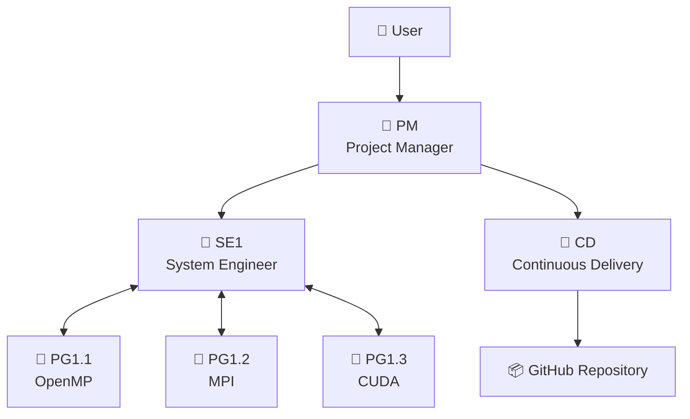
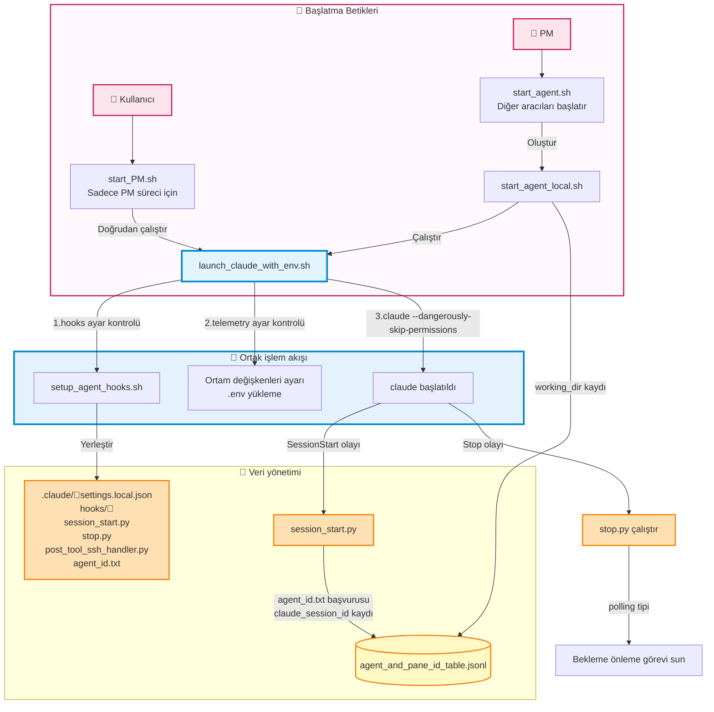
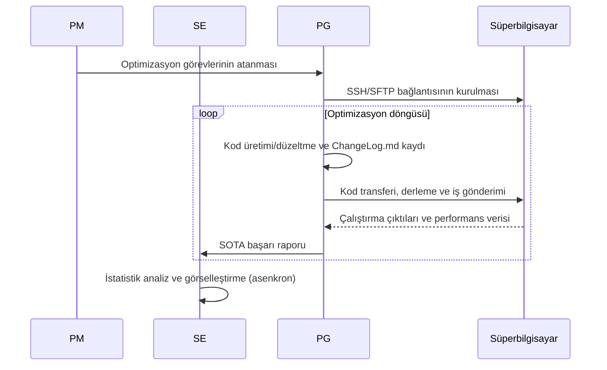

# VibeCodeHPC - Multi Agentic Vibe Coding for HPC

VibeCodeHPC, HPC için tam otomatik ortam kurulumunu ve kod optimizasyonunu gerçekleştiren çoklu aracı bir sistemdir.
Claude Code gibi CLI ortamlarında tmux tabanlı iletişimle birden fazla yapay zekâ aracısı birlikte çalışır.


## Makale
- [📝arXiv (2025/10/02)](https://arxiv.org/abs/2510.00031)
- [🎞️Google Slaytlar (Deneyler)](https://docs.google.com/presentation/d/1u9aK52nouAgjFTTchJAiZm5HglynGwl-Hwi97EK2Gis/edit?usp=sharing)
- [Çoklu aracı deney sonuçları](https://github.com/Katagiri-Hoshino-Lab/VibeCodeHPC-demo-0.6.10-multi-ex1/blob/all_local_and_remote_files/User-shared/final_report.md)
- [Tek aracı deney sonuçları](https://github.com/Katagiri-Hoshino-Lab/VibeCodeHPC-demo-0.6.10-solo-ex1/blob/solo_commited_push_later/User-shared/reports/final_report.md)

## Sistem Özeti

### Özellikler
- **Hiyerarşik çoklu aracı**: PM → SE ↔ PG kurumsal iş bölümü
- **Proje haritası**: Organizasyonu gerçek zamanlı görselleştiren `directory_pane_map`
- **Evrimsel arama**: Alttan-üstte `Flat`📁 yapı ile verimli keşif
- **Otomatik optimizasyon**: OpenMP, MPI, OpenACC, CUDA... ile kademeli paralelleştirme ve teknoloji bileşimi
- **Bütçe yönetimi**: Hesaplama kaynaklarının 💰 verimli tahsisi ve takibi
- **Birleşik günlük**: `ChangeLog.md` ile merkezi ilerleme yönetimi

### Desteklenen Ortamlar
- **Süper bilgisayarlar**: Furo, Fugaku gibi HPC sistemleri
- **Derleyiciler**: Intel OneAPI, GCC, NVIDIA HPC SDK...

## 🏗️ Aracı Yapısı



### 🤖 Aracı Rolleri

| Aracı | Rol | Ana çıktılar | Sorumluluk alanı |
|-------|------|------------|----------|
| **PM** | Proje koordinasyonu | directory_pane_map.md<br/>User-shared/final_report.md | Gereksinim tanımı, kaynak tahsisi, bütçe yönetimi |
| **SE** | Sistem tasarımı | User-shared/ içindeki görseller ve raporlar | Aracı izleme, istatistik analiz, raporlama |
| **PG** | Kod üretimi/çalıştırma | ChangeLog.md<br/>sota_local.txt | Paralelleştirme, SSH/SFTP, iş çalıştırma, performans ölçümü |
| **CD** | Dağıtım yönetimi | GitHub/ altındaki proje kopyaları | SOTA kod yayımlama ve anonimleştirme |

## 📁 Dizin Yapısı

```
VibeCodeHPC/🤖PM
├── 📄 CLAUDE.md                     # 全エージェント# Tüm aracılar için ortak kurallar
├── 📄 requirement_definition.md     # 要件定義書# Gereksinim tanımı belgesi
├── 📄 directory_pane_map.md         # エージェント配# Aracı yerleşimi ve tmux pane bütünleşik yönetimi
├── 📄 sota_project.txt              # プロジェクト全# Proje genel SOTA bilgisi
│
├── 📁 Agent-shared/                 # エージェント共# Aracı paylaşım talimatları
│
├── 📁 User-shared/                  # ユーザ向け成果# Kullanıcıya yönelik çıktı dosyaları
│   ├── 📄 final_report.md           # 最終報告書# Nihai rapor
│   ├── 📁 reports/                  # 統合レポート# Birleşik raporlar
│   └── 📁 visualizations/           # グラフ・図表# Grafikler ve çizimler
│
├── 📁 BaseCode/                     # 既存のオリジナ# Mevcut özgün kodlar
│
├── 📁 communication/                # エージェント起# Aracı başlatma ve tmux iletişim sistemi
│
├── 📁 GitHub/🤖CD
│
└── 📁 Flow/TypeII/single-node/🤖SE1 # ハードウェア階層# Donanım katmanı
    ├── 📄 hardware_info.md          # 計算ノードのス# Hesaplama düğümü özellik bilgileri
    ├── 📄 sota_hardware.txt         # 指定ハード内の# Belirli donanım için SOTA
    ├── 📁 intel2024/                 # コンパイラ環境# Derleyici ortamı                       
    │   └── 📁 OpenMP/🤖PG1.1.1      # 並列化モジュール# Paralelleştirme modülü
    │        ├── 📄 ChangeLog.md      # 進捗記録# İlerleme kaydı
    │        └── 📄 sota_local.txt
    └── 📁 gcc11.3.0/                 # 別コンパイラ# Alternatif derleyici
        └── 📁 CUDA/🤖PG1.2.1
```

## 🔄 İş Akışı

### Aracı Çalışma Desenleri

#### **⏳ Yoklama (Polling) tipi** (PM, SE, PG, CD)
- **Özellik**: Dosya ve durumları sürekli kontrol eder; otonom, asenkron hareket eder
- **Örnek**: PM tüm aracıları dolaşarak izler → kaynakları yeniden tahsis eder
- **Örnek**: PG kod üretir → otonom çalıştırır → sonucu inceler → bir sonraki optimizasyon

#### **➡️ Akış (Flow) güdümlü** (yalnızca PM başlangıçta)
- **Özellik**: Görevleri sırayla yürütür ve her adımda karar verir
- **Örnek**: Gereksinim tanımı → ortam araştırması → hiyerarşik tasarım → aracı yerleşimi

### 1. Aracı başlatılırken hooks kurulumu



Ayrıntılar için bkz. [Issue #23: Aracı başlatma ve hooks kurulum akışı](https://github.com/Katagiri-Hoshino-Lab/VibeCodeHPC-jp/issues/23).

### 2. Kod optimizasyon döngüsü



### 3. Proje kapanış yönetimi

Proje kapanış koşulları ve akış şeması için bkz. [Issue #33: Proje kapanış koşulları ve adımlar](https://github.com/Katagiri-Hoshino-Lab/VibeCodeHPC-jp/issues/33).

# 🚀 Hızlı Başlangıç

## 1. Ön hazırlık
Bu sistemi kullanmadan önce aşağıdaki ortamın kurulu olduğunu doğrulayın.

### ☑️ VibeCodeHPC deposu kodlarını indirin

> [!NOTE]
> Aşağıdaki sebeplerle VibeCodeHPC için git clone yerine zip indirip açmanız önerilir
> 
> GitHub/📁 içindeki anonim proje kopyalarını yöneten CD aracısının Git kimliğiyle karışıklığı önlemek

#### GUI için
[release](https://github.com/Katagiri-Hoshino-Lab/VibeCodeHPC-jp/releases) sayfasından (main de olabilir) indirdiğiniz .zip’i açın

#### CLI için
<details>
<summary>Komut satırından indirme (genişletmek için tıklayın)</summary>

VibeCodeHPC’yi indirin
```bash
wget https://github.com/Katagiri-Hoshino-Lab/VibeCodeHPC-jp/archive/refs/tags/v{sürüm}.zip
```

Zip’i açın
```bash
unzip VibeCodeHPC-jp-{sürüm}.zip
```

Açtıktan sonra VibeCodeHPC kök dizinine geçin
```bash
cd VibeCodeHPC-jp-{sürüm}
```
</details>

---

### ☑️ **SSH aracısı ayarı (ssh-agent)**
- Süper bilgisayara parolasız SSH için `ssh-agent` içine özel anahtarınızı ekleyin.
- ssh-agent etkinleştirme adımları için [bu Google Sunuları’na bakın](https://docs.google.com/presentation/d/1Nrz6KbSsL5sbaKk1nNS8ysb4sfB2dK8JZeZooPx4NSg/edit?usp=sharing)
  
  ssh-agent’i başlatın:
  ```bash
  eval "$(ssh-agent -s)"
  ```
  
  Özel anahtar ekleyin:
  ```bash
  ssh-add ~/.ssh/your_private_key
  ```
- Doğrulama komutu
  ```bash
  ssh-add -l
  ```
> [!NOTE]
> Bu terminal kapanana kadar geçerlidir ve tmux bölünmüş panellerinde devredilir.


---

### ☑️ **Claude Code kurulumu ve kimlik doğrulaması**
- Windows için WSL (Ubuntu 22.04) kurun.
- Node.js (v18+) için `nvm` ile kurulum önerilir [bkz: https://zenn.dev/acntechjp/articles/eb5d6c8e71bfb9]
- Aşağıdaki komutla Claude Code’u kurun ve ilk çalıştırmada hesap doğrulamasını tamamlayın.
  ```bash
  npm install -g @anthropic-ai/claude-code
  claude
  ```


### ☑️ **Önerilen araçların kurulumu**
<details>
<summary>tmux, jq, Python ortamı kurulum yöntemleri (genişletmek için tıklayın)</summary>

VibeCodeHPC’nin tüm özelliklerinden yararlanmak için aşağıdaki araçları kurmanız önerilir:

#### **tmux** - Terminal çoklayıcı (çoklu aracı iletişim altyapısı)

Ubuntu/WSL:
```bash
sudo apt-get update && sudo apt-get install tmux
```

CentOS/RHEL/Fedora:
```bash
sudo yum install tmux  # veya sudo dnf install tmux
```

macOS:
```bash
brew install tmux
```

Kullanıcı yetkisiyle kurulum (sudo olmayan ortamlar):
```bash
wget https://github.com/tmux/tmux/releases/download/3.4/tmux-3.4.tar.gz
tar xzf tmux-3.4.tar.gz
cd tmux-3.4
./configure --prefix=$HOME/.local
make && make install
export PATH=$HOME/.local/bin:$PATH  # .bashrc’ye eklemeniz önerilir
```
> Tek aracı modu (`./start_solo.sh`) tmux olmadan da çalışır, ancak oturum yönetimi için tmux önerilir.

#### **jq** - JSONL dosya analizi için

Ubuntu/WSL:
```bash
sudo apt install jq
```

macOS:
```bash
brew install jq
```
> Aracılar arası iletişimde (agent_send.sh) JSONL tablolarını verimli analiz eder


#### Python paketleri - Görselleştirme ve veri analizi için

Standart kurulum:
```bash
pip3 install -r requirements.txt
```

Gerekli paketler:
- **matplotlib** - Grafik üretimi (SOTA eğilimi, bütçe tüketimi, bağlam kullanım oranı)
- **numpy** - Sayısal hesaplama (doğrusal regresyon, istatistik işlemler)
- **pandas** - Veri analizi (ChangeLog.md çözümleme, toplulaştırma)
- **scipy** - İstatistik analiz (bütçe tahmini için doğrusal regresyon)

> Bu paketler esas olarak görselleştirme betiklerinde kullanılır. Sürüm kısıtı yoktur; güncel sürümler uygundur.

> Görselleştirme betikleri `python3 script.py` ile çalıştırılır.
</details>

---

### ☑️ GitHub kimlik doğrulaması (CD aracısı kullanılmıyorsa gerekmez)
GitHub arayüzünden bir depo oluşturun (özel olabilir)

GitHub/📁 dizinine geçin
```bash
cd GitHub
```
Git yapılandırmasını gösteren komut
```bash
git config -l
```

Eğer user.email ve user.name ayarlı değilse:
```bash
git config --global user.email xxx@yyy.zzz
git config --global user.name YOUR_GITHUB_NAME
```

GitHub dizininde ilk yapılandırma
```bash
git init
```

Uzak depo ayarı
```bash
git remote add origin https://github.com/YOUR_NAME/YOUR_REPOSITORY.git
# Halihazırda origin varsa:
git remote set-url origin https://github.com/YOUR_NAME/YOUR_REPOSITORY.git
```
#### Git HTTPS (iki aşamalı) kimlik doğrulama yöntemleri
➡ Birden fazla seçenek mevcuttur
https://zenn.dev/miya789/articles/manager-core-for-two-factor-authentication

<details>
<summary>Seçenek 1: GCM</summary>

Git Credential Manager (GCM) önerilir.
https://github.com/git-ecosystem/git-credential-manager/releases

WSL’de kullanım notları
https://zenn.dev/jeffi7/articles/dccb6f29fbb640
</details>


<details>
<summary>Seçenek 2: gh</summary>

gh (GitHub CLI) indirme
```bash
sudo apt update
sudo apt install gh
```
gh ile kimlik doğrulama
```bash
gh auth login
```
Tarayıcı üzerinden oturum açma
</details>

---

### ☑️ **MCP sunucu kurulumu**

Başlamadan hemen önce aşağıdaki MCP sunucularını eklemeniz önerilir:

Proje kökünde çalışan PM 🤖 için MCP sunucuları tanımlayın.
**Önemli**: Claude Code’u başlatmadan önce MCP’yi ayarlayın.

```bash
cd VibeCodeHPC-main
```

[Desktop Commander MCP](https://github.com/wonderwhy-er/DesktopCommanderMCP)
PM, SE, PG için HPC ortamına SSH/SFTP bağlantı yönetiminde kullanılır
```bash
claude mcp add desktop-commander -- npx -y @wonderwhy-er/desktop-commander
```

[mcp-screenshot](https://github.com/kazuph/mcp-screenshot)
PM, arıza durumlarında tmux genel görünümünü görsel olarak doğrulamak için kullanır
```bash
claude mcp add mcp-screenshot -- npx -y @kazuph/mcp-screenshot
```

> [!WARNING]
> **mcp-screenshot WSL üzerinde çalışmaz**
> WSL ortamında ekran görüntüsü özelliği çalışmadığından, işletim sistemi yerel komut istemcisini kullanmanız önerilir.


---

## 2. Ortam kurulumu

```bash
# Proje dizinine geç
cd VibeCodeHPC-jp-main
```
#### OpenTelemetry’yi devre dışı bırakma (hafif çalışma)

Ortam değişkeniyle devre dışı bırakın:
```bash
export VIBECODE_ENABLE_TELEMETRY=false
```

### 🔭 İzleme seçenekleri

#### ccusage (hızlı kontrol)

```bash
# Kurulum gerektirmeden token kullanımını görüntüle
npx ccusage@latest
```


#### 📊 Grafana + Prometheus + Loki ortamı (önerilmez bir seçenek)

<details>

İzleme ortamını otomatik kurulum:
```bash
./telemetry/setup_grafana.sh
```

Tarayıcıdan erişim:
```
http://localhost:3000
```

Giriş bilgileri:
- ユーザー名: `admin`
- パスワード: `admin`


[ccusage](https://github.com/ryoppippi/ccusage)は、JSONLログからトークン使用量を分析するCLIツールです。


Grafanaでメトリクスを確認する方法（OpenTelemetry有効時のみ）

#### 基本的な使い方
1. **Drilldown → Metrics** を選択
   - ログイン後、特に事前準備なしで利用可能
   - Cost（コスト）やToken数が自動的に可視化される
   - エージェント別・時系列でのトークン消費を確認


2. **注意事項**
   - Claude CodeのOpenTelemetryメトリクスはOTLP経由で送信
   - デフォルトではローカルのCollector（4317ポート）に接続
   - 詳細な設定は`telemetry/otel_config.env`で調整可能

</details>

### 🤖 Tek Aracı Modu (v0.5.3+)

<details>
<summary>実験評価用シングルエージェントモード（クリックで展開）</summary>

実験評価用のシングルエージェントモードを追加しました。1つのClaude Codeインスタンスが全ての役割（PM/SE/PG/CD）を担当します。

使用方法
```bash
# セットアップ（0ワーカー = シングルモード）
./communication/setup.sh 0 --project GEMM

# エージェント起動
./start_solo.sh
```

起動後、以下のプロンプトが表示されるのでコピーして貼り付けてください：
```
あなたはVibeCodeHPCのシングルエージェントモードで動作します。
全ての役割（PM/SE/PG/CD）を1人で担当し、効率的にプロジェクトを進めます。

【初期設定】
まず以下のファイルを読み込んでください：
- CLAUDE.md（全エージェント共通ルール）
- instructions/SOLO.md（シングルモード専用の統合プロンプト）
- requirement_definition.md（存在する場合）
- Agent-shared/project_start_time.txt（プロジェクト開始時刻）

【ToDoリストによる役割管理】
TodoWriteツールを積極的に使用し、各タスクに役割タグ（[PM], [SE], [PG], [CD]）を付けて管理してください。

【時間管理】
- プロジェクト開始時刻から経過時間を定期的に確認
- requirement_definition.mdに時間制限がある場合は厳守
- 予算管理と並行して時間効率も意識

【効率的な実行順序】
1. [PM] 要件定義と環境調査
2. [SE] 環境構築
3. [PG] 実装とテスト（ループ）
4. [SE] 統計・可視化
5. [CD] GitHub同期（必要時）
6. [PM] 最終報告

agent_send.shは使用不要です（通信相手がいないため）。
全ての処理を内部で完結させてください。

プロジェクトを開始してください。
```

#### Özellikler
- **統合実行**: 1つのインスタンスで全役割を実行
- **ToDoリスト管理**: 役割切り替えを明示的に管理
- **時間管理**: project_start_time.txtで経過時間を追跡
- **マルチモードと同じ仕組み**: ChangeLog.md、SOTA管理等は共通

詳細は `instructions/SOLO.md` を参照してください。

</details>


### Çoklu Aracı: tmux oturumu oluşturma

> [!IMPORTANT]
> VibeCodeHPCは複数のtmuxセッションを使用します：
> - **PMセッション**: PMエージェント専用（ユーザとの対話用）
>   - デフォルト: `Team1_PM`
>   - プロジェクト指定時: `{ProjectName}_PM`
> - **ワーカーセッション**: その他のエージェント（SE, PG, CD）
>   - デフォルト: `Team1_Workers1`
>   - プロジェクト指定時: `{ProjectName}_Workers1`
> 
> 最小エージェント数は2です（SE + PG）

```bash
cd VibeCodeHPC-jp-main
./communication/setup.sh [ワーカー数]  # 例: ./communication/setup.sh 12
```


コマンドラインオプション:
<details>
#   [ワーカー数]     : PM以外のエージェント総数 (最小: 2)
#   --project <名前> : プロジェクト名を指定（例: GEMM, MatMul）
#   --clean-only     : 既存セッションのクリーンアップのみ実行
#   --dry-run        : 実際のセットアップを行わずに計画を表示
#   --help           : ヘルプメッセージを表示
</details>

#### プロジェクト名指定例:
```bash
./communication/setup.sh 12 --project GEMM  # デフォルト60秒間隔で定期Enter送信
./communication/setup.sh 12 --project GEMM --periodic-enter 30  # 30秒間隔
./communication/setup.sh 12 --project GEMM --periodic-enter 0  # 定期Enter無効
```
上記コマンドで `GEMM_PM`, `GEMM_Workers1` セッションを作成、残留メッセージ強制送信機能も起動


#### 参考構成例（実際の配置はPMが決定）

| Workers | SE | PG | CD | 備考 |
|---------|----|----|-----|------|
| 2 | 1 | 1 | 0 | 最小構成 |
| 4 | 1 | 3 | 0 | 小規模 |
| 8 | 2 | 5 | 1 | SE≧2で安定 |
| 12 | 2 | 9 | 1 | 推奨構成 |
| 16 | 3 | 12 | 1 | 大規模 |

#### 2つのターミナルタブでそれぞれアタッチ
プロジェクト名を`GEMM`に指定した場合の例

タブ1（PMエージェント用）:
```bash
tmux attach-session -t GEMM_PM
```
タブ2（その他のエージェント用）:
```bash
tmux attach-session -t GEMM_Workers1
```

> [!TIP]
> setup.shの出力に表示される実際のセッション名を使用してください。

### 3. プロジェクト開始
要件定義（skipした場合は、PMと対話的に作成）
```bash
cp requirement_definition_template.md requirement_definition.md
# requirement_definition.mdを編集
```

PMを起動
```bash
./start_PM.sh
```

<details>
<summary>その他の起動オプション（クリックで展開）</summary>

```bash
# telemetryのみ（hooksなし、待機防止が無効）
./telemetry/launch_claude_with_env.sh PM

# 最小構成（hooks・telemetryなし）
claude --dangerously-skip-permissions

# telemetryのみ無効化（PM起動時）
VIBECODE_ENABLE_TELEMETRY=false ./start_PM.sh

# ⚠️ hooksの無効化は非推奨（ポーリング型エージェントが待機してしまう）
# どうしても無効化したい場合は、プロジェクト開始前に以下を実行：
# export VIBECODE_ENABLE_HOOKS=false
```

**注意**: PMはポーリング型エージェントのため、hooksを無効化すると待機状態に入ってしまいます。
</details>

### 🪝 Claude Code Hooks機能

エージェントの挙動を制御するhooks機能により、以下が実現されます：

#### 主な機能
- [x] **ポーリング型エージェント（PM, SE, PG, CD）の待機防止**: 定期的なタスクを自動提示
- [x] **SSH/SFTP接続支援**: PostToolUseフックがSSH接続を検出し、Desktop Commander MCPでのセッション管理方法を自動案内
- [x] **session_id追跡**: 各エージェントのClaude session_idを記録・管理

#### STOP Hooksバージョンの選択
```bash
# v3（デフォルト）確率的に生のドキュメントを提供
./communication/setup.sh 12

# v2: ファイルパスのみ提供（レガシー）
./communication/setup.sh 12 --hooks v2
```

- **v3**: 全モード推奨。`auto_tuning_config.json`で役割別の確率カスタマイズ可能
- **v2**: 旧バージョン。固定ファイルリストのみ提供
- **SOLO**: 常にv3を使用（v2指定は無視される）

⚠️ hooks無効化は非推奨 - ポーリング型エージェントが待機状態に入りプロジェクト未達成のまま終了するリスク大

#### カスタム監視モード（v0.7+）

公式hooks不安定時の代替として、tmux監視による状態検出を提供します。

**有効化方法**:
```bash
export CLI_HOOKS_MODE=custom
./communication/setup.sh 12
```

- **機能**: Stop/SessionStart/PostToolUse hooksをtmux capture-pane経由で実現
- **詳細**: [Issue #45](https://github.com/Katagiri-Hoshino-Lab/VibeCodeHPC-jp/issues/45)

詳細は `hooks/hooks_deployment_guide.md` を参照してください。


起動後、以下のプロンプトをコピーして貼り付け：
```
あなたはPM（Project Manager）です。VibeCodeHPCプロジェクトを開始します。

まず以下のファイルを読み込んでプロジェクトの全体像を把握してください：
- CLAUDE.md（全エージェント共通ルール）
- instructions/PM.md（あなたの役割詳細）
- requirement_definition.md（プロジェクト要件）※存在する場合
- Agent-shared/以下の全ての.mdと.txtファイル（ただし、.pyファイルを除く）

特に重要：
- max_agent_number.txt（利用可能なワーカー数）
- agent_and_pane_id_table.jsonl（セッション構成とエージェント管理）
- directory_pane_map_example.md（エージェント配置とペイン管理）
- sota_management.md（SOTA管理方法とfamilyの重要性）

全て読み込んだ後、該当する既存の tmux セッションを活用してプロジェクトを初期化してください。新規セッションは作成しないでください。
```

---

## 📈 SOTA管理システム

### 4階層SOTA追跡

| 名称 | 最高性能のスコープ |
|---------|------------------------|
| **Local** | PG自身のディレクトリ内 |
| **Family** | 技術系統（親子世代の関係） |
| **Hardware** | 同一ハードウェア構成内（single-node/multi-node等） |
| **Project** | プロジェクト全体 |

各階層でのSOTA判定により、効率的なベンチマーク比較と最適化方針決定を自動化。

### SOTA性能推移の可視化


異なるミドルウェア（gcc, intel等）のデータを統合し、ハードウェア（single-node）構成全体での性能変遷が自動プロットされる。
特にその時点での最高性能：SOTA（State-of-the-Art）を可視化する。

### 予算消費のリアルタイム追跡


HPC予算の消費をリアルタイムで追跡し、線形回帰による予測と閾値到達時刻（ETA）を表示。多くのスパコンでは前日までの集計しか確認できませんが、ChangeLog.mdから即座に推定値を算出します。

### ChangeLog.md統一フォーマット

エージェント間の情報共有を実現する統一ログシステム。

実際の`ChangeLog.md`例：

---

### v1.1.0
**変更点**: "ブロッキング最適化とスレッド数調整"  
**結果**: 理論性能の65.1%達成 `312.4 GFLOPS`  
**コメント**: "ブロックサイズを64から128に変更、キャッシュ効率が大幅改善"  

<details>

- **生成時刻**: `2025-08-20T10:30:00Z`
- [x] **compile**
    - status: `success`
    - warnings: `none`
- [x] **job**
    - id: `123456`
    - resource_group: `F_small`
    - start_time: `2025-08-20T10:31:00Z`
    - end_time: `2025-08-20T10:31:45Z`
    - runtime_sec: `45`
    - status: `success`
- [x] **test**
    - status: `pass`
    - performance: `312.4`
    - unit: `GFLOPS`
    - efficiency: `65.1%`
    - accuracy: `PASS (diff < 1e-6)`
- [x] **sota**
    - scope: `local`
- **params**:
    - nodes: `8`
    - threads_per_node: `32`
    - block_size: `128`
</details>

---

### v1.0.0
**変更点**: "初期OpenMP実装"  
**結果**: ベースライン確立 `248.3 GFLOPS`  
**コメント**: "基本的なOpenMP並列化を外側ループに適用"  

<details>

- **生成時刻**: `2025-08-20T10:15:00Z`
- [x] **compile**
    - status: `success`
    - warnings: `none`
- [x] **job**
    - id: `123454`
    - resource_group: `F_small`
    - start_time: `2025-08-20T10:16:00Z`
    - end_time: `2025-08-20T10:16:48Z`
    - runtime_sec: `48`
    - status: `success`
- [x] **test**
    - status: `pass`
    - performance: `248.3`
    - unit: `GFLOPS`
    - efficiency: `51.7%`
- **params**:
    - nodes: `8`
    - threads_per_node: `32`
</details>

---

- 詳細：[Agent-shared/change_log/ChangeLog_format.md](Agent-shared/change_log/ChangeLog_format.md)
- PMオーバーライド：[Agent-shared/change_log/ChangeLog_format_PM_override_template.md](Agent-shared/change_log/ChangeLog_format_PM_override_template.md)

## 🧬 進化的最適化アプローチ

### 段階的進化プロセス
1.  **🌱 種子期**: 単一技術の個別最適化 (`/OpenMP/`, `/MPI/`, `/AVX512/`, `/CUDA/`)
2.  **🌿 交配期**: 有望技術の融合 (`/OpenMP_MPI/`, `/MPI_CUDA/`)
3.  **🌳 品種改良期**: 高度な組み合わせ (`/OpenMP_MPI_AVX512/`)

### 📁Flat Directory の利点
- **階層の曖昧性解消**: `/MPI/OpenMP/` vs `/OpenMP/MPI/` の重複排除
- **並列探索効率化**: 複数エージェントによる同時最適化
- **技術継承**: 上位世代が下位世代の成果を参照可能

- [ ] 詳細: [Agent-shared/strategies/auto_tuning/evolutional_flat_dir.md](Agent-shared/strategies/auto_tuning/evolutional_flat_dir.md)

## 🔍 ファイルベースの情報共有

### 成果物の管理
- 成果物配置: [Agent-shared/artifacts_position.md](Agent-shared/artifacts_position.md)
- SOTA管理: [Agent-shared/sota/sota_management.md](Agent-shared/sota/sota_management.md)
- レポート階層: [Agent-shared/report_hierarchy.md](Agent-shared/report_hierarchy.md)

> [!IMPORTANT]
> **ユーザ向け成果物**
> プロジェクトの成果は`User-shared/`ディレクトリに集約されます：

> [!TIP]
> **エージェント可視化**
> 各エージェントのコンテキスト推移を可視化
> SE担当の統計解析により、性能推移とSOTA更新履歴をリアルタイム監視。

## 🔭 監視とメトリクス

### 組み込みコンテキスト監視


エージェントごとのコンテキスト使用量を自動追跡し、auto-compact（メモリリセット）の発生を予測・検知する監視機能を標準搭載。各エージェントの消費量を可視化し、効率的なリソース管理を支援します。

### OpenTelemetry監視（オプション）

より詳細なトークン使用量やコスト、ツール実行状況の分析が必要な場合は、組み込みのOpenTelemetryによる監視が可能です。ただし、スパコン環境への導入が困難な場合があるため、オプション機能として提供しています。

監視設定は[「2. 環境セットアップ」](https://github.com/Katagiri-Hoshino-Lab/VibeCodeHPC-jp#-%E7%9B%A3%E8%A6%96%E3%82%AA%E3%83%97%E3%82%B7%E3%83%A7%E3%83%B3) の監視オプションを参照してください。

詳細設定: [telemetry/README.md](telemetry/README.md)

## 🔒 セキュリティ

- [x] **機密情報保護**: `_remote_info/`はGit管理外
- [x] **自動匿名化**: GitHub公開時にユーザID等を匿名化
- [x] **SOTA達成コードのみ公開**: 性能向上を実現したコードのみ
- [x] **階層別アクセス制御**: Agent役割に応じた読み書き権限

## 📄 ライセンス

このプロジェクトは[Apache License 2.0](LICENSE)の下で公開されています。自由にご利用いただけますが、使用に関する責任は負いかねます。
