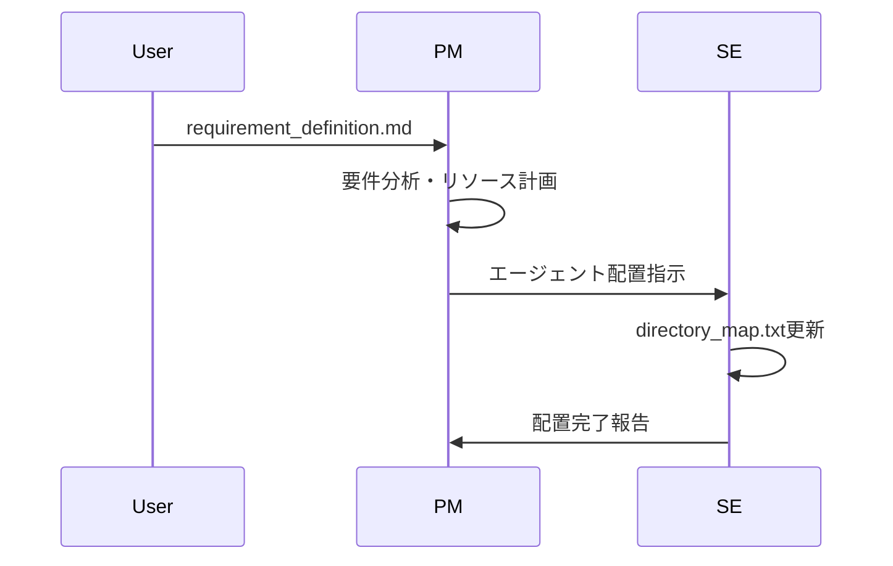
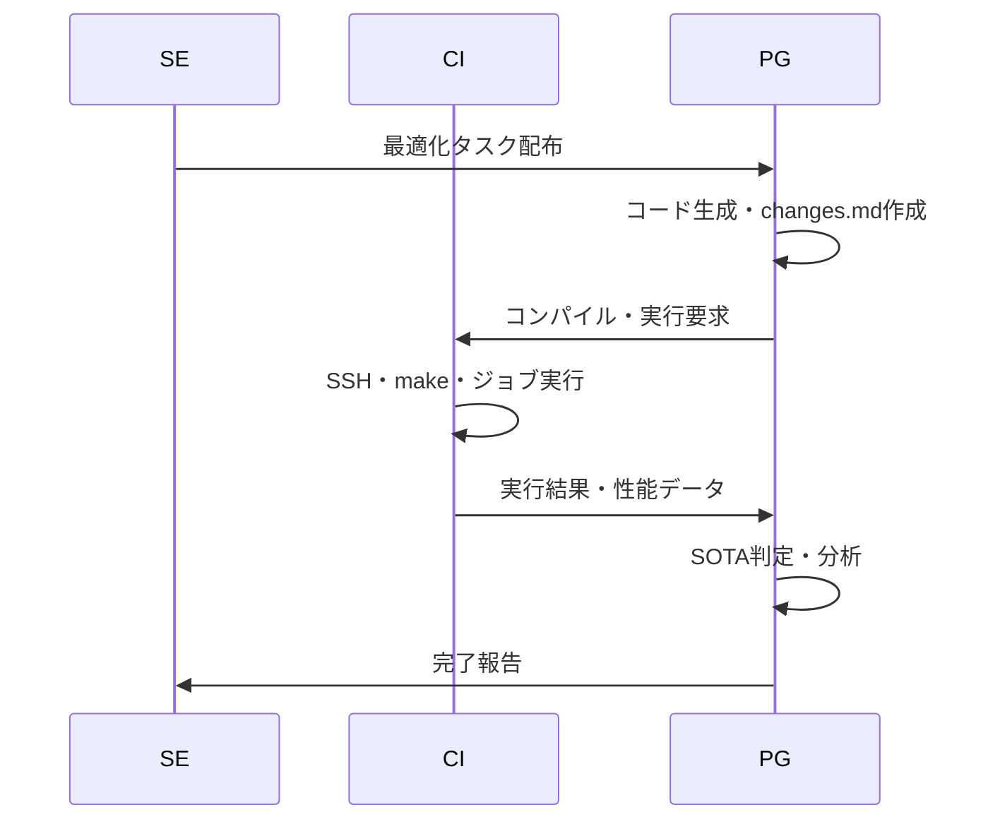

# 🎯OpenCodeAT - Multi-Agent HPC Code Optimization System

OpenCodeATは、HPCコードの自動最適化を行うマルチエージェントシステムです。
Claude Code環境でtmux-based通信により、複数のAIエージェントが協調してコードの並列化・最適化を実現します。

## システム概要

### 特徴
- **階層型マルチエージェント**: PM → SE → CI ↔ PG の企業的分業体制
- **進化的階層設計**: ボトムアップ型のFlattened Directory構造による効率的探索
- **自動最適化**: OpenMP、MPI、CUDA等の段階的並列化と技術融合
- **SOTA追跡**: Local/Parent/Global/Projectの4階層でのSOTA管理
- **予算管理**: 計算資源の効率的配分と追跡
- **統一ログ**: changes.mdによる一元的な進捗管理

### 対応環境
- **スパコン**: 不老、富岳等のHPCシステム
- **並列化**: OpenMP、MPI、CUDA、OpenACC、AVX512
- **コンパイラ**: Intel OneAPI、GCC、NVIDIA HPC SDK

## 🏗️ エージェント構成


## 📁 ディレクトリ構造

```
OpenCodeAT/
├── 📄 CLAUDE.md                     # 全エージェント共通ルール
├── 📄 requirement_definition.md     # 要件定義書
├── 📄 sota_project.txt              # プロジェクト全体SOTA
├── 📁 Agent-shared/                 # 全エージェント共有
│   ├── 📄 changes_unified.md        # 統一フォーマット仕様
│   ├── 📄 directory_map.txt         # エージェント配置
│   └── 📁 changes_query/            # 解析ツール
├── 📁 communication/                # tmux通信システム
│   ├── 🔧 hpc_agent_send.sh
│   └── 🔧 setup_hpc.sh
└── 📁 Flow/TypeII/single-node/      # ハードウェア階層
    ├── 📄 sota_global.txt           # Global SOTA
    ├── 📁 intel2024/                # コンパイラ環境
    │   ├── 📁 CI1.1/                # SSH・ビルド
    │   └── 📁 OpenMP/               # 並列化戦略
    │       └── 📁 PG1.1.1/          # コード生成
    │           ├── 📄 changes.md    # 進捗記録
    │           ├── 📄 sota_local.txt
    │           └── 📄 matrix_v1.2.3.c
    └── 📁 gcc11.3.0/                # 別コンパイラ
        └── 📁 CUDA/
            └── 📁 PG1.2.1/
```

## 🔄 ワークフロー

### 1. プロジェクト初期化



### 2. コード最適化サイクル



## 🚀 クイックスタート

### 1. 事前セットアップ
本システムを利用する前に、以下の環境がセットアップ済みであることを確認してください。

☑️ **Claude Codeのインストール**
- Windowsの場合は、WSL (Ubuntu 22.04) をセットアップします。
- `nvm` 経由でのNode.js (v18以上) のインストールを推奨します [参考: https://zenn.dev/acntechjp/articles/eb5d6c8e71bfb9]。
- 以下のコマンドでClaude Codeをインストールし、初回起動時にアカウント認証を完了させてください。
  ```bash
  npm install -g @anthropic-ai/claude-code
  claude
  ```

☑️ **SSHエージェントの設定 (ssh-agent)**
- スーパーコンピュータへのパスワード不要のSSH接続を有効にするため、`ssh-agent` に秘密鍵を登録します。
- ssh-agentを有効にする手順は後日掲載します
- ターミナルで以下のコマンドを実行し、パスフレーズを一度入力してください。
  ```bash
  eval "$(ssh-agent -s)"
  ssh-add ~/.ssh/your_private_key
  ```

☑️ **MCPサーバのセットアップ (wcgw)**
- Claude CodeからHPC環境のコマンドを安全に実行するため、`wcgw` MCPサーバを追加します [cite: 66, 121]。
- 以下のコマンドで `wcgw` を追加
  ```bash
  claude mcp add wcgw -- uv tool run --python 3.12 wcgw@latest
  ```
- ２分後に別のターミナルを起動しClaude Code内で `/mcp` コマンドで接続を確認してください。

### 2. 環境セットアップ
```bash
cd OpenCodeAT
./communication/setup_hpc.sh
tmux attach-session -t multiagent
```

### 3. プロジェクト開始
```bash
# 要件定義作成
cp requirement_definition_template.md requirement_definition.md
# requirement_definition.mdを編集

# PM起動
tmux send-keys -t pm_session 'claude' C-m
# "requirement_definition.mdに基づいてプロジェクトを初期化してください"
```

## 🔧 エージェント役割

| Agent | 役割 | 主要成果物 | 責任範囲 |
|-------|------|------------|----------|
| **PM** | プロジェクト統括 | assign_history.txt<br/>resource_allocation.md | 要件定義・リソース配分・予算管理 |
| **SE** | システム設計 | visible_paths.txt<br/>performance_trends.png | エージェント監視・統計分析 |
| **CI** | ビルド・実行 | setup.md<br/>job_list_CI*.txt | SSH接続・コンパイル・ジョブ実行 |
| **PG** | コード生成 | changes.md<br/>sota_local.txt | 並列化実装・性能測定・SOTA判定 |
| **CD** | デプロイ管理 | GitHub/changes_public.md | SOTA達成コード公開・匿名化 |

## 📊 SOTA管理システム

### 4階層SOTA追跡
- **Local**: PG自身のディレクトリ内での最高性能
- **Parent**: 継承元フォルダ全体での最高性能（Virtual算出）
- **Global**: ハードウェア全体での最高性能
- **Project**: プロジェクト全体での最高性能

各階層でのSOTA判定により、効率的なベンチマーク比較と最適化方針決定を自動化。

### changes.md統一フォーマット
```yaml
## version: v1.2.3 (PG writes)
change_summary: "OpenMP collapse(2)とMPI領域分割を追加"
timestamp: "2025-07-16 12:34:56 UTC"
code_files: "matrix_v1.2.3.c"

# Build & Execution (CI updates)
compile_status: success | fail | pending
job_status: completed | failed | timeout
performance_metric: "285.7 GFLOPS"
compute_cost: "12.5 node-hours"

# Analysis (PG updates)
sota_level: local | parent | global | project
technical_comment: "collapse(2)で15%向上、MPI分割で20%向上"
next_steps: "ループアンローリングとブロッキング最適化を実装"
```

## 🔍 解析・モニタリング

### SOTA確認
```bash
# Local SOTA
cat PG1.1.1/sota_local.txt

# Global SOTA  
cat Flow/TypeII/single-node/sota_global.txt

# Project SOTA
cat OpenCodeAT/sota_project.txt
```

## 🧬 進化的最適化アプローチ

### 段階的進化プロセス
- **🌱 種子期**: 単一技術の個別最適化 (`/OpenMP/`, `/MPI/`, `/CUDA/`)
- **🌿 交配期**: 有望技術の融合 (`/OpenMP_MPI/`, `/CUDA_OpenMP/`)
- **🌳 品種改良期**: 高度な組み合わせ (`/OpenMP_MPI_AVX512/`)
- **🌲 進化継続**: さらなる技術統合と最適化...

### Flattened Directory の利点
- **階層の曖昧性解消**: `/MPI/OpenMP/` vs `/OpenMP/MPI/` の重複排除
- **並列探索効率化**: 複数エージェントによる同時最適化
- **技術継承**: 上位世代が下位世代の成果を参照可能

詳細: [Agent-shared/evolutional_flatten_dir.md](Agent-shared/evolutional_flatten_dir.md)

## 📋 高度な機能

### 統一ログシステム
changes.mdを中心とした情報集約により、分散管理コストを削減。詳細仕様は[Agent-shared/about_changes.md](Agent-shared/about_changes.md)参照。

### SOTA管理システム
4階層（Local/Parent/Global/Project）でのSOTA追跡により、効率的なベンチマーク管理を実現。Virtual Parent算出により重複ファイルを排除。詳細: [Agent-shared/sota_management.md](Agent-shared/sota_management.md)

### エージェント可視化
SE担当の統計解析により、性能推移とSOTA更新履歴をリアルタイム監視。詳細: [Agent-shared/document_generation_structure.md](Agent-shared/document_generation_structure.md)

## 🔒 セキュリティ

- **機密情報保護**: `_remote_info/`はGit管理外
- **自動匿名化**: GitHub公開時にユーザID等を匿名化
- **SOTA達成コードのみ公開**: 性能向上を実現したコードのみ
- **階層別アクセス制御**: Agent役割に応じた読み書き権限

## 📄 ライセンス

このプロジェクトは[Apache License 2.0](LICENSE)の下で公開されています。自由にご利用いただけますが、使用に関する責任は負いかねます。

---

🧬 **進化的HPC最適化で、コードの可能性を解き放つ！** 🚀✨
