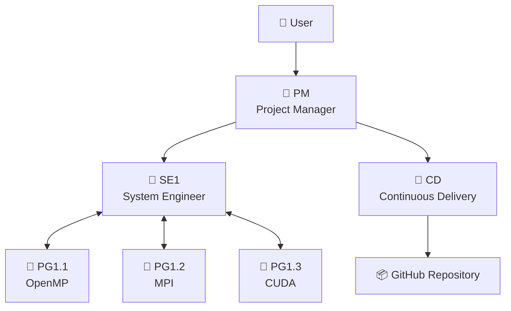
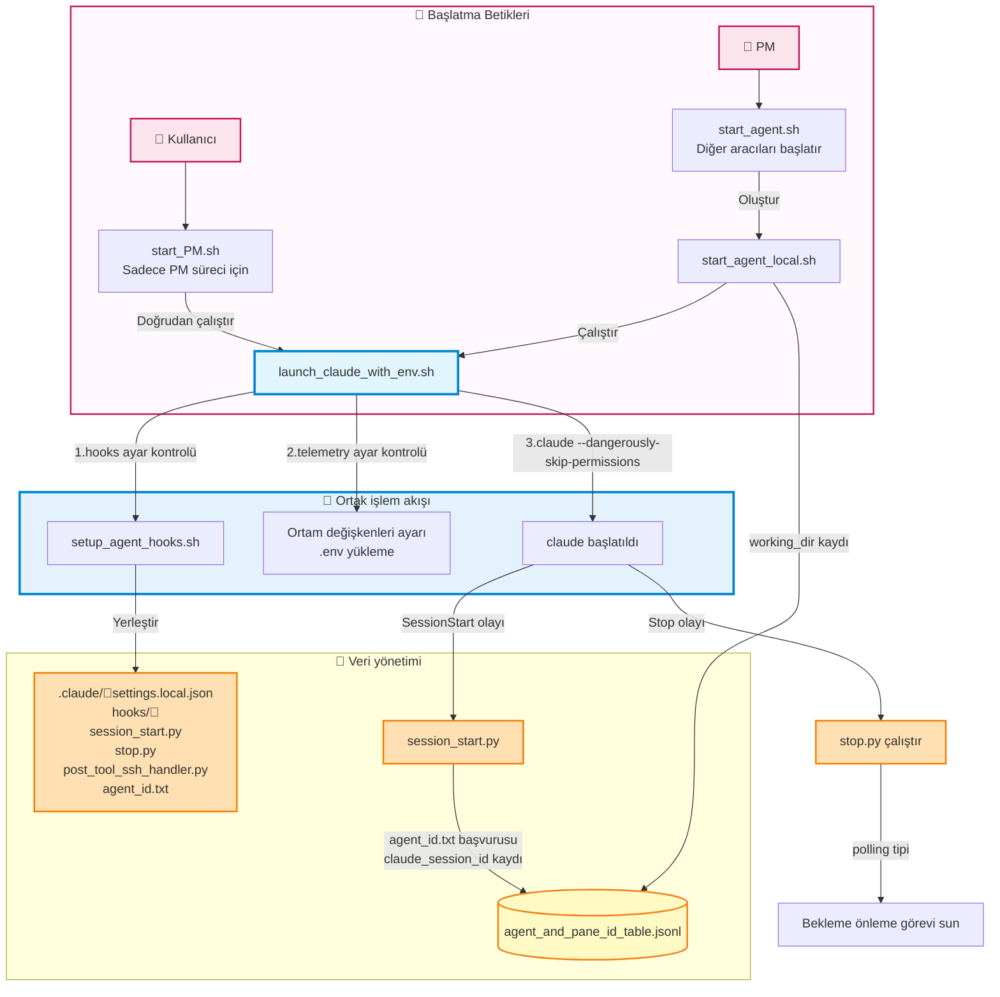
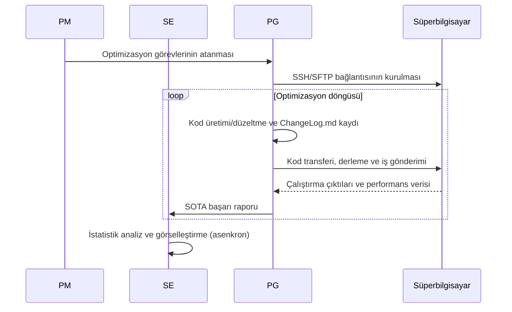

# VibeCodeHPC - Multi Agentic Vibe Coding for HPC

VibeCodeHPC, HPC için tam otomatik ortam kurulumunu ve kod optimizasyonunu gerçekleştiren çoklu aracı bir sistemdir.
Claude Code gibi CLI ortamlarında tmux tabanlı iletişimle birden fazla yapay zekâ aracısı birlikte çalışır.


## Makale
- [📝arXiv (2025/10/02)](https://arxiv.org/abs/2510.00031)
- [🎞️Google Slaytlar (Deneyler)](https://docs.google.com/presentation/d/1u9aK52nouAgjFTTchJAiZm5HglynGwl-Hwi97EK2Gis/edit?usp=sharing)
- [Çoklu aracı deney sonuçları](https://github.com/Katagiri-Hoshino-Lab/VibeCodeHPC-demo-0.6.10-multi-ex1/blob/all_local_and_remote_files/User-shared/final_report.md)
- [Tek aracı deney sonuçları](https://github.com/Katagiri-Hoshino-Lab/VibeCodeHPC-demo-0.6.10-solo-ex1/blob/solo_commited_push_later/User-shared/reports/final_report.md)

## Sistem Özeti

### Özellikler
- **Hiyerarşik çoklu aracı**: PM → SE ↔ PG kurumsal iş bölümü
- **Proje haritası**: Organizasyonu gerçek zamanlı görselleştiren `directory_pane_map`
- **Evrimsel arama**: Alttan-üstte `Flat`📁 yapı ile verimli keşif
- **Otomatik optimizasyon**: OpenMP, MPI, OpenACC, CUDA... ile kademeli paralelleştirme ve teknoloji bileşimi
- **Bütçe yönetimi**: Hesaplama kaynaklarının 💰 verimli tahsisi ve takibi
- **Birleşik günlük**: `ChangeLog.md` ile merkezi ilerleme yönetimi

### Desteklenen Ortamlar
- **Süper bilgisayarlar**: Furo, Fugaku gibi HPC sistemleri
- **Derleyiciler**: Intel OneAPI, GCC, NVIDIA HPC SDK...

## 🏗️ Aracı Yapısı



### 🤖 Aracı Rolleri

| Aracı | Rol | Ana çıktılar | Sorumluluk alanı |
|-------|------|------------|----------|
| **PM** | Proje koordinasyonu | directory_pane_map.md<br/>User-shared/final_report.md | Gereksinim tanımı, kaynak tahsisi, bütçe yönetimi |
| **SE** | Sistem tasarımı | User-shared/ içindeki görseller ve raporlar | Aracı izleme, istatistik analiz, raporlama |
| **PG** | Kod üretimi/çalıştırma | ChangeLog.md<br/>sota_local.txt | Paralelleştirme, SSH/SFTP, iş çalıştırma, performans ölçümü |
| **CD** | Dağıtım yönetimi | GitHub/ altındaki proje kopyaları | SOTA kod yayımlama ve anonimleştirme |

## 📁 Dizin Yapısı

```
VibeCodeHPC/🤖PM
├── 📄 CLAUDE.md                     # Tüm aracılar için ortak kurallar
├── 📄 requirement_definition.md     # Gereksinim tanımı belgesi
├── 📄 directory_pane_map.md         # Aracı yerleşimi ve tmux pane bütünleşik yönetimi
├── 📄 sota_project.txt              # Proje genel SOTA bilgisi
│
├── 📁 Agent-shared/                 # Aracı paylaşım talimatları
│
├── 📁 User-shared/                  # Kullanıcıya yönelik çıktı dosyaları
│   ├── 📄 final_report.md           # Nihai rapor
│   ├── 📁 reports/                  # Birleşik raporlar
│   └── 📁 visualizations/           # Grafikler ve çizimler
│
├── 📁 BaseCode/                     # Mevcut özgün kodlar
│
├── 📁 communication/                # Aracı başlatma ve tmux iletişim sistemi
│
├── 📁 GitHub/🤖CD
│
└── 📁 Flow/TypeII/single-node/🤖SE1 # Donanım katmanı
    ├── 📄 hardware_info.md          # Hesaplama düğümü özellik bilgileri
    ├── 📄 sota_hardware.txt         # Belirli donanım için SOTA
    ├── 📁 intel2024/                # Derleyici ortamı
    │   └── 📁 OpenMP/🤖PG1.1.1      # Paralelleştirme modülü
    │        ├── 📄 ChangeLog.md     # İlerleme kaydı
    │        └── 📄 sota_local.txt
    └── 📁 gcc11.3.0/                # Alternatif derleyici
        └── 📁 CUDA/🤖PG1.2.1
```

## 🔄 İş Akışı

### Aracı Çalışma Desenleri

#### **⏳ Yoklama (Polling) tipi** (PM, SE, PG, CD)
- **Özellik**: Dosya ve durumları sürekli kontrol eder; otonom, asenkron hareket eder
- **Örnek**: PM tüm aracıları dolaşarak izler → kaynakları yeniden tahsis eder
- **Örnek**: PG kod üretir → otonom çalıştırır → sonucu inceler → bir sonraki optimizasyon

#### **➡️ Akış (Flow) güdümlü** (yalnızca PM başlangıçta)
- **Özellik**: Görevleri sırayla yürütür ve her adımda karar verir
- **Örnek**: Gereksinim tanımı → ortam araştırması → hiyerarşik tasarım → aracı yerleşimi

### 1. Aracı başlatılırken hooks kurulumu



Ayrıntılar için bkz. [Issue #23: Aracı başlatma ve hooks kurulum akışı](https://github.com/Katagiri-Hoshino-Lab/VibeCodeHPC-jp/issues/23).

### 2. Kod optimizasyon döngüsü



### 3. Proje kapanış yönetimi

Proje kapanış koşulları ve akış şeması için bkz. [Issue #33: Proje kapanış koşulları ve adımlar](https://github.com/Katagiri-Hoshino-Lab/VibeCodeHPC-jp/issues/33).

# 🚀 Hızlı Başlangıç

## 1. Ön hazırlık
Bu sistemi kullanmadan önce aşağıdaki ortamın kurulu olduğunu doğrulayın.

### ☑️ VibeCodeHPC deposu kodlarını indirin

> [!NOTE]
> Aşağıdaki sebeplerle VibeCodeHPC için git clone yerine zip indirip açmanız önerilir
> 
> GitHub/📁 içindeki anonim proje kopyalarını yöneten CD aracısının Git kimliğiyle karışıklığı önlemek

#### GUI için
[release](https://github.com/Katagiri-Hoshino-Lab/VibeCodeHPC-jp/releases) sayfasından (main de olabilir) indirdiğiniz .zip’i açın

#### CLI için
<details>
<summary>Komut satırından indirme (genişletmek için tıklayın)</summary>

VibeCodeHPC’yi indirin
```bash
wget https://github.com/Katagiri-Hoshino-Lab/VibeCodeHPC-jp/archive/refs/tags/v{sürüm}.zip
```

Zip’i açın
```bash
unzip VibeCodeHPC-jp-{sürüm}.zip
```

Açtıktan sonra VibeCodeHPC kök dizinine geçin
```bash
cd VibeCodeHPC-jp-{sürüm}
```
</details>

---

### ☑️ **SSH aracısı ayarı (ssh-agent)**
- Süper bilgisayara parolasız SSH için `ssh-agent` içine özel anahtarınızı ekleyin.
- ssh-agent etkinleştirme adımları için [bu Google Sunuları’na bakın](https://docs.google.com/presentation/d/1Nrz6KbSsL5sbaKk1nNS8ysb4sfB2dK8JZeZooPx4NSg/edit?usp=sharing)
  
  ssh-agent’i başlatın:
  ```bash
  eval "$(ssh-agent -s)"
  ```
  
  Özel anahtar ekleyin:
  ```bash
  ssh-add ~/.ssh/your_private_key
  ```
- Doğrulama komutu
  ```bash
  ssh-add -l
  ```
> [!NOTE]
> Bu terminal kapanana kadar geçerlidir ve tmux bölünmüş panellerinde devredilir.


---

### ☑️ **Claude Code kurulumu ve kimlik doğrulaması**
- Windows için WSL (Ubuntu 22.04) kurun.
- Node.js (v18+) için `nvm` ile kurulum önerilir [bkz: https://zenn.dev/acntechjp/articles/eb5d6c8e71bfb9]
- Aşağıdaki komutla Claude Code’u kurun ve ilk çalıştırmada hesap doğrulamasını tamamlayın.
  ```bash
  npm install -g @anthropic-ai/claude-code
  claude
  ```


### ☑️ **Önerilen araçların kurulumu**
<details>
<summary>tmux, jq, Python ortamı kurulum yöntemleri (genişletmek için tıklayın)</summary>

VibeCodeHPC’nin tüm özelliklerinden yararlanmak için aşağıdaki araçları kurmanız önerilir:

#### **tmux** - Terminal çoklayıcı (çoklu aracı iletişim altyapısı)

Ubuntu/WSL:
```bash
sudo apt-get update && sudo apt-get install tmux
```

CentOS/RHEL/Fedora:
```bash
sudo yum install tmux  # veya sudo dnf install tmux
```

macOS:
```bash
brew install tmux
```

Kullanıcı yetkisiyle kurulum (sudo olmayan ortamlar):
```bash
wget https://github.com/tmux/tmux/releases/download/3.4/tmux-3.4.tar.gz
tar xzf tmux-3.4.tar.gz
cd tmux-3.4
./configure --prefix=$HOME/.local
make && make install
export PATH=$HOME/.local/bin:$PATH  # .bashrc’ye eklemeniz önerilir
```
> Tek aracı modu (`./start_solo.sh`) tmux olmadan da çalışır, ancak oturum yönetimi için tmux önerilir.

#### **jq** - JSONL dosya analizi için

Ubuntu/WSL:
```bash
sudo apt install jq
```

macOS:
```bash
brew install jq
```
> Aracılar arası iletişimde (agent_send.sh) JSONL tablolarını verimli analiz eder


#### Python paketleri - Görselleştirme ve veri analizi için

Standart kurulum:
```bash
pip3 install -r requirements.txt
```

Gerekli paketler:
- **matplotlib** - Grafik üretimi (SOTA eğilimi, bütçe tüketimi, bağlam kullanım oranı)
- **numpy** - Sayısal hesaplama (doğrusal regresyon, istatistik işlemler)
- **pandas** - Veri analizi (ChangeLog.md çözümleme, toplulaştırma)
- **scipy** - İstatistik analiz (bütçe tahmini için doğrusal regresyon)

> Bu paketler esas olarak görselleştirme betiklerinde kullanılır. Sürüm kısıtı yoktur; güncel sürümler uygundur.

> Görselleştirme betikleri `python3 script.py` ile çalıştırılır.
</details>

---

### ☑️ GitHub kimlik doğrulaması (CD aracısı kullanılmıyorsa gerekmez)
GitHub arayüzünden bir depo oluşturun (özel olabilir)

GitHub/📁 dizinine geçin
```bash
cd GitHub
```
Git yapılandırmasını gösteren komut
```bash
git config -l
```

Eğer user.email ve user.name ayarlı değilse:
```bash
git config --global user.email xxx@yyy.zzz
git config --global user.name YOUR_GITHUB_NAME
```

GitHub dizininde ilk yapılandırma
```bash
git init
```

Uzak depo ayarı
```bash
git remote add origin https://github.com/YOUR_NAME/YOUR_REPOSITORY.git
# Halihazırda origin varsa:
git remote set-url origin https://github.com/YOUR_NAME/YOUR_REPOSITORY.git
```
#### Git HTTPS (iki aşamalı) kimlik doğrulama yöntemleri
➡ Birden fazla seçenek mevcuttur
https://zenn.dev/miya789/articles/manager-core-for-two-factor-authentication

<details>
<summary>Seçenek 1: GCM</summary>

Git Credential Manager (GCM) önerilir.
https://github.com/git-ecosystem/git-credential-manager/releases

WSL’de kullanım notları
https://zenn.dev/jeffi7/articles/dccb6f29fbb640
</details>


<details>
<summary>Seçenek 2: gh</summary>

gh (GitHub CLI) indirme
```bash
sudo apt update
sudo apt install gh
```
gh ile kimlik doğrulama
```bash
gh auth login
```
Tarayıcı üzerinden oturum açma
</details>

---

### ☑️ **MCP sunucu kurulumu**

Başlamadan hemen önce aşağıdaki MCP sunucularını eklemeniz önerilir:

Proje kökünde çalışan PM 🤖 için MCP sunucuları tanımlayın.
**Önemli**: Claude Code’u başlatmadan önce MCP’yi ayarlayın.

```bash
cd VibeCodeHPC-main
```

[Desktop Commander MCP](https://github.com/wonderwhy-er/DesktopCommanderMCP)
PM, SE, PG için HPC ortamına SSH/SFTP bağlantı yönetiminde kullanılır
```bash
claude mcp add desktop-commander -- npx -y @wonderwhy-er/desktop-commander
```

[mcp-screenshot](https://github.com/kazuph/mcp-screenshot)
PM, arıza durumlarında tmux genel görünümünü görsel olarak doğrulamak için kullanır
```bash
claude mcp add mcp-screenshot -- npx -y @kazuph/mcp-screenshot
```

> [!WARNING]
> **mcp-screenshot WSL üzerinde çalışmaz**
> WSL ortamında ekran görüntüsü özelliği çalışmadığından, işletim sistemi yerel komut istemcisini kullanmanız önerilir.


---

## 2. Ortam kurulumu

```bash
# Proje dizinine geç
cd VibeCodeHPC-jp-main
```
#### OpenTelemetry’yi devre dışı bırakma (hafif çalışma)

Ortam değişkeniyle devre dışı bırakın:
```bash
export VIBECODE_ENABLE_TELEMETRY=false
```

### 🔭 İzleme seçenekleri

#### ccusage (hızlı kontrol)

```bash
# Kurulum gerektirmeden token kullanımını görüntüle
npx ccusage@latest
```


#### 📊 Grafana + Prometheus + Loki ortamı (önerilmez bir seçenek)

<details>

İzleme ortamını otomatik kurulum:
```bash
./telemetry/setup_grafana.sh
```

Tarayıcıdan erişim:
```
http://localhost:3000
```

Giriş bilgileri:
- Kullanıcı adı: `admin`
- Parola: `admin`


[ccusage](https://github.com/ryoppippi/ccusage), JSONL günlüklerinden token kullanımını analiz eden bir CLI aracıdır.


Grafana’da metrikleri görüntüleme (yalnız OpenTelemetry etkinse)

#### Temel kullanım
1. **Drilldown → Metrics** öğesini seçin
   - Girişten sonra, ön hazırlık olmadan kullanılabilir
   - Maliyet (Cost) ve Token sayıları otomatik olarak görselleştirilir
   - Aracı bazında ve zaman serisinde token tüketimini görüntüleyin


2. **Dikkat**
   - Claude Code’un OpenTelemetry metrikleri OTLP üzerinden gönderilir
   - Varsayılan olarak yerel Collector’a (4317 portu) bağlanır
   - Ayrıntılı ayarlar `telemetry/otel_config.env` içinde düzenlenebilir

</details>

### 🤖 Tek Aracı Modu (v0.5.3+)

<details>
<summary>Deneysel değerlendirme için tek aracı modu (genişletmek için tıklayın)</summary>

Deneysel değerlendirme için tek aracı modu eklendi. Tek bir Claude Code örneği tüm rolleri (PM/SE/PG/CD) üstlenir.

Kullanım
```bash
# Kurulum (0 işçi = tek mod)
./communication/setup.sh 0 --project GEMM

# Aracıyı başlatma
./start_solo.sh
```

Başlatıldıktan sonra aşağıdaki istem görüntülenir; kopyalayıp yapıştırın:
```
VibeCodeHPC tek aracı modunda çalışacaksınız.
Tüm rolleri (PM/SE/PG/CD) tek başınıza üstlenip projeyi verimli şekilde ilerleteceksiniz.

[İlk Ayar]
Önce aşağıdaki dosyaları okuyun:
- CLAUDE.md (tüm aracılar için ortak kurallar)
- instructions/SOLO.md (tek mod için birleşik istem)
- requirement_definition.md (varsa)
- Agent-shared/project_start_time.txt (proje başlangıç zamanı)

[ToDo listesi ile rol yönetimi]
TodoWrite aracını etkin kullanın, her görevi rol etiketleri ([PM], [SE], [PG], [CD]) ile yönetin.

【Zaman yönetimi】
- Proje başlangıcından itibaren geçen süreyi düzenli kontrol edin
- requirement_definition.md’de zaman sınırı varsa mutlaka uyun
- Bütçe yönetimiyle birlikte zaman verimliliğine de dikkat edin

【Verimli yürütme sırası】
1. [PM] Gereksinim tanımı ve ortam araştırması
2. [SE] Ortam kurulumu
3. [PG] Uygulama ve test (döngüsel)
4. [SE] İstatistik ve görselleştirme
5. [CD] Gerekirse GitHub senkronizasyonu
6. [PM] Son rapor

agent_send.sh gerekli değildir (iletişim kurulacak başka aracı yoktur).
Tüm işlemleri tek aracı içinde tamamlayın.

Projeyi başlatın.
```

#### Özellikler
- Birleşik yürütme: Tüm rolleri tek bir örnek üzerinde yürütür
- ToDo listesi yönetimi: Rol geçişlerini açıkça yönetir
- Zaman yönetimi: project_start_time.txt ile geçen süreyi takip edin
- Çoklu mod ile aynı mekanizmalar: ChangeLog.md ve SOTA yönetimi ortaktır

Ayrıntılar için `instructions/SOLO.md` dosyasına bakın.

</details>


### Çoklu Aracı: tmux oturumu oluşturma

> [!IMPORTANT]
> VibeCodeHPC birden çok tmux oturumu kullanır:
> - **PM oturumu**: PM aracısına özeldir (kullanıcıyla etkileşim)
>   - Varsayılan: `Team1_PM`
>   - Proje verildiğinde: `{ProjectName}_PM`
> - **Worker oturumu**: Diğer aracılar (SE, PG, CD)
>   - Varsayılan: `Team1_Workers1`
>   - Proje verildiğinde: `{ProjectName}_Workers1`
> 
> En az aracı sayısı 2’dir (SE + PG)

```bash
cd VibeCodeHPC-jp-main
./communication/setup.sh [worker_sayısı]  # Ör: ./communication/setup.sh 12
```


Komut satırı seçenekleri:
<details>
#   [worker_sayısı]  : PM dışındaki toplam aracı sayısı (en az: 2)
#   --project <ad>   : Proje adını belirtir (ör: GEMM, MatMul)
#   --clean-only     : Yalnız var olan oturumları temizler
#   --dry-run        : Gerçek kurulum yapmadan planı gösterir
#   --help           : Yardım mesajını gösterir
</details>

#### Proje adı verme örnekleri:
```bash
./communication/setup.sh 12 --project GEMM  # Varsayılan 60 saniye aralıkla periyodik Enter gönderimi
./communication/setup.sh 12 --project GEMM --periodic-enter 30  # 30 saniye aralık
./communication/setup.sh 12 --project GEMM --periodic-enter 0  # Periyodik Enter devre dışı
```
Yukarıdaki komutlar `GEMM_PM` ve `GEMM_Workers1` oturumlarını oluşturur, kalmış mesajları zorla gönderme özelliğini de başlatır


#### Örnek yapılandırmalar (nihai yerleşim PM tarafından belirlenir)

| Workers | SE | PG | CD | Not |
|---------|----|----|-----|------|
| 2 | 1 | 1 | 0 | En küçük yapı |
| 4 | 1 | 3 | 0 | Küçük ölçek |
| 8 | 2 | 5 | 1 | SE≥2 ile daha stabil |
| 12 | 2 | 9 | 1 | Önerilen yapı |
| 16 | 3 | 12 | 1 | Büyük ölçek |

#### İki terminal sekmesinden ayrı ayrı bağlanın
`GEMM` proje adı için örnek

Sekme 1 (PM aracı için):
```bash
tmux attach-session -t GEMM_PM
```
Sekme 2 (diğer aracılar için):
```bash
tmux attach-session -t GEMM_Workers1
```

> [!TIP]
> Lütfen setup.sh çıktısında görünen gerçek oturum adlarını kullanın.

### 3. Projeyi başlatma
Gereksinim tanımı (atlandıysa PM ile etkileşimli oluşturun)
```bash
cp requirement_definition_template.md requirement_definition.md
# requirement_definition.md dosyasını düzenleyin
```

PM’i başlatın
```bash
./start_PM.sh
```

<details>
<summary>Diğer başlatma seçenekleri (genişletmek için tıklayın)</summary>

```bash
# yalnızca telemetry (hooks yok, bekleme önleme devre dışı)
./telemetry/launch_claude_with_env.sh PM

# en küçük yapı (hooks ve telemetry yok)
claude --dangerously-skip-permissions

# yalnız telemetry devre dışı (PM başlatırken)
VIBECODE_ENABLE_TELEMETRY=false ./start_PM.sh

# ⚠️ hooks’u devre dışı bırakmak önerilmez (polling tipli aracılar bekleme durumuna geçer)
# Mutlaka devre dışı bırakmak isterseniz, proje başlamadan önce şunları çalıştırın:
# export VIBECODE_ENABLE_HOOKS=false
```

**Dikkat**: PM polling tipli bir aracı olduğundan, hooks devre dışı bırakılırsa bekleme durumuna girer.
</details>

### 🪝 Claude Code Hooks özellikleri

Aracı davranışını kontrol eden hooks sayesinde aşağıdakiler sağlanır:

#### Başlıca özellikler
- [x] **Polling tipli aracılarda (PM, SE, PG, CD) beklemenin önlenmesi**: Periyodik görevlerin otomatik sunulması
- [x] **SSH/SFTP bağlantı desteği**: PostToolUse hook’u SSH bağlantısını algılar ve Desktop Commander MCP ile oturum yönetimi için otomatik yönlendirme yaparar
- [x] **session_id takibi**: Her aracının Claude session_id bilgisini kaydeder ve yönetir

#### STOP Hooks sürüm seçimi
```bash
# v3 (varsayılan) olasılıksal olarak ham doküman sağlar
./communication/setup.sh 12

# v2: yalnızca dosya yolları (eski)
./communication/setup.sh 12 --hooks v2
```

- **v3**: Tüm modlar için önerilir. `auto_tuning_config.json` ile role göre olasılık özelleştirilebilir
- **v2**: Eski sürüm. Sadece sabit dosya listesi sağlar
- **SOLO**: Her zaman v3 kullanır (v2 belirtimi yok sayılır)

⚠️ hooks’u kapatmak önerilmez – polling tipli aracılar beklemede kalıp projenin tamamlanmaması riski artar

#### Özel izleme modu (v0.7+)

Resmi hooks kararsız olduğunda alternatif olarak tmux izleme ile durum tespiti sunar.

**Etkinleştirme yöntemi**:
```bash
export CLI_HOOKS_MODE=custom
./communication/setup.sh 12
```

- **İşlev**: Stop/SessionStart/PostToolUse hooks tmux capture-pane üzerinden gerçekleştirilir
- **Ayrıntı**: [Issue #45](https://github.com/Katagiri-Hoshino-Lab/VibeCodeHPC-jp/issues/45)

Detaylar için `hooks/hooks_deployment_guide.md` dosyasına bakın.


Başladıktan sonra aşağıdaki istemi kopyalayıp yapıştırın:
```
Siz bir PM’siniz (Project Manager). VibeCodeHPC projesini başlatın.

Önce aşağıdaki dosyaları okuyarak projenin genel resmini anlayın:
- CLAUDE.md (tüm aracılar için ortak kurallar)
- instructions/PM.md (rolünüzün ayrıntıları)
- requirement_definition.md (proje gereksinimleri) — varsa
- Agent-shared/ altındaki tüm .md ve .txt dosyaları (.py dosyaları hariç)

Özellikle önemli:
- max_agent_number.txt (kullanılabilir çalışan sayısı)
- agent_and_pane_id_table.jsonl (oturum yapısı ve aracı yönetimi)
- directory_pane_map_example.md (aracı yerleşimi ve pane yönetimi)
- sota_management.md (SOTA yönetimi ve family kavramının önemi)

Tümünü inceledikten sonra, mevcut tmux oturumlarını kullanarak projeyi başlatın. Yeni oturum oluşturmayın.
```

---

## 📈 SOTA Yönetim Sistemi

### 4 katmanlı SOTA takibi

| Ad | En yüksek performans kapsamı |
|---------|------------------------|
| **Local** | PG’nin kendi dizini |
| **Family** | Teknoloji soyu (ebeveyn-çocuk nesil ilişkisi) |
| **Hardware** | Aynı donanım yapılandırması (tek düğüm/çok düğüm vb.) |
| **Project** | Proje genelinde |

Her katmandaki SOTA değerlendirmesi ile verimli kıyaslama ve optimizasyon stratejisi belirleme otomatikleştirilir.

### SOTA performans eğrisinin görselleştirilmesi


Farklı ara katman yazılımlardan (gcc, intel vb.) gelen veriler birleştirilerek tek düğümlü donanım yapılandırmasında performans değişimi otomatik çizdirilir.
O andaki en yüksek performans olan SOTA (State-of-the-Art) vurgulanır.

### Bütçe tüketiminin gerçek zamanlı takibi


HPC bütçe tüketimi gerçek zamanlı izlenir; doğrusal regresyon ile tahmin ve eşik erişim zamanı (ETA) gösterilir. Birçok süperbilgisayarda yalnızca bir önceki güne kadar toplu veriler görülebilirken, ChangeLog.md üzerinden anlık tahmin üretilir.

### ChangeLog.md birleşik biçimi

Aracılar arasında bilgi paylaşımını sağlayan birleşik günlük sistemi.

Örnek `ChangeLog.md`:

---

### v1.1.0
**変更点**: "ブロッキング最適化とスレッド数調整"  
**結果**: 理論性能の65.1%達成 `312.4 GFLOPS`  
**コメント**: "ブロックサイズを64から128に変更、キャッシュ効率が大幅改善"  

<details>

- **生成時刻**: `2025-08-20T10:30:00Z`
- [x] **compile**
    - status: `success`
    - warnings: `none`
- [x] **job**
    - id: `123456`
    - resource_group: `F_small`
    - start_time: `2025-08-20T10:31:00Z`
    - end_time: `2025-08-20T10:31:45Z`
    - runtime_sec: `45`
    - status: `success`
- [x] **test**
    - status: `pass`
    - performance: `312.4`
    - unit: `GFLOPS`
    - efficiency: `65.1%`
    - accuracy: `PASS (diff < 1e-6)`
- [x] **sota**
    - scope: `local`
- **params**:
    - nodes: `8`
    - threads_per_node: `32`
    - block_size: `128`
</details>

---

### v1.0.0
**変更点**: "初期OpenMP実装"  
**結果**: ベースライン確立 `248.3 GFLOPS`  
**コメント**: "基本的なOpenMP並列化を外側ループに適用"  

<details>

- **生成時刻**: `2025-08-20T10:15:00Z`
- [x] **compile**
    - status: `success`
    - warnings: `none`
- [x] **job**
    - id: `123454`
    - resource_group: `F_small`
    - start_time: `2025-08-20T10:16:00Z`
    - end_time: `2025-08-20T10:16:48Z`
    - runtime_sec: `48`
    - status: `success`
- [x] **test**
    - status: `pass`
    - performance: `248.3`
    - unit: `GFLOPS`
    - efficiency: `51.7%`
- **params**:
    - nodes: `8`
    - threads_per_node: `32`
</details>

---

- 詳細：[Agent-shared/change_log/ChangeLog_format.md](Agent-shared/change_log/ChangeLog_format.md)
- PMオーバーライド：[Agent-shared/change_log/ChangeLog_format_PM_override_template.md](Agent-shared/change_log/ChangeLog_format_PM_override_template.md)

## 🧬 進化的最適化アプローチ

### 段階的進化プロセス
1.  **🌱 種子期**: 単一技術の個別最適化 (`/OpenMP/`, `/MPI/`, `/AVX512/`, `/CUDA/`)
2.  **🌿 交配期**: 有望技術の融合 (`/OpenMP_MPI/`, `/MPI_CUDA/`)
3.  **🌳 品種改良期**: 高度な組み合わせ (`/OpenMP_MPI_AVX512/`)

### 📁Flat Directory の利点
- **階層の曖昧性解消**: `/MPI/OpenMP/` vs `/OpenMP/MPI/` の重複排除
- **並列探索効率化**: 複数エージェントによる同時最適化
- **技術継承**: 上位世代が下位世代の成果を参照可能

- [ ] 詳細: [Agent-shared/strategies/auto_tuning/evolutional_flat_dir.md](Agent-shared/strategies/auto_tuning/evolutional_flat_dir.md)

## 🔍 ファイルベースの情報共有

### 成果物の管理
- 成果物配置: [Agent-shared/artifacts_position.md](Agent-shared/artifacts_position.md)
- SOTA管理: [Agent-shared/sota/sota_management.md](Agent-shared/sota/sota_management.md)
- レポート階層: [Agent-shared/report_hierarchy.md](Agent-shared/report_hierarchy.md)

> [!IMPORTANT]
> **ユーザ向け成果物**
> プロジェクトの成果は`User-shared/`ディレクトリに集約されます：

> [!TIP]
> **エージェント可視化**
> 各エージェントのコンテキスト推移を可視化
> SE担当の統計解析により、性能推移とSOTA更新履歴をリアルタイム監視。

## 🔭 監視とメトリクス

### 組み込みコンテキスト監視


エージェントごとのコンテキスト使用量を自動追跡し、auto-compact（メモリリセット）の発生を予測・検知する監視機能を標準搭載。各エージェントの消費量を可視化し、効率的なリソース管理を支援します。

### OpenTelemetry izleme (opsiyonel)

Daha ayrıntılı token kullanımı, maliyet ve araç yürütme durumlarının analizi gerektiğinde, yerleşik OpenTelemetry ile izleme mümkündür. Ancak süperbilgisayar ortamlarına kurulumu zor olabileceği için opsiyonel bir özellik olarak sunulur.

İzleme ayarları için [“2. Ortam Kurulumu”](https://github.com/Katagiri-Hoshino-Lab/VibeCodeHPC-jp#-%E7%9B%A3%E8%A6%96%E3%82%AA%E3%83%97%E3%82%B7%E3%83%A7%E3%83%B3) bölümündeki izleme seçeneklerine bakın.

Ayrıntılı ayarlar: [telemetry/README.md](telemetry/README.md)

## 🔒 Güvenlik

- [x] **Gizli bilgi koruması**: `_remote_info/` Git takibi dışında
- [x] **Otomatik anonimleştirme**: GitHub'da yayımlarken kullanıcı kimliği vb. anonimleştirilir
- [x] **Yalnız SOTA başarısı sağlayan kod yayımlanır**: Performans artışı sağlayan kodlar
- [x] **Hiyerarşik erişim kontrolü**: Aracı rolüne göre okuma/yazma yetkileri

## 📄 Lisans

Bu proje [Apache License 2.0](LICENSE) altında yayımlanmıştır. Özgürce kullanabilirsiniz ancak kullanım sorumluluğu kullanıcıya aittir.
