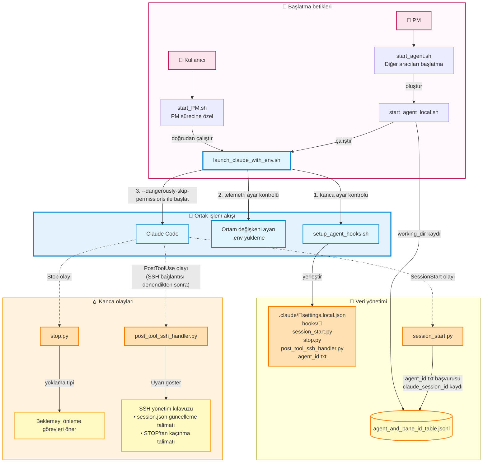
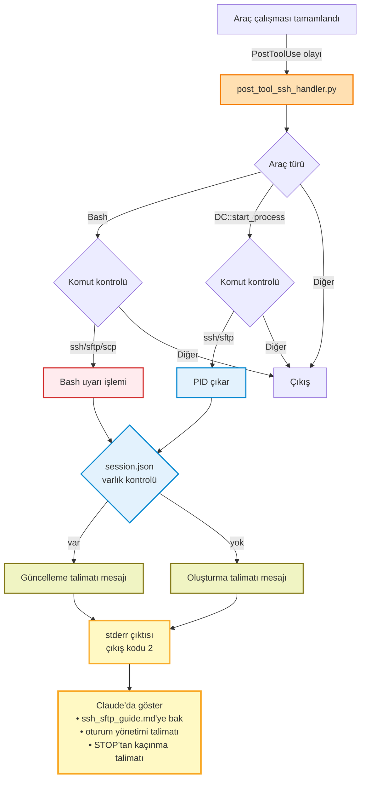

# Hooks System Flowchart (Updated)

## Aracı başlatma ve Hooks sistemi genel akışı

```mermaid
flowchart TB
      %% Başlatma betiklerinin kapsama ilişkisi
      subgraph StartScripts["🚀 Başlatma betikleri"]
      User[👤 Kullanıcı] 
      PM[🤖 PM]
      User -->StartPM[start_PM.sh<br/>PM sürecine özel]
      PM -->StartAgent[start_agent.sh<br/>Diğer aracıları başlatma]

          StartPM -->|doğrudan çalıştır| LaunchClaude
          StartAgent -->|oluştur| LocalScript[start_agent_local.sh]
          LocalScript -->|çalıştır| LaunchClaude
      end

      %% Ortak işlem akışı
      subgraph CommonFlow["🔄 Ortak işlem akışı"]
          LaunchClaude[launch_claude_with_env.sh]
          LaunchClaude -->|1. kanca ayar kontrolü| SetupHooks[setup_agent_hooks.sh]
          LaunchClaude -->|2. telemetri ayar kontrolü| EnvSetup[Ortam değişkeni ayarı<br/>.env yükleme]
          LaunchClaude -->|"3. --dangerously-skip-permissions ile başlat"| ClaudeCode[Claude Code]
      end

      %% Veri akışı
      subgraph DataFlow["💾 Veri yönetimi"]
          SetupHooks -->|yerleştir| HooksDir[.claude/📂settings.local.json<br/>hooks/📂<br/>session_start.py<br/>stop.py<br/>post_tool_ssh_handler.py<br/>agent_id.txt]
          
          LocalScript -->|working_dir kaydı| JSONL
          ClaudeCode -.->|SessionStart olayı| SessionHook[session_start.py]
          SessionHook -->|agent_id.txt başvurusu<br/>claude_session_id kaydı| JSONL

          JSONL[(agent_and_pane_id_table.jsonl)]
      end

      %% Kanca olay akışı
      subgraph HookEvents["🪝 Kanca olayları"]
          ClaudeCode -.->|Stop olayı| StopHook[stop.py]
          StopHook -->|yoklama tipi| PreventWait[Beklemeyi önleme görevleri öner]
          
          ClaudeCode -.->|"PostToolUse olayı<br/>(SSH bağlantısı denendikten sonra)"| SSHHandler[post_tool_ssh_handler.py]
          SSHHandler -->|Uyarı göster| SSHGuide[SSH yönetim kılavuzu<br/>• session.json güncelleme talimatı<br/>• STOP’tan kaçınma talimatı]
      end

      %% スタイリング
      style StartScripts fill:#fff8fc,stroke:#c2185b,stroke-width:2px
      style CommonFlow fill:#e3f2fd,stroke:#0288d1,stroke-width:3px
      style HookEvents fill:#fff3e0,stroke:#ff9800,stroke-width:2px

      style User fill:#fce4ec,stroke:#c2185b,stroke-width:2px
      style PM fill:#fce4ec,stroke:#c2185b,stroke-width:2px
      style LaunchClaude fill:#e1f5fe,stroke:#0288d1,stroke-width:3px
      style ClaudeCode fill:#e1f5fe,stroke:#0288d1,stroke-width:2px
      style EnvSetup fill:#e1f5fe,stroke:#0288d1,stroke-width:2px
      style SetupHooks fill:#e1f5fe,stroke:#0288d1,stroke-width:2px

      style JSONL fill:#fff9c4,stroke:#f57f17,stroke-width:2px
      style HooksDir fill:#ffe0b2,stroke:#f57c00,stroke-width:2px
      style StopHook fill:#ffe0b2,stroke:#f57c00,stroke-width:2px
      style SessionHook fill:#ffe0b2,stroke:#f57c00,stroke-width:2px
      style SSHHandler fill:#ffe0b2,stroke:#f57c00,stroke-width:2px
      style SSHGuide fill:#fff9c4,stroke:#f9a825,stroke-width:2px
      style PreventWait fill:#fff9c4,stroke:#f9a825,stroke-width:2px
```

## PostToolUse Kancası ayrıntılı akışı

```mermaid
flowchart TB
      Start[Araç çalışması tamamlandı] -->|PostToolUse olayı| Handler[post_tool_ssh_handler.py]
      
      Handler --> CheckTool{Araç türü}
      CheckTool -->|"Bash"| CheckBashCmd{Komut kontrolü}
      CheckTool -->|"DC::start_process"| CheckDCCmd{Komut kontrolü}
      CheckTool -->|Diğer| Exit[Çıkış]
      
      CheckBashCmd -->|"ssh/sftp/scp"| BashWarn[Bash uyarı işlemi]
      CheckBashCmd -->|Diğer| Exit
      
      CheckDCCmd -->|"ssh/sftp"| ExtractPID[PID çıkar]
      CheckDCCmd -->|Diğer| Exit
      
      ExtractPID --> SessionCheck{session.json<br/>varlık kontrolü}
      BashWarn --> SessionCheck
      
      SessionCheck -->|var| UpdateMsg[Güncelleme talimatı mesajı]
      SessionCheck -->|yok| CreateMsg[Oluşturma talimatı mesajı]
      
      UpdateMsg --> Display[stderr çıktısı<br/>çıkış kodu 2]
      CreateMsg --> Display
      
      Display --> Guide[Claude’da göster<br/>• ssh_sftp_guide.md'ye bak<br/>• oturum yönetimi talimatı<br/>• STOP’tan kaçınma talimatı]
      
      %% スタイリング
      style Handler fill:#ffe0b2,stroke:#f57c00,stroke-width:2px
      style ExtractPID fill:#e3f2fd,stroke:#0288d1,stroke-width:2px
      style SessionCheck fill:#e3f2fd,stroke:#0288d1,stroke-width:2px
      style Display fill:#fff9c4,stroke:#f9a825,stroke-width:2px
      style Guide fill:#fff9c4,stroke:#f9a825,stroke-width:3px
      style BashWarn fill:#ffebee,stroke:#d32f2f,stroke-width:2px
      style UpdateMsg fill:#f0f4c3,stroke:#827717,stroke-width:2px
      style CreateMsg fill:#f0f4c3,stroke:#827717,stroke-width:2px
```
