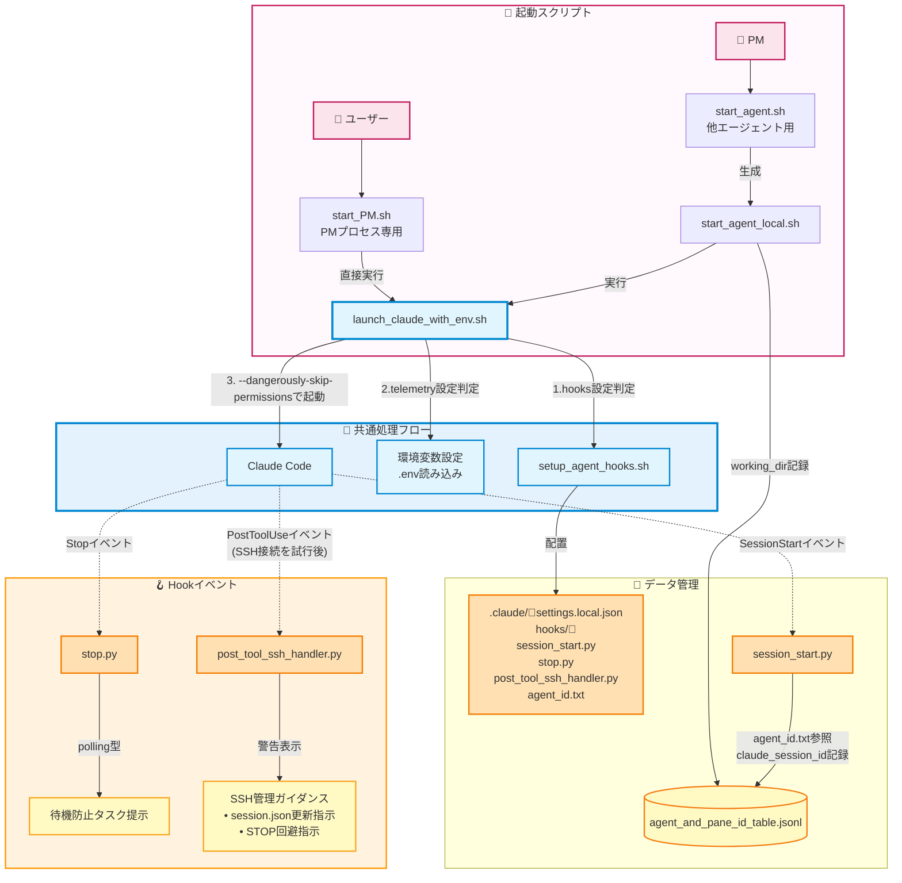
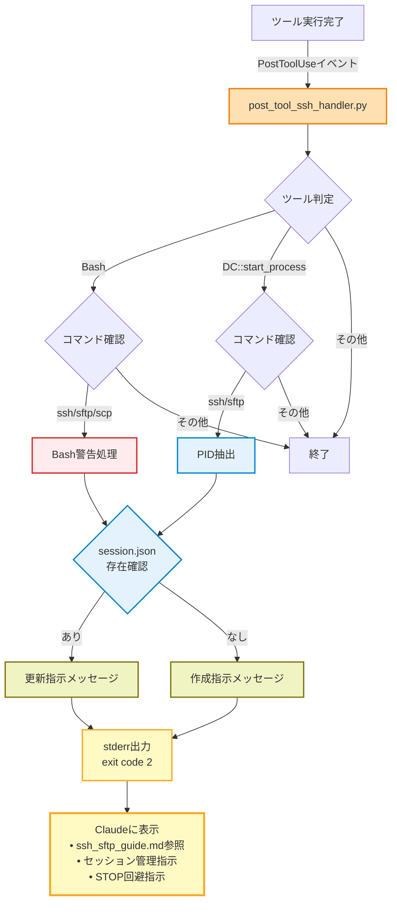

# Hooks System Flowchart (Updated)

## エージェント起動とHooksシステムの全体フロー

```mermaid
flowchart TB
      %% 起動スクリプトの包含関係
      subgraph StartScripts["🚀 起動スクリプト"]
      User[👤 ユーザー] 
      PM[🤖 PM]
      User -->StartPM[start_PM.sh<br/>PMプロセス専用]
      PM -->StartAgent[start_agent.sh<br/>他エージェント用]

          StartPM -->|直接実行| LaunchClaude
          StartAgent -->|生成| LocalScript[start_agent_local.sh]
          LocalScript -->|実行| LaunchClaude
      end

      %% 共通処理の流れ
      subgraph CommonFlow["🔄 共通処理フロー"]
          LaunchClaude[launch_claude_with_env.sh]
          LaunchClaude -->|1.hooks設定判定| SetupHooks[setup_agent_hooks.sh]
          LaunchClaude -->|2.telemetry設定判定| EnvSetup[環境変数設定<br/>.env読み込み]
          LaunchClaude -->|"3. --dangerously-skip-permissionsで起動"| ClaudeCode[Claude Code]
      end

      %% データフロー
      subgraph DataFlow["💾 データ管理"]
          SetupHooks -->|配置| HooksDir[.claude/📂settings.local.json<br/>hooks/📂<br/>session_start.py<br/>stop.py<br/>post_tool_ssh_handler.py<br/>agent_id.txt]

          LocalScript -->|working_dir記録| JSONL
          ClaudeCode -.->|SessionStartイベント| SessionHook[session_start.py]
          SessionHook -->|agent_id.txt参照<br/>claude_session_id記録| JSONL

          JSONL[(agent_and_pane_id_table.jsonl)]
      end

      %% Hook イベントフロー
      subgraph HookEvents["🪝 Hookイベント"]
          ClaudeCode -.->|Stopイベント| StopHook[stop.py]
          StopHook -->|polling型| PreventWait[待機防止タスク提示]
          
          ClaudeCode -.->|"PostToolUseイベント<br/>(SSH接続を試行後)"| SSHHandler[post_tool_ssh_handler.py]
          SSHHandler -->|警告表示| SSHGuide[SSH管理ガイダンス<br/>• session.json更新指示<br/>• STOP回避指示]
      end

      %% スタイリング
      style StartScripts fill:#fff8fc,stroke:#c2185b,stroke-width:2px
      style CommonFlow fill:#e3f2fd,stroke:#0288d1,stroke-width:3px
      style HookEvents fill:#fff3e0,stroke:#ff9800,stroke-width:2px

      style User fill:#fce4ec,stroke:#c2185b,stroke-width:2px
      style PM fill:#fce4ec,stroke:#c2185b,stroke-width:2px
      style LaunchClaude fill:#e1f5fe,stroke:#0288d1,stroke-width:3px
      style ClaudeCode fill:#e1f5fe,stroke:#0288d1,stroke-width:2px
      style EnvSetup fill:#e1f5fe,stroke:#0288d1,stroke-width:2px
      style SetupHooks fill:#e1f5fe,stroke:#0288d1,stroke-width:2px

      style JSONL fill:#fff9c4,stroke:#f57f17,stroke-width:2px
      style HooksDir fill:#ffe0b2,stroke:#f57c00,stroke-width:2px
      style StopHook fill:#ffe0b2,stroke:#f57c00,stroke-width:2px
      style SessionHook fill:#ffe0b2,stroke:#f57c00,stroke-width:2px
      style SSHHandler fill:#ffe0b2,stroke:#f57c00,stroke-width:2px
      style SSHGuide fill:#fff9c4,stroke:#f9a825,stroke-width:2px
      style PreventWait fill:#fff9c4,stroke:#f9a825,stroke-width:2px
```

## PostToolUse Hook詳細フロー

```mermaid
flowchart TB
      Start[ツール実行完了] -->|PostToolUseイベント| Handler[post_tool_ssh_handler.py]
      
      Handler --> CheckTool{ツール判定}
      CheckTool -->|"Bash"| CheckBashCmd{コマンド確認}
      CheckTool -->|"DC::start_process"| CheckDCCmd{コマンド確認}
      CheckTool -->|その他| Exit[終了]
      
      CheckBashCmd -->|"ssh/sftp/scp"| BashWarn[Bash警告処理]
      CheckBashCmd -->|その他| Exit
      
      CheckDCCmd -->|"ssh/sftp"| ExtractPID[PID抽出]
      CheckDCCmd -->|その他| Exit
      
      ExtractPID --> SessionCheck{session.json<br/>存在確認}
      BashWarn --> SessionCheck
      
      SessionCheck -->|あり| UpdateMsg[更新指示メッセージ]
      SessionCheck -->|なし| CreateMsg[作成指示メッセージ]
      
      UpdateMsg --> Display[stderr出力<br/>exit code 2]
      CreateMsg --> Display
      
      Display --> Guide[Claudeに表示<br/>• ssh_sftp_guide.md参照<br/>• セッション管理指示<br/>• STOP回避指示]
      
      %% スタイリング
      style Handler fill:#ffe0b2,stroke:#f57c00,stroke-width:2px
      style ExtractPID fill:#e3f2fd,stroke:#0288d1,stroke-width:2px
      style SessionCheck fill:#e3f2fd,stroke:#0288d1,stroke-width:2px
      style Display fill:#fff9c4,stroke:#f9a825,stroke-width:2px
      style Guide fill:#fff9c4,stroke:#f9a825,stroke-width:3px
      style BashWarn fill:#ffebee,stroke:#d32f2f,stroke-width:2px
      style UpdateMsg fill:#f0f4c3,stroke:#827717,stroke-width:2px
      style CreateMsg fill:#f0f4c3,stroke:#827717,stroke-width:2px
```